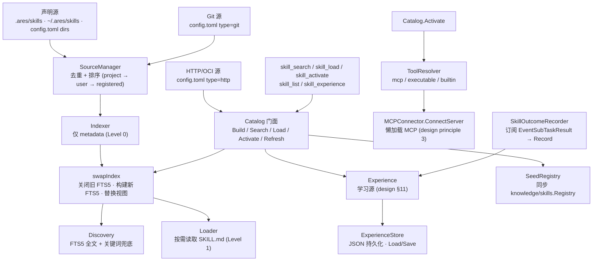

`internal/ares_skills` 包（包名 `ares_skills`）实现 **ARES Capability
Fabric**（0.3.0）：一个把 Skill 当作**能力包**（`SKILL.md` + references +
工具声明）而非 Tool 的小抽象。实现层刻意限制在 `SkillCatalog` /
`SkillLoader` / `ToolResolver`——没有 `SkillManager` / `Orchestrator` /
`Marketplace`。

设计支柱（`ares-capability-fabric-design.md`）：

1. 只扫描声明源——绝不全盘 find。
2. Skill 是能力包，Tool 是执行载体。
3. MCP server 在 skill 激活时懒加载，不预连接。
4. 内容渐进式披露：metadata → `SKILL.md` → resources。
5. 发现、加载、执行、信任是四个独立关切。

## 职责

- 提供 `SkillCatalog` 门面（`Catalog`），将 `SourceManager`、
  `Indexer`、`Discovery`、`Loader`、`ToolResolver`、`Experience` 组合在
  一个入口之后。
- 仅索引 metadata（渐进式披露 Level 0）：100 个 skill 约 100×100 tokens，
  而非 100 个完整指令体。
- 在 skill 激活时懒连接 MCP server（`MCPConnector` 接口；
  `ares_mcp.MCPManager` 满足它）——未激活的 MCP server 不启动。
- 持久化学习到的相关性先验（`Experience` + `ExperienceStore`）：
  `{skill, task_pattern, success_rate}` 记录，偏置后续发现排序。学习到的
  skill 可被索引但绝不自动执行（Discovery ≠ Permission）。
- 提供面向智能体的 skill 工具（`skill_search` / `skill_load` /
  `skill_activate` / `skill_list` / `skill_experience`），闭合 LLM 主循环
  中的 Discover → Load → Execute 环。
- 播种现有 `knowledge/skills.Registry`，使记忆管理器的常驻 skill 块与索引
  同步。

## 架构图



## 渐进式披露

| 级别 | 内容 | 加载时机 |
| --- | --- | --- |
| 0 | Metadata：`id`、`name`、`description`、`keywords`、`capabilities` | catalog 中常驻 |
| 1 | `SKILL.md` body（指令） | `Load(id)` 按需 |
| 2 | 解析后的工具（mcp / executable / builtin） | `Activate(id)` 懒加载 |

## 外部接口

```go
package ares_skills

// --- Catalog 门面 ---

type CatalogConfig struct {
    ProjectSkillsDir      string   // ".ares/skills"
    UserSkillsDir         string   // "~/.ares/skills"
    RegisteredDirs        []string // 来自 config.toml 的额外目录源
    AllowLocalExecutables bool     // 允许受信任源声明的可执行文件
    Builtins              []string // 已知框架内置工具名
    ExperiencePath        string   // 非空时将先验持久化为 JSON
}
type Catalog struct {
    // mu sync.RWMutex
    // sm *SourceManager, indexer *Indexer, discovery *Discovery
    // loader *Loader, resolver *Resolver, exp *Experience
    // mcp MCPConnector, httpSrcs []HTTPSource, registry *skills.Registry
}
func NewCatalog(cfg CatalogConfig) *Catalog
func (c *Catalog) SetGitSources(gits []GitSource)
func (c *Catalog) SyncGitSources(ctx context.Context) error          // clone 或 refresh
func (c *Catalog) SetHTTPSources(srcs []HTTPSource)
func (c *Catalog) Build() error                                      // 仅索引 metadata
func (c *Catalog) Refresh(ctx context.Context) error                 // 重同步 git、重拉 http、重建
func (c *Catalog) Close() error                                      // 释放 FTS5 后端存储

func (c *Catalog) Search(query string, limit int) []SkillIndexEntry  // Level 0 排名匹配
func (c *Catalog) All() []SkillIndexEntry                             // 完整索引快照
func (c *Catalog) Count() int                                         // 索引大小
func (c *Catalog) Load(id string) (string, error)                     // Level 1: SKILL.md body
func (c *Catalog) Activate(ctx context.Context, id string) (*Activation, error)  // Level 2: 解析工具，懒连 MCP
func (c *Catalog) Get(id string) (SkillIndexEntry, bool)              // metadata 查询

func (c *Catalog) SetMCPConnector(mcp MCPConnector)                   // 接线懒加载 MCP
func (c *Catalog) SeedRegistry(reg *skills.Registry) error            // 同步记忆管理器常驻块
func (c *Catalog) Experience() *Experience                            // 学习到的相关性先验

// --- MCP 懒激活 ---

type MCPConnector interface {
    ConnectServer(ctx context.Context, name string) error  // ares_mcp.MCPManager 满足此接口
}

// --- Experience (学习源, design §11) ---

type ExperienceStore interface {
    Load(ctx context.Context) ([]ExperienceRecord, error)
    Save(ctx context.Context, records []ExperienceRecord) error
}
type ExperienceRecord struct {
    Skill       string  `json:"skill"`
    TaskPattern string  `json:"task_pattern"`
    SuccessRate float64 `json:"success_rate"`  // 0-1
}
type Experience struct {
    // mu sync.RWMutex, records []ExperienceRecord, maxRecords int, store ExperienceStore
}
func NewExperience() *Experience
func NewExperienceWithStore(ctx context.Context, store ExperienceStore) *Experience
func (e *Experience) Record(skill, taskPattern string, successRate float64) error
func (e *Experience) BestMatch(taskPattern string) (ExperienceRecord, bool)  // 关键词重叠匹配
func (e *Experience) List() []ExperienceRecord
func (e *Experience) Count() int

// --- 类型 ---

type SourceKind string
const (
    SourceProject    SourceKind = "project"
    SourceUser       SourceKind = "user"
    SourceRegistered SourceKind = "registered"
    SourceExperience SourceKind = "experience"
)
type SkillIndexEntry struct {
    ID           string     `json:"id"`
    Name         string     `json:"name"`
    Description  string     `json:"description"`
    Keywords     []string   `json:"keywords"`
    Source       SourceKind `json:"source"`
    Path         string     `json:"path"`
    Version      string     `json:"version"`
    Capabilities []string   `json:"capabilities"`
    ToolTypes    []string   `json:"tool_types"`
    Hash         string     `json:"hash"`
}
type ToolKind string
const (
    ToolMCP        ToolKind = "mcp"
    ToolExecutable ToolKind = "executable"
    ToolBuiltin    ToolKind = "builtin"
)
type ResolvedTool struct {
    ID     string
    Kind   ToolKind
    Target string
    Args   []string
}
type ToolDecl struct {
    ID      string   `yaml:"id"`
    Type    string   `yaml:"type"`     // "mcp" | "executable" | "builtin"
    Command string   `yaml:"command,omitempty"`
    Args    []string `yaml:"args,omitempty"`
    Server  string   `yaml:"server,omitempty"`
    Name    string   `yaml:"name,omitempty"`
}
type Manifest struct {
    ID          string     `yaml:"id"`
    Name        string     `yaml:"name"`
    Description string     `yaml:"description"`
    Keywords    []string   `yaml:"keywords"`
    Version     string     `yaml:"version"`
    Tools       []ToolDecl `yaml:"tools"`
}

// --- 哨兵错误 ---

var (
    ErrSkillNotFound
)
```

## 关键类型与方法

| 类型 / 方法 | 用途 |
| --- | --- |
| `Catalog` | SkillCatalog 门面，组合 SourceManager、Indexer、Discovery、Loader、ToolResolver、Experience。 |
| `NewCatalog` / `Build` / `Refresh` | 基于声明源构造；`Build` 仅索引 metadata；`Refresh` 重同步 git、重拉 http、重建。 |
| `Search` / `All` / `Count` / `Get` | Level-0 metadata 查询（FTS5 全文 + 关键词兜底）。 |
| `Load` | Level-1 按需获取 `SKILL.md` body。 |
| `Activate` | Level-2 工具解析 + 懒连接 MCP。 |
| `MCPConnector` | 懒加载 MCP 激活接口（`ares_mcp.MCPManager` 满足）。 |
| `Experience` / `ExperienceStore` | 学习源：`{skill, task_pattern, success_rate}` 先验，JSON 持久化；`BestMatch` 用关键词重叠匹配。 |
| `SkillIndexEntry` | 仅 metadata 的索引记录（Level 0）。 |
| `ResolvedTool` / `ToolKind` | 绑定到可运行 provider 的 skill 声明工具（mcp / executable / builtin）。 |
| `Manifest` / `ToolDecl` | 解析后的 `skill.yaml` 工具声明文件。 |
| `SeedRegistry` | 使记忆管理器常驻 skill 块与 catalog 索引同步。 |

## 模块协作

- `ares_skills` -> `internal/ares_mcp`（经 `MCPConnector`）：skill 激活时
  懒连接 MCP server（设计原则 3）。
- `ares_skills` -> `internal/knowledge/skills`：`SeedRegistry` 使记忆
  管理器常驻 skill 块与 catalog 索引同步。
- `ares_skills` -> `internal/ares_events`（经 `SkillOutcomeRecorder`）：
  订阅 `EventSubTaskResult` 并记录经验先验
  （`Record(skill, taskPattern, successRate)`）。
- `ares_skills` -> `internal/taskfabric`（经 `ConfidenceSource` 适配器）：
  Experience 的 `BestMatch` `SuccessRate` 喂给 taskfabric 调度器的
  `confidence` 项。
- `ares_skills` -> `internal/tools`（经 `ToolResolver`）：解析 skill
  manifest 声明的 builtin 与 executable 工具载体。

## 扩展方式

1. **新增 skill 源**：在 `config.toml` `[[skill_sources]]` 中声明目录
   （`directory` / `git` / `http`）；`SourceManager` 去重并排序
  （project → user → registered）。
2. **接线懒加载 MCP**：实现 `MCPConnector` 并调用
   `Catalog.SetMCPConnector(mcp)`；`Activate` 仅在 skill 激活时连接声明的
   MCP server。
3. **持久化学习先验**：将 `CatalogConfig.ExperiencePath` 设为 JSON 文件
   路径；`ExperienceStore.Save` 跨重启原子写入记录集。
4. **注册面向智能体的 skill 工具**（`skill_search` / `skill_load` /
   `skill_activate` / `skill_list` / `skill_experience`）到 serve 工具
   注册表，闭合 Discover → Load → Execute 环。
5. **喂给调度器 confidence**：经 `taskfabric.ConfidenceSource` 接口适配
   `Experience.BestMatch`。
6. **源变更后重建**：调用 `Refresh(ctx)`；catalog 重同步 git 源（2 分钟
   超时上限，不可达主机降级为本地 checkout 索引），重拉 http manifest，
   原子换装索引。

## 双语状态

本页为英文参考的结构镜像中文版。所有代码标识符、类型名与签名在两份文件中均
保持英文，仅叙述性文字不同。英文版发布为 `ares_skills.en.md`。

## 成熟度

Production。该包由 `ares_skills_test.go`、`catalog_test.go`、
`config_test.go`、`discovery.go` 测试、`e2e_mcp_test.go`、
`experience_cap_test.go`、`experience_confidence_test.go`、
`outcome_recorder_test.go`、`references_test.go`、`sources_test.go`、
`tools_test.go`、`benchmark_test.go` 覆盖。它实现 Capability Fabric
（0.3.0），经懒加载 MCP 与经验先验集成进 ARES Kernel，且不含任何实验性
标记。


