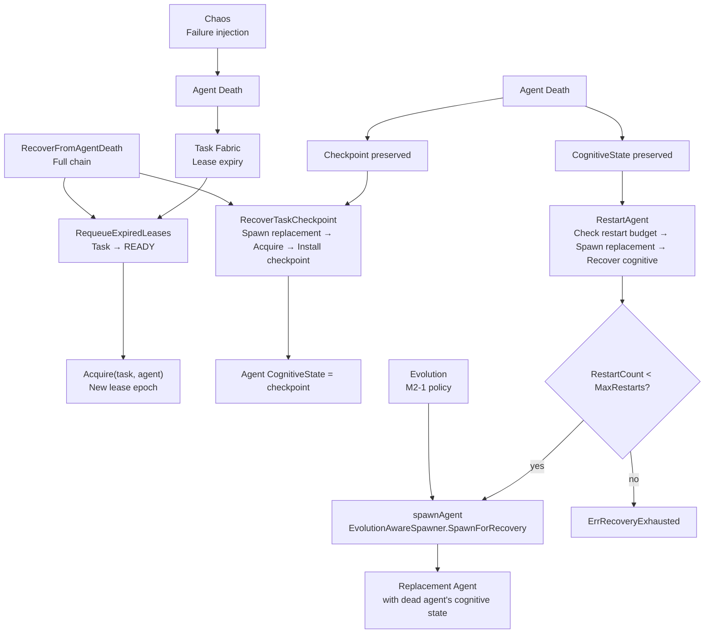

The `internal/aresrecovery` package (package `aresrecovery`) implements the
**ARES Kernel Recovery** subsystem (P5 of `docs/zh/architecture/ares-runtime.md`):
the independent responsibility of keeping durable tasks alive across agent
deaths.

Design invariants (`ares-runtime.md §13`):

- **Agent is disposable, Task is durable** — Agent death ≠ Task death.
- **Recovery is a distinct responsibility from Chaos** (failure injection):
  Chaos breaks things on purpose; Recovery proves the Runtime survives.

The Recovery subsystem orchestrates three failure paths:

1. **Lease expiry → requeue**: a dead agent's lease expires; the task returns
   to `READY` and another agent can acquire it (Task Fabric).
2. **Checkpoint recovery**: a task's preserved checkpoint is resumed by a new
   agent (Task Fabric + Agent Fabric `CognitiveState`).
3. **Agent restart**: a crashed agent is replaced by a new one that picks up
   the dead agent's cognitive checkpoint (Agent Fabric `Recover`).

## Responsibility

- Wire the Task Fabric (durable tasks + lease expiry + checkpoints) to the
  Agent Fabric (disposable agents + cognitive state) so that an agent death
  is followed by task requeue + checkpoint resume + agent replacement.
- Sweep the Task Fabric for expired leases via `RequeueExpiredLeases` and
  requeue the corresponding tasks to `READY` (failure path 1).
- Resume a task's preserved checkpoint with a new agent via
  `RecoverTaskCheckpoint`: spawns or reuses a replacement agent, acquires the
  task for it, and installs the checkpoint as the new agent's cognitive state
  (failure path 2).
- Replace a crashed agent with a new one via `RestartAgent`: spawns a
  replacement with the dead agent's capabilities and installs the preserved
  cognitive state, bounded by the restart budget (failure path 3).
- Enforce the restart budget (`RestartPolicy`) with exponential backoff:
  `MaxRestarts` attempts, `Backoff` initial delay doubled each attempt
  (capped at `MaxBackoff`).
- Provide the `EvolutionAwareSpawner` integration point (v0.4.0 M2-1): when
  wired, every replacement spawn is routed through the spawner so the
  evolution policy (`Enabled` / `MaxConcurrent` / `PreferredCapabilities`)
  shapes restarts and checkpoint recovery — "Evolution decides; Kernel
  enforces". Recovery spawns bypass the population cap (`SpawnForRecovery`)
  so a self-healing spawn is never blocked by `MaxConcurrent`.
- Expose `RecoverFromAgentDeath` as the full recovery chain: sweep expired
  leases → requeue tasks → resume each requeued task's checkpoint with a
  fresh replacement agent (P5 acceptance path).

## Architecture



## External interfaces

```go
package aresrecovery

// --- Recovery ---

type Recovery struct {
    // tasks *taskfabric.Fabric
    // agents *agentfabric.Fabric
    // spawner *EvolutionAwareSpawner
    // policy RestartPolicy
    // mu sync.Mutex
    // restarts map[string]int
    // now func() time.Time
}

func New(tasks *taskfabric.Fabric, agents *agentfabric.Fabric, policy RestartPolicy) *Recovery
func (r *Recovery) WithClock(now func() time.Time) *Recovery
func (r *Recovery) WithSpawner(s *EvolutionAwareSpawner) *Recovery

func (r *Recovery) RequeueExpiredLeases() int
func (r *Recovery) RecoverTaskCheckpoint(ctx context.Context, taskID, replacementID string) (string, uint64, error)
func (r *Recovery) RestartAgent(ctx context.Context, deadAgentID string, cognitive agentfabric.CognitiveState, capabilities []string) (*agentfabric.Agent, error)
func (r *Recovery) RestartCount(agentID string) int
func (r *Recovery) RecoverFromAgentDeath(ctx context.Context) int

// --- RestartPolicy ---

type RestartPolicy struct {
    MaxRestarts int
    Backoff     time.Duration
    MaxBackoff  time.Duration
}

func DefaultRestartPolicy() RestartPolicy

// --- EvolutionAwareSpawner (v0.4.0 M2-1) ---

type SpawnPolicy struct {
    Enabled               bool
    MaxConcurrent         int
    PreferredCapabilities []string
}
type SpawnPolicySource interface {
    ActiveSpawnPolicy(ctx context.Context) (SpawnPolicy, error)
}
type EvolutionAwareSpawner struct {
    // agents *agentfabric.Fabric
    // source SpawnPolicySource
}
func NewEvolutionAwareSpawner(agents *agentfabric.Fabric, source SpawnPolicySource) *EvolutionAwareSpawner
func (s *EvolutionAwareSpawner) Spawn(ctx context.Context, spec agentfabric.SpawnSpec) (*agentfabric.Agent, error)
func (s *EvolutionAwareSpawner) SpawnForRecovery(ctx context.Context, spec agentfabric.SpawnSpec) (*agentfabric.Agent, error)

// --- Sentinel errors ---

var ErrRecoveryExhausted = errors.New("aresrecovery: restart budget exhausted")
var ErrSpawnDisabled = errors.New("aresrecovery: evolution disabled spawning")
var ErrSpawnLimitReached = errors.New("aresrecovery: evolution spawn limit reached")
```

## Key types and methods

| Type / Method | Purpose |
| --- | --- |
| `Recovery` | Orchestrates the Kernel's failure-recovery paths — wires Task Fabric to Agent Fabric so agent death is followed by task requeue + checkpoint resume + agent replacement. |
| `New` | Wires the Recovery subsystem to the Task and Agent Fabrics with the given `RestartPolicy`; zero values fall back to `DefaultRestartPolicy`. |
| `WithClock` | Injects a controllable clock for deterministic tests. |
| `WithSpawner` | Injects the evolution-aware spawn gate so evolution policy shapes restart and recovery spawns (v0.4.0 M2-1). |
| `RequeueExpiredLeases` | Sweeps the Task Fabric for expired leases and returns the number of tasks requeued to `READY` (failure path 1). |
| `RecoverTaskCheckpoint` | Resumes a task's preserved checkpoint with a new agent — spawns a replacement, acquires the task, and installs the checkpoint as cognitive state. Returns replacement agent ID and new lease epoch (fencing token). |
| `RestartAgent` | Replaces a crashed agent with a new one that picks up the dead agent's cognitive checkpoint; checks restart budget, spawns replacement, calls `Recover`. Returns `ErrRecoveryExhausted` when budget is exhausted. |
| `RestartCount` | Returns how many times an agent has been restarted. |
| `RecoverFromAgentDeath` | Full recovery chain: sweeps expired leases, requeues tasks, and resumes each requeued task's checkpoint with a fresh replacement agent. |
| `RestartPolicy` / `DefaultRestartPolicy` | Bounds agent restart attempts: `MaxRestarts=5`, `Backoff=1s`, `MaxBackoff=30s` as production default. |
| `EvolutionAwareSpawner` | Evolution-aware spawn gate that consults a `SpawnPolicySource` before spawning; `Spawn` enforces the `Enabled` gate and the `MaxConcurrent` quota, `SpawnForRecovery` bypasses only the quota (never the `Enabled` gate). |

## Module collaboration

- `aresrecovery` -> `internal/taskfabric` (via `tasks *taskfabric.Fabric`): sweeps expired leases via `CheckExpiredLeases`, acquires tasks for replacement agents, reads preserved checkpoints.
- `aresrecovery` -> `internal/agentfabric` (via `agents *agentfabric.Fabric`): spawns replacement agents, installs cognitive state via `SetCognitiveState` and `Recover`.
- `aresrecovery` -> `internal/ares_evolution` (via `SpawnPolicySource`, defined in aresrecovery and implemented by the evolution system — aresrecovery never imports the evolution package): evolution policy (`SpawnPolicy`) shapes restart and recovery spawns; `SpawnForRecovery` bypasses only the population quota.
- `aresrecovery` -> `internal/system_runtime`: the Recovery subsystem is registered as a component and started/stopped by the Orchestrator.

## Extension points

1. **Wire an evolution-aware spawn gate** via `Recovery.WithSpawner(spawner)` so the evolution policy (`Enabled` / `MaxConcurrent` / `PreferredCapabilities`) shapes restarts and checkpoint recovery. Recovery spawns always use `SpawnForRecovery` — they bypass the population cap so a self-healing spawn is never blocked by `MaxConcurrent`.
2. **Customise the restart policy** by passing a non-default `RestartPolicy` to `New`; adjust `MaxRestarts`, `Backoff`, and `MaxBackoff` to match operational requirements.
3. **Inject a deterministic clock** via `Recovery.WithClock(now)` for hermetic tests of restart ordering and backoff timing.
4. **Verify the full recovery chain** by calling `RecoverFromAgentDeath` — it sweeps expired leases, requeues tasks, and resumes each checkpoint with a fresh replacement agent (P5 acceptance path).
5. **Instrument recovery observability** by reading `RestartCount(agentID)` to track per-agent restart attempts and detect exhausted budgets.

## Bilingual status

This page is the English reference. A Chinese translation with identical structure and technical content is published as `aresrecovery.zh.md`. All code identifiers, type names, and signatures are kept in English in both files; only the prose differs.

## Maturity

Production. The package is covered by unit tests and implements the Kernel Recovery subsystem (P5) with restart budget enforcement, evolution-aware spawn gates, and the full `RecoverFromAgentDeath` chain. It integrates with the Task Fabric, Agent Fabric, and Evolution subsystems, and exposes no experimental markers.


