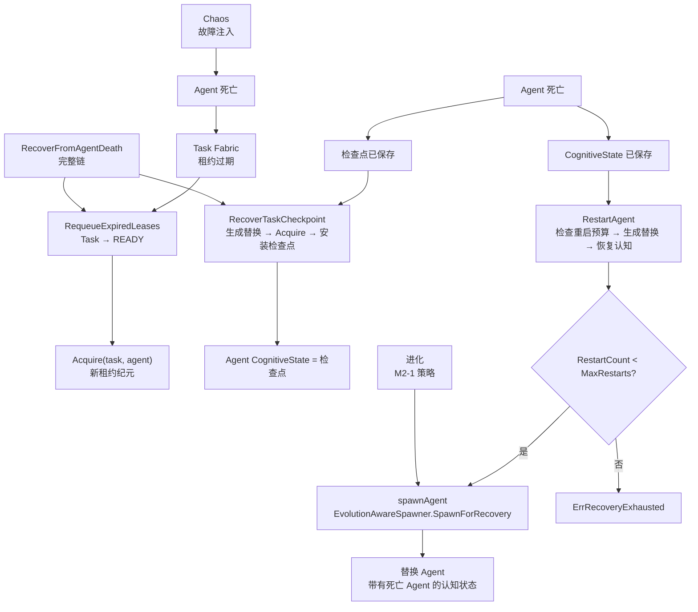

`internal/aresrecovery` 包（package `aresrecovery`）实现了 **ARES Kernel Recovery**
子系统（`docs/zh/architecture/ares-runtime.md` 的 P5）：独立负责在 Agent 崩溃后保持
持久化任务存活。

设计不变量（`ares-runtime.md §13`）：

- **Agent 是可丢弃的，Task 是持久化的** — Agent 死亡 ≠ Task 死亡。
- **Recovery 与 Chaos（故障注入）是独立的职责**：Chaos 故意破坏；Recovery 证明运行时
  能够存活。

Recovery 子系统编排了三种故障路径：

1. **租约过期 → 重排**：已死 Agent 的租约过期后，任务回到 `READY` 状态，等待另一个
   Agent 获取（Task Fabric）。
2. **检查点恢复**：通过新 Agent 恢复任务保存的检查点（Task Fabric + Agent Fabric
   `CognitiveState`）。
3. **Agent 重启**：用新 Agent 替换崩溃的 Agent，新 Agent 承接死亡 Agent 的认知检查点
   （Agent Fabric `Recover`）。

## 职责

- 将 Task Fabric（持久化任务 + 租约过期 + 检查点）与 Agent Fabric（可丢弃 Agent +
  认知状态）串联，使 Agent 死亡后依次执行任务重排、检查点恢复和 Agent 替换。
- 通过 `RequeueExpiredLeases` 扫描 Task Fabric 中已过期的租约，将对应任务重排至
  `READY` 状态（故障路径 1）。
- 通过 `RecoverTaskCheckpoint` 用新 Agent 恢复任务保存的检查点：生成或复用替换 Agent，
  获取任务，并将检查点安装为新 Agent 的认知状态（故障路径 2）。
- 通过 `RestartAgent` 用新 Agent 替换崩溃的 Agent：生成一个具备死亡 Agent 能力的
  替换 Agent，并安装保存的认知状态，受重启预算约束（故障路径 3）。
- 通过指数退避执行重启预算（`RestartPolicy`）：`MaxRestarts` 次尝试，`Backoff` 初始
  延迟每次翻倍（上限 `MaxBackoff`）。
- 提供 `EvolutionAwareSpawner` 集成点（v0.4.0 M2-1）：接入后，每次替换生成都通过该
  生成器路由，使进化策略（`Enabled` / `MaxConcurrent` / `PreferredCapabilities`）
  塑造重启和检查点恢复 — "进化决策，内核执行"。恢复生成绕过人口上限
  （`SpawnForRecovery`），确保自愈生成不会被 `MaxConcurrent` 阻塞。
- 暴露 `RecoverFromAgentDeath` 作为完整的恢复链：扫描过期租约 → 重排任务 → 用新
  替换 Agent 恢复每个重排任务的检查点（P5 验收路径）。

## 架构



## 外部接口

```go
package aresrecovery

// --- Recovery ---

type Recovery struct {
    // tasks *taskfabric.Fabric
    // agents *agentfabric.Fabric
    // spawner *EvolutionAwareSpawner
    // policy RestartPolicy
    // mu sync.Mutex
    // restarts map[string]int
    // now func() time.Time
}

func New(tasks *taskfabric.Fabric, agents *agentfabric.Fabric, policy RestartPolicy) *Recovery
func (r *Recovery) WithClock(now func() time.Time) *Recovery
func (r *Recovery) WithSpawner(s *EvolutionAwareSpawner) *Recovery

func (r *Recovery) RequeueExpiredLeases() int
func (r *Recovery) RecoverTaskCheckpoint(ctx context.Context, taskID, replacementID string) (string, uint64, error)
func (r *Recovery) RestartAgent(ctx context.Context, deadAgentID string, cognitive agentfabric.CognitiveState, capabilities []string) (*agentfabric.Agent, error)
func (r *Recovery) RestartCount(agentID string) int
func (r *Recovery) RecoverFromAgentDeath(ctx context.Context) int

// --- RestartPolicy ---

type RestartPolicy struct {
    MaxRestarts int
    Backoff     time.Duration
    MaxBackoff  time.Duration
}

func DefaultRestartPolicy() RestartPolicy

// --- EvolutionAwareSpawner (v0.4.0 M2-1) ---

type SpawnPolicy struct {
    Enabled               bool
    MaxConcurrent         int
    PreferredCapabilities []string
}
type SpawnPolicySource interface {
    ActiveSpawnPolicy(ctx context.Context) (SpawnPolicy, error)
}
type EvolutionAwareSpawner struct {
    // agents *agentfabric.Fabric
    // source SpawnPolicySource
}
func NewEvolutionAwareSpawner(agents *agentfabric.Fabric, source SpawnPolicySource) *EvolutionAwareSpawner
func (s *EvolutionAwareSpawner) Spawn(ctx context.Context, spec agentfabric.SpawnSpec) (*agentfabric.Agent, error)
func (s *EvolutionAwareSpawner) SpawnForRecovery(ctx context.Context, spec agentfabric.SpawnSpec) (*agentfabric.Agent, error)

// --- Sentinel errors ---

var ErrRecoveryExhausted = errors.New("aresrecovery: restart budget exhausted")
var ErrSpawnDisabled = errors.New("aresrecovery: evolution disabled spawning")
var ErrSpawnLimitReached = errors.New("aresrecovery: evolution spawn limit reached")
```

## 关键类型与方法

| 类型 / 方法 | 用途 |
| --- | --- |
| `Recovery` | 编排内核的故障恢复路径 — 将 Task Fabric 与 Agent Fabric 串联，使 Agent 死亡后依次执行任务重排 + 检查点恢复 + Agent 替换。 |
| `New` | 将 Recovery 子系统连接到 Task 和 Agent Fabric，并指定 `RestartPolicy`；零值回退到 `DefaultRestartPolicy`。 |
| `WithClock` | 注入可控时钟，用于确定性测试。 |
| `WithSpawner` | 注入进化感知生成门控，使进化策略塑造重启和恢复生成（v0.4.0 M2-1）。 |
| `RequeueExpiredLeases` | 扫描 Task Fabric 中已过期的租约，返回重排至 `READY` 的任务数（故障路径 1）。 |
| `RecoverTaskCheckpoint` | 用新 Agent 恢复任务的保存检查点 — 生成替换 Agent，获取任务，并将检查点安装为认知状态。返回替换 Agent ID 和新租约纪元（ fencing token）。 |
| `RestartAgent` | 用新 Agent 替换崩溃的 Agent，新 Agent 承接死亡 Agent 的认知检查点；检查重启预算，生成替换，调用 `Recover`。预算耗尽时返回 `ErrRecoveryExhausted`。 |
| `RestartCount` | 返回 Agent 已被重启的次数。 |
| `RecoverFromAgentDeath` | 完整恢复链：扫描过期租约，重排任务，用新替换 Agent 恢复每个重排任务的检查点。 |
| `RestartPolicy` / `DefaultRestartPolicy` | 约束 Agent 重启尝试次数：`MaxRestarts=5`，`Backoff=1s`，`MaxBackoff=30s` 作为生产默认值。 |
| `EvolutionAwareSpawner` | 进化感知生成门控，在生成前咨询 `SpawnPolicySource`；`Spawn` 强制执行 `Enabled` 门控和 `MaxConcurrent` 配额，`SpawnForRecovery` 仅绕过配额（绝不绕过 `Enabled` 门控）。 |

## 模块协作

- `aresrecovery` -> `internal/taskfabric`（通过 `tasks *taskfabric.Fabric`）：通过 `CheckExpiredLeases` 扫描过期租约，为替换 Agent 获取任务，读取保存的检查点。
- `aresrecovery` -> `internal/agentfabric`（通过 `agents *agentfabric.Fabric`）：生成替换 Agent，通过 `SetCognitiveState` 和 `Recover` 安装认知状态。
- `aresrecovery` -> `internal/ares_evolution`（通过 `SpawnPolicySource`，该接口在 aresrecovery 中定义、由进化系统实现 — aresrecovery 从不导入进化包）：进化策略（`SpawnPolicy`）塑造重启和恢复生成；`SpawnForRecovery` 仅绕过人口配额。
- `aresrecovery` -> `internal/system_runtime`：Recovery 子系统注册为组件，由 Orchestrator 启动/停止。

## 扩展点

1. **接入进化感知生成门控**：通过 `Recovery.WithSpawner(spawner)` 使进化策略（`Enabled` / `MaxConcurrent` / `PreferredCapabilities`）塑造重启和检查点恢复。恢复生成始终使用 `SpawnForRecovery` — 绕过人口上限，确保自愈生成不会被 `MaxConcurrent` 阻塞。
2. **自定义重启策略**：向 `New` 传递非默认的 `RestartPolicy`；调整 `MaxRestarts`、`Backoff` 和 `MaxBackoff` 以适应运维需求。
3. **注入确定性时钟**：通过 `Recovery.WithClock(now)` 实现重启顺序和退避定时的封闭测试。
4. **验证完整恢复链**：调用 `RecoverFromAgentDeath` — 扫描过期租约，重排任务，用新替换 Agent 恢复每个检查点（P5 验收路径）。
5. **监控恢复可观测性**：读取 `RestartCount(agentID)` 跟踪每个 Agent 的重启尝试次数，检测预算耗尽。

## 双语状态

本页为中文翻译。英文参考以相同结构和内容发布为 `aresrecovery.en.md`。所有代码标识符、类型名和签名在两种语言中都保持英文；仅散文部分不同。

## 成熟度

Production。该包包含单元测试，实现了带有重启预算执行、进化感知生成门控和完整 `RecoverFromAgentDeath` 链的 Kernel Recovery 子系统（P5）。它与 Task Fabric、Agent Fabric 和 Evolution 子系统集成，且无实验性标记。


