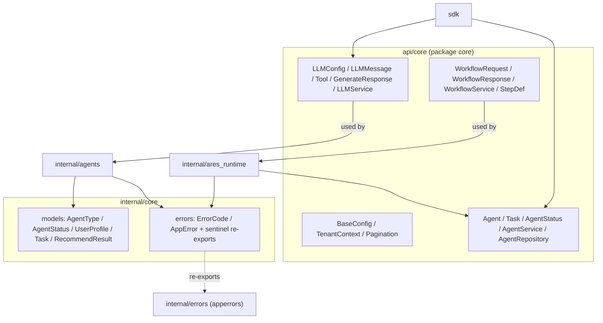

The `core` module is the shared contract layer of ARES. It is split across two
locations: `api/core` (package `core`) holds the public data-transfer objects
and service interfaces for LLM, agent, and workflow operations; `internal/core`
holds the internal domain models (`internal/core/models`, package `models`) and
the structured error types plus re-exported sentinel errors
(`internal/core/errors`, package `errors`). Almost every other package imports
these types, so they are kept free of business logic and side effects.

## Responsibility

- Define the LLM contract: `LLMConfig`, `LLMMessage`, `Tool`, `ToolCall`,
  `FunctionDefinition`, `GenerateRequest`, `GenerateResponse`, `TokenUsage`,
  embedding request/response, and the `LLMService` / `LLMRepository`
  interfaces.
- Define the agent contract: `Agent`, `AgentConfig`, `AgentStatus`, `Task`,
  `TaskResult`, `AgentFilter`, `AgentRepository`, and `AgentService`.
- Define the workflow contract: `WorkflowService`, `WorkflowRequest`,
  `WorkflowResponse`, `WorkflowEvent`, `WorkflowDefinition`, `StepDef`,
  `StepResult`, and `WorkflowStatus` / `WorkflowEventType` enums.
- Provide cross-cutting primitives: `BaseConfig`, `TenantContext`,
  `RequestContext`, `PaginationRequest` / `PaginationResponse`, `Metadata`.
- Provide domain enums and models in `models`: `AgentType`, `AgentStatus`
  (with `ParseAgentStatus`), `Gender`, `StyleTag`, `Occasion`,
  `SessionStatus`, `PriceRange`, `Task`, `TaskResult`, `RecommendResult`,
  `RecommendItem`, `UserProfile`.
- Provide structured errors in `errors`: `ErrorCode`, `AppError` (with
  `Wrap`, `New`, `WithContext`, `IsRetryable`, `ShouldRetry`), and re-exported
  sentinel errors that share identity with `internal/errors`.

## Architecture



## External interfaces

```go
// ---- api/core: base types (types.go) ----
type BaseConfig struct {
    RequestTimeout time.Duration
    MaxRetries     int
    RetryDelay     time.Duration
}
type TenantContext struct {
    TenantID string
    UserID   string
    TraceID  string
}
type PaginationRequest struct {
    Page     int
    PageSize int
    Offset   int
    Limit    int
}
type PaginationResponse struct {
    Total      int64
    Page       int
    PageSize   int
    TotalPages int
    HasMore    bool
}
type Metadata map[string]interface{}
type RequestContext struct {
    Context  context.Context
    Tenant   *TenantContext
    Metadata Metadata
}
func NewRequestContext(ctx context.Context, tenantID string) *RequestContext
func (rc *RequestContext) WithUserID(userID string) *RequestContext
func (rc *RequestContext) WithTraceID(traceID string) *RequestContext
func (rc *RequestContext) WithMetadata(key string, value interface{}) *RequestContext

// ---- api/core: LLM (llm.go) ----
type LLMProvider string
const (
    LLMProviderOpenRouter LLMProvider = "openrouter"
    LLMProviderOllama     LLMProvider = "ollama"
    LLMProviderOpenAI     LLMProvider = "openai"
    LLMProviderAnthropic  LLMProvider = "anthropic"
)
type LLMConfig struct {
    Provider         LLMProvider
    APIKey           string
    BaseURL          string
    Model            string
    Timeout          int
    Temperature      float64
    MaxTokens        int
    TopP             float64
    FrequencyPenalty float64
    PresencePenalty  float64
    MaxPromptLength  int `yaml:"max_prompt_length"`
}
type LLMMessage struct {
    Role       string
    Content    string
    ToolCalls  []ToolCall
    ToolCallID string
    Name       string
}
type ToolCall struct {
    ID       string
    Type     string
    Function FunctionCall
}
type FunctionCall struct {
    Name      string
    Arguments string
}
type GenerateRequest struct {
    Messages       []*LLMMessage
    Model          string
    Temperature    *float64
    MaxTokens      *int
    Stream         bool
    Tools          []Tool
    TopP           *float64
    Stop           []string
    Seed           *int64
    User           string
    Metadata       map[string]string
    ToolChoice     json.RawMessage
    ResponseFormat json.RawMessage
}
type Tool struct {
    Type     string
    Function FunctionDefinition
}
type FunctionDefinition struct {
    Name        string
    Description string
    Parameters  map[string]interface{}
}
type GenerateResponse struct {
    Content      string
    FinishReason string
    Usage        TokenUsage
    ToolCalls    []ToolCall
    Model        string
}
type TokenUsage struct {
    PromptTokens     int
    CompletionTokens int
    TotalTokens      int
}
type EmbeddingRequest struct {
    Input string
    Model string
}
type EmbeddingResponse struct {
    Embedding []float32
    Model     string
    Usage     TokenUsage
}
type LLMRepository interface {
    LogGeneration(ctx context.Context, request *GenerateRequest, response *GenerateResponse) error
    GetGenerationLog(ctx context.Context, logID string) (*GenerateRequest, *GenerateResponse, error)
}
type LLMService interface {
    Generate(ctx context.Context, request *GenerateRequest) (*GenerateResponse, error)
    GenerateSimple(ctx context.Context, prompt string) (string, error)
    GenerateEmbedding(ctx context.Context, request *EmbeddingRequest) (*EmbeddingResponse, error)
    GetConfig() *LLMConfig
    IsEnabled() bool
    GetProvider() LLMProvider
    GetModel() string
}

// ---- api/core: agent (agent.go) ----
type AgentStatus string
const (
    AgentStatusReady        AgentStatus = "ready"
    AgentStatusRunning      AgentStatus = "running"
    AgentStatusStopped      AgentStatus = "stopped"
    AgentStatusError        AgentStatus = "error"
    AgentStatusInitializing AgentStatus = "initializing"
)
type Agent struct {
    ID        string
    Name      string
    Type      string
    Status    AgentStatus
    SessionID string
    Config    map[string]interface{}
    CreatedAt int64
    UpdatedAt int64
}
type AgentConfig struct {
    ID     string
    Name   string
    Type   string
    Config map[string]interface{}
}
type Task struct {
    ID          string
    AgentID     string
    Type        string
    Payload     map[string]interface{}
    Priority    int
    Status      string
    CreatedAt   int64
    StartedAt   int64
    CompletedAt int64
}
type TaskResult struct {
    TaskID      string
    AgentID     string
    Success     bool
    Data        map[string]interface{}
    Error       string
    CompletedAt int64
}
type AgentFilter struct {
    Type       string
    Status     AgentStatus
    SessionID  string
    Pagination *PaginationRequest
}
type AgentRepository interface {
    Create(ctx context.Context, agent *Agent) error
    Get(ctx context.Context, agentID string) (*Agent, error)
    Update(ctx context.Context, agent *Agent) error
    Delete(ctx context.Context, agentID string) error
    List(ctx context.Context, filter *AgentFilter) ([]*Agent, error)
}
type AgentService interface {
    CreateAgent(ctx context.Context, config *AgentConfig) (*Agent, error)
    GetAgent(ctx context.Context, agentID string) (*Agent, error)
    UpdateAgent(ctx context.Context, agentID string, updates map[string]interface{}) (*Agent, error)
    DeleteAgent(ctx context.Context, agentID string) error
    ListAgents(ctx context.Context, filter *AgentFilter) ([]*Agent, *PaginationResponse, error)
    ExecuteTask(ctx context.Context, task *Task) (*TaskResult, error)
    GetTaskResult(ctx context.Context, taskID string) (*TaskResult, error)
}

// ---- api/core: workflow (workflow.go) ----
type WorkflowService interface {
    Execute(ctx context.Context, req *WorkflowRequest) (*WorkflowResponse, error)
    ExecuteStream(ctx context.Context, req *WorkflowRequest) (<-chan WorkflowEvent, error)
    ListWorkflows(ctx context.Context) ([]*WorkflowSummary, error)
    GetWorkflow(ctx context.Context, id string) (*WorkflowDefinition, error)
}
type WorkflowRequest struct {
    WorkflowID string
    Input      string
    Variables  map[string]string
    Timeout    time.Duration
}
type WorkflowResponse struct {
    ExecutionID string
    WorkflowID  string
    Status      WorkflowStatus
    Output      map[string]interface{}
    Steps       []*StepResult
    Error       string
    Duration    time.Duration
}
type WorkflowEvent struct {
    Type        WorkflowEventType
    ExecutionID string
    WorkflowID  string
    StepID      string
    StepName    string
    Status      WorkflowStatus
    Output      string
    Error       string
    Timestamp   time.Time
}
type WorkflowSummary struct {
    ID          string
    Name        string
    Description string
    StepCount   int
    CreatedAt   time.Time
    UpdatedAt   time.Time
}
type WorkflowDefinition struct {
    ID          string
    Name        string
    Version     string
    Description string
    Steps       []*StepDef
    Variables   map[string]string
    Metadata    map[string]string
    CreatedAt   time.Time
    UpdatedAt   time.Time
}
type StepDef struct {
    ID        string
    Name      string
    AgentType string
    Input     string
    DependsOn []string
    Timeout   time.Duration
}
type StepResult struct {
    StepID   string
    Name     string
    Status   WorkflowStatus
    Output   string
    Error    string
    Duration time.Duration
}
type WorkflowStatus string
const (
    WorkflowStatusPending   WorkflowStatus = "pending"
    WorkflowStatusRunning   WorkflowStatus = "running"
    WorkflowStatusCompleted WorkflowStatus = "completed"
    WorkflowStatusFailed    WorkflowStatus = "failed"
    WorkflowStatusCancelled WorkflowStatus = "cancelled"
)
type WorkflowEventType int
const (
    WorkflowEventStarted WorkflowEventType = iota
    WorkflowEventStepStarted
    WorkflowEventStepCompleted
    WorkflowEventStepFailed
    WorkflowEventCompleted
    WorkflowEventFailed
)

// ---- internal/core/models (package models) ----
type AgentType string
const (
    AgentTypeLeader       AgentType = "leader"
    AgentTypeTop          AgentType = "agent_top"
    AgentTypeBottom       AgentType = "agent_bottom"
    AgentTypeDestination  AgentType = "destination"
    AgentTypeFood         AgentType = "food"
    AgentTypeHotel        AgentType = "hotel"
    AgentTypeItinerary    AgentType = "itinerary"
)
type AgentStatus string // models.AgentStatus (starting/ready/busy/stopping/offline)
const (
    AgentStatusStarting AgentStatus = "starting"
    AgentStatusReady    AgentStatus = "ready"
    AgentStatusBusy     AgentStatus = "busy"
    AgentStatusStopping AgentStatus = "stopping"
    AgentStatusOffline  AgentStatus = "offline"
)
func ParseAgentStatus(s string) (AgentStatus, error)

type Task struct {
    TaskID           string
    TaskType         AgentType
    AgentType        AgentType
    UserProfile      *UserProfile
    Context          *TaskContext
    Payload          map[string]any
    Priority         int
    Deadline         time.Time
    UsedExperienceID string
    CreatedAt        time.Time
}
func NewTask(taskID string, agentType AgentType, profile *UserProfile) *Task
func (t *Task) IsExpired() bool

type TaskResult struct {
    TaskID    string
    AgentType AgentType
    Success   bool
    Items     []*RecommendItem
    Reason    string
    Metadata  map[string]any
    Error     string
    Duration  time.Duration
    CreatedAt time.Time
}
func NewTaskResult(taskID string, agentType AgentType) *TaskResult
func (r *TaskResult) SetSuccess(items []*RecommendItem, reason string)
func (r *TaskResult) SetError(errMsg string)

type RecommendResult struct {
    SessionID  string
    UserID     string
    Items      []*RecommendItem
    Reason     string
    TotalPrice float64
    MatchScore float64
    Occasion   Occasion
    Season     string
    Feedback   *UserFeedback
    Metadata   map[string]any
    CreatedAt  time.Time
}
type RecommendItem struct {
    ItemID           string
    Category         string
    Name             string
    Brand            string
    Price            float64
    URL              string
    ImageURL         string
    AgentPreferences []StyleTag
    Colors           []string
    Description      string
    MatchReason      string
    Content          string
    Metadata         map[string]any
}
type UserProfile struct {
    UserID      string
    Name        string
    Gender      Gender
    Age         int
    Occupation  string
    Style       []StyleTag
    Budget      *PriceRange
    Colors      []string
    Occasions   []Occasion
    BodyType    string
    Preferences map[string]any
    CreatedAt   time.Time
    UpdatedAt   time.Time
}
func NewUserProfile(userID, name string) *UserProfile
func (p *UserProfile) Validate() error

type PriceRange struct{ Min, Max float64 }
func NewPriceRange(min, max float64) *PriceRange
func (p *PriceRange) IsValid() bool
func (p *PriceRange) Contains(price float64) bool

// Enums: Gender (male/female/other), StyleTag (sporty/minimalist/vintage/bohemian),
// Occasion (work/sports/formal/vacation), SessionStatus (pending/.../expired).
const (
    DefaultSessionTTL = 24 * time.Hour
    DefaultTaskTTL    = 1 * time.Hour
)

// ---- internal/core/errors (package errors) ----
type ErrorCode struct {
    Code       string
    Message    string
    Module     string
    Retry      bool
    RetryMax   int
    Backoff    time.Duration
    HTTPStatus int
}
func NewErrorCode(code, message, module string, retry bool, retryMax int, backoff time.Duration, httpStatus int) *ErrorCode

type AppError struct {
    Code    *ErrorCode
    Err     error
    Context map[string]any
}
func (e *AppError) Error() string
func (e *AppError) Unwrap() error
func (e *AppError) WithContext(key string, value any) *AppError
func (e *AppError) IsRetryable() bool
func (e *AppError) ShouldRetry(attempt int) bool
func Wrap(err error, code *ErrorCode) *AppError
func New(code *ErrorCode) *AppError

// Sentinel errors (re-exported from internal/errors; shared identity):
//   ErrNotFound, ErrInvalidConfig, ErrAlreadyExists, ErrAccessDenied,
//   ErrTimeout, ErrInternal, ErrInvalidInput, ErrNilPointer,
//   ErrAgentNotFound, ErrAgentNotReady, ErrAgentBusy, ErrAgentAlreadyStarted,
//   ErrAgentNotRunning, ErrQueueNotInitialized, ErrToolNotFound,
//   ErrMaxStepsExceeded, ErrInvalidMessage, ErrMessageTimeout,
//   ErrHeartbeatMissed, ErrQueueFull, ErrQueueEmpty, ErrQueueClosed,
//   ErrDBConnectionFailed, ErrQueryFailed, ErrVectorSearchFailed,
//   ErrRecordNotFound, ErrTransactionFailed, ErrInvalidArgument,
//   ErrCircuitBreakerOpen, ErrServiceUnavailable, ErrInvalidState,
//   ErrNotImplemented, ErrLLMRequestFailed, ErrLLMTimeout,
//   ErrLLMQuotaExceeded, ErrLLMInvalidResponse, ErrLLMParserFailed,
//   ErrLLMValidationFailed, ErrRateLimitExceeded, ErrDBTimeout,
//   ErrInvalidUserID, ErrInvalidAge, ErrInvalidBudget,
//   ErrProfileParsingFailed, ErrProfileValidationFailed,
//   ErrMaxRetriesExceeded, ErrTaskExecutionFailed, ErrPromptRenderFailed,
//   ErrLLMGenerateFailed, ErrTaskPlannerNotInitialized,
//   ErrProfileParserNotInitialized, ErrDispatchNotInitialized,
//   ErrResultAggNotInitialized, ErrDispatchFailed, ErrWorkflowNotFound,
//   ErrWorkflowLoadFailed, ErrWorkflowCyclicDAG, ErrWorkflowInvalidPhase,
//   ErrBackpressureTriggered, ErrTokenBucketExhausted.
```

## Key types and methods

| Type / Method | Purpose |
| --- | --- |
| `core.LLMConfig` | Provider, model, sampling, and prompt-length knobs for LLM calls. |
| `core.LLMMessage` / `ToolCall` / `FunctionCall` | Conversation message and tool-call representation. |
| `core.Tool` / `FunctionDefinition` | Function-calling schema passed to the LLM. |
| `core.GenerateRequest` / `GenerateResponse` | LLM generation request/response (streaming, tools, overrides). |
| `core.TokenUsage` | Prompt/completion/total token accounting. |
| `core.LLMService` | Interface for generation, embedding, and config introspection. |
| `core.Agent` / `AgentConfig` / `AgentStatus` | Agent entity and lifecycle status enum. |
| `core.Task` / `TaskResult` | API-layer task and result DTOs. |
| `core.AgentService` / `AgentRepository` | Agent business-logic and persistence interfaces. |
| `core.WorkflowService` | Workflow execute / execute-stream / list / get interface. |
| `core.WorkflowRequest` / `WorkflowResponse` | Workflow execution request and result. |
| `core.WorkflowDefinition` / `StepDef` / `StepResult` | Workflow structure and per-step outcome. |
| `core.BaseConfig` / `RequestContext` | Shared timeout/retry config and tenant-aware request context. |
| `models.AgentType` / `AgentStatus` | Domain enums used by the agent implementations. |
| `models.Task` / `TaskResult` | Domain task/result carrying profile, context, and experience ID. |
| `models.RecommendResult` / `RecommendItem` | Generic agent output with content + metadata carriers. |
| `models.UserProfile` | User profile with style, budget, occasions, preferences. |
| `models.PriceRange` | Budget range with `IsValid` / `Contains`. |
| `errors.AppError` / `ErrorCode` | Structured error with retry policy and context. |
| `errors.Wrap` / `New` / sentinel errors | Error construction and cross-package identity. |

## Module collaboration

- `api/core` is imported by `sdk`, `api/service/llm`, `internal/agents`
  (`agents.Service`, `sub.ChatClient`/executor), `internal/ares_runtime`,
  and the workflow engine for the DTOs and service interfaces.
- `internal/core/models` is imported by `internal/agents/base`, `leader`,
  `sub`, `ares_runtime` (status fallback), and the recommendation/aggregation
  components.
- `internal/core/errors` re-exports sentinel errors from `internal/errors`
  (imported as `apperrors`) so `errors.Is` works across both packages; it is
  used by `agents.Service`, `ares_runtime`, and the agent implementations for
  error wrapping and classification.
- The `LLMService` interface is implemented by `api/service/llm.Service`,
  which the SDK wraps; `AgentService` is implemented by `agents.Service`;
  `WorkflowService` is implemented by the workflow engine.

## Extension points

1. Add a new LLM provider by extending the `LLMProvider` constants and
   implementing the `LLMService` interface (generation, embeddings, config
   introspection).
2. Plug a custom agent persistence backend by implementing `AgentRepository`
   (`Create`, `Get`, `Update`, `Delete`, `List`) and handing it to
   `agents.NewService`.
3. Add a new agent domain type by extending `models.AgentType` constants and
   wiring the new type into the dispatcher/factory layer.
4. Extend workflow capabilities by implementing `WorkflowService` (or its
   underlying engine) and emitting `WorkflowEvent` values over
   `ExecuteStream`.
5. Add structured error categories by defining `ErrorCode` values and
   wrapping errors with `errors.Wrap(err, code)`; rely on the re-exported
   sentinels for `errors.Is` checks rather than declaring new sentinel
   values.
6. Carry tenant/trace metadata through call stacks by building a
   `RequestContext` via `NewRequestContext` and chaining `WithUserID`,
   `WithTraceID`, `WithMetadata`.

## Bilingual status

This page is the English reference. A Chinese translation with identical
structure and technical content is published as `core.zh.md`. All code
identifiers, type names, and signatures are kept in English in both files;
only the prose differs.

## Maturity

Production. The `api/core` package is covered by `core_test.go`, `llm_test.go`,
`agent_test.go`, `types_test.go`, and `cleaning_test.go`; `internal/core/models`
by `models_test.go`; `internal/core/errors` by `errors_test.go`,
`error_scenarios_test.go`, and `strategy_config_test.go`. These types are the
shared foundation imported by every production module and contain no
experimental markers.


