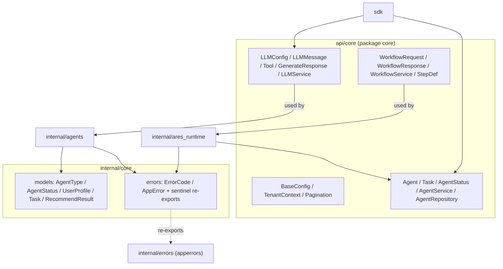

`core` 模块是 ARES 的共享契约层，分布在两处：`api/core`（包 `core`）持有面向公众的
数据传输对象与 LLM、智能体、工作流的 service 接口；`internal/core` 持有内部领域模型
（`internal/core/models`，包 `models`）以及结构化错误类型与再导出的哨兵错误
（`internal/core/errors`，包 `errors`）。几乎所有其他包都导入这些类型，因此它们保持
无业务逻辑、无副作用。

## 职责

- 定义 LLM 契约：`LLMConfig`、`LLMMessage`、`Tool`、`ToolCall`、
  `FunctionDefinition`、`GenerateRequest`、`GenerateResponse`、`TokenUsage`、
  embedding 请求/响应，以及 `LLMService` / `LLMRepository` 接口。
- 定义智能体契约：`Agent`、`AgentConfig`、`AgentStatus`、`Task`、`TaskResult`、
  `AgentFilter`、`AgentRepository`、`AgentService`。
- 定义工作流契约：`WorkflowService`、`WorkflowRequest`、`WorkflowResponse`、
  `WorkflowEvent`、`WorkflowDefinition`、`StepDef`、`StepResult`，以及
  `WorkflowStatus` / `WorkflowEventType` 枚举。
- 提供横切原语：`BaseConfig`、`TenantContext`、`RequestContext`、
  `PaginationRequest` / `PaginationResponse`、`Metadata`。
- 在 `models` 中提供领域枚举与模型：`AgentType`、`AgentStatus`（含
  `ParseAgentStatus`）、`Gender`、`StyleTag`、`Occasion`、`SessionStatus`、
  `PriceRange`、`Task`、`TaskResult`、`RecommendResult`、`RecommendItem`、
  `UserProfile`。
- 在 `errors` 中提供结构化错误：`ErrorCode`、`AppError`
  （含 `Wrap`、`New`、`WithContext`、`IsRetryable`、`ShouldRetry`），以及与
  `internal/errors` 共享身份的哨兵错误。

## 架构图



## 外部接口

```go
// ---- api/core: base types (types.go) ----
type BaseConfig struct {
    RequestTimeout time.Duration
    MaxRetries     int
    RetryDelay     time.Duration
}
type TenantContext struct {
    TenantID string
    UserID   string
    TraceID  string
}
type PaginationRequest struct {
    Page     int
    PageSize int
    Offset   int
    Limit    int
}
type PaginationResponse struct {
    Total      int64
    Page       int
    PageSize   int
    TotalPages int
    HasMore    bool
}
type Metadata map[string]interface{}
type RequestContext struct {
    Context  context.Context
    Tenant   *TenantContext
    Metadata Metadata
}
func NewRequestContext(ctx context.Context, tenantID string) *RequestContext
func (rc *RequestContext) WithUserID(userID string) *RequestContext
func (rc *RequestContext) WithTraceID(traceID string) *RequestContext
func (rc *RequestContext) WithMetadata(key string, value interface{}) *RequestContext

// ---- api/core: LLM (llm.go) ----
type LLMProvider string
const (
    LLMProviderOpenRouter LLMProvider = "openrouter"
    LLMProviderOllama     LLMProvider = "ollama"
    LLMProviderOpenAI     LLMProvider = "openai"
    LLMProviderAnthropic  LLMProvider = "anthropic"
)
type LLMConfig struct {
    Provider         LLMProvider
    APIKey           string
    BaseURL          string
    Model            string
    Timeout          int
    Temperature      float64
    MaxTokens        int
    TopP             float64
    FrequencyPenalty float64
    PresencePenalty  float64
    MaxPromptLength  int `yaml:"max_prompt_length"`
}
type LLMMessage struct {
    Role       string
    Content    string
    ToolCalls  []ToolCall
    ToolCallID string
    Name       string
}
type ToolCall struct {
    ID       string
    Type     string
    Function FunctionCall
}
type FunctionCall struct {
    Name      string
    Arguments string
}
type GenerateRequest struct {
    Messages       []*LLMMessage
    Model          string
    Temperature    *float64
    MaxTokens      *int
    Stream         bool
    Tools          []Tool
    TopP           *float64
    Stop           []string
    Seed           *int64
    User           string
    Metadata       map[string]string
    ToolChoice     json.RawMessage
    ResponseFormat json.RawMessage
}
type Tool struct {
    Type     string
    Function FunctionDefinition
}
type FunctionDefinition struct {
    Name        string
    Description string
    Parameters  map[string]interface{}
}
type GenerateResponse struct {
    Content      string
    FinishReason string
    Usage        TokenUsage
    ToolCalls    []ToolCall
    Model        string
}
type TokenUsage struct {
    PromptTokens     int
    CompletionTokens int
    TotalTokens      int
}
type EmbeddingRequest struct {
    Input string
    Model string
}
type EmbeddingResponse struct {
    Embedding []float32
    Model     string
    Usage     TokenUsage
}
type LLMRepository interface {
    LogGeneration(ctx context.Context, request *GenerateRequest, response *GenerateResponse) error
    GetGenerationLog(ctx context.Context, logID string) (*GenerateRequest, *GenerateResponse, error)
}
type LLMService interface {
    Generate(ctx context.Context, request *GenerateRequest) (*GenerateResponse, error)
    GenerateSimple(ctx context.Context, prompt string) (string, error)
    GenerateEmbedding(ctx context.Context, request *EmbeddingRequest) (*EmbeddingResponse, error)
    GetConfig() *LLMConfig
    IsEnabled() bool
    GetProvider() LLMProvider
    GetModel() string
}

// ---- api/core: agent (agent.go) ----
type AgentStatus string
const (
    AgentStatusReady        AgentStatus = "ready"
    AgentStatusRunning      AgentStatus = "running"
    AgentStatusStopped      AgentStatus = "stopped"
    AgentStatusError        AgentStatus = "error"
    AgentStatusInitializing AgentStatus = "initializing"
)
type Agent struct {
    ID        string
    Name      string
    Type      string
    Status    AgentStatus
    SessionID string
    Config    map[string]interface{}
    CreatedAt int64
    UpdatedAt int64
}
type AgentConfig struct {
    ID     string
    Name   string
    Type   string
    Config map[string]interface{}
}
type Task struct {
    ID          string
    AgentID     string
    Type        string
    Payload     map[string]interface{}
    Priority    int
    Status      string
    CreatedAt   int64
    StartedAt   int64
    CompletedAt int64
}
type TaskResult struct {
    TaskID      string
    AgentID     string
    Success     bool
    Data        map[string]interface{}
    Error       string
    CompletedAt int64
}
type AgentFilter struct {
    Type       string
    Status     AgentStatus
    SessionID  string
    Pagination *PaginationRequest
}
type AgentRepository interface {
    Create(ctx context.Context, agent *Agent) error
    Get(ctx context.Context, agentID string) (*Agent, error)
    Update(ctx context.Context, agent *Agent) error
    Delete(ctx context.Context, agentID string) error
    List(ctx context.Context, filter *AgentFilter) ([]*Agent, error)
}
type AgentService interface {
    CreateAgent(ctx context.Context, config *AgentConfig) (*Agent, error)
    GetAgent(ctx context.Context, agentID string) (*Agent, error)
    UpdateAgent(ctx context.Context, agentID string, updates map[string]interface{}) (*Agent, error)
    DeleteAgent(ctx context.Context, agentID string) error
    ListAgents(ctx context.Context, filter *AgentFilter) ([]*Agent, *PaginationResponse, error)
    ExecuteTask(ctx context.Context, task *Task) (*TaskResult, error)
    GetTaskResult(ctx context.Context, taskID string) (*TaskResult, error)
}

// ---- api/core: workflow (workflow.go) ----
type WorkflowService interface {
    Execute(ctx context.Context, req *WorkflowRequest) (*WorkflowResponse, error)
    ExecuteStream(ctx context.Context, req *WorkflowRequest) (<-chan WorkflowEvent, error)
    ListWorkflows(ctx context.Context) ([]*WorkflowSummary, error)
    GetWorkflow(ctx context.Context, id string) (*WorkflowDefinition, error)
}
type WorkflowRequest struct {
    WorkflowID string
    Input      string
    Variables  map[string]string
    Timeout    time.Duration
}
type WorkflowResponse struct {
    ExecutionID string
    WorkflowID  string
    Status      WorkflowStatus
    Output      map[string]interface{}
    Steps       []*StepResult
    Error       string
    Duration    time.Duration
}
type WorkflowEvent struct {
    Type        WorkflowEventType
    ExecutionID string
    WorkflowID  string
    StepID      string
    StepName    string
    Status      WorkflowStatus
    Output      string
    Error       string
    Timestamp   time.Time
}
type WorkflowSummary struct {
    ID          string
    Name        string
    Description string
    StepCount   int
    CreatedAt   time.Time
    UpdatedAt   time.Time
}
type WorkflowDefinition struct {
    ID          string
    Name        string
    Version     string
    Description string
    Steps       []*StepDef
    Variables   map[string]string
    Metadata    map[string]string
    CreatedAt   time.Time
    UpdatedAt   time.Time
}
type StepDef struct {
    ID        string
    Name      string
    AgentType string
    Input     string
    DependsOn []string
    Timeout   time.Duration
}
type StepResult struct {
    StepID   string
    Name     string
    Status   WorkflowStatus
    Output   string
    Error    string
    Duration time.Duration
}
type WorkflowStatus string
const (
    WorkflowStatusPending   WorkflowStatus = "pending"
    WorkflowStatusRunning   WorkflowStatus = "running"
    WorkflowStatusCompleted WorkflowStatus = "completed"
    WorkflowStatusFailed    WorkflowStatus = "failed"
    WorkflowStatusCancelled WorkflowStatus = "cancelled"
)
type WorkflowEventType int
const (
    WorkflowEventStarted WorkflowEventType = iota
    WorkflowEventStepStarted
    WorkflowEventStepCompleted
    WorkflowEventStepFailed
    WorkflowEventCompleted
    WorkflowEventFailed
)

// ---- internal/core/models (package models) ----
type AgentType string
const (
    AgentTypeLeader       AgentType = "leader"
    AgentTypeTop          AgentType = "agent_top"
    AgentTypeBottom       AgentType = "agent_bottom"
    AgentTypeDestination  AgentType = "destination"
    AgentTypeFood         AgentType = "food"
    AgentTypeHotel        AgentType = "hotel"
    AgentTypeItinerary    AgentType = "itinerary"
)
type AgentStatus string // models.AgentStatus (starting/ready/busy/stopping/offline)
const (
    AgentStatusStarting AgentStatus = "starting"
    AgentStatusReady    AgentStatus = "ready"
    AgentStatusBusy     AgentStatus = "busy"
    AgentStatusStopping AgentStatus = "stopping"
    AgentStatusOffline  AgentStatus = "offline"
)
func ParseAgentStatus(s string) (AgentStatus, error)

type Task struct {
    TaskID           string
    TaskType         AgentType
    AgentType        AgentType
    UserProfile      *UserProfile
    Context          *TaskContext
    Payload          map[string]any
    Priority         int
    Deadline         time.Time
    UsedExperienceID string
    CreatedAt        time.Time
}
func NewTask(taskID string, agentType AgentType, profile *UserProfile) *Task
func (t *Task) IsExpired() bool

type TaskResult struct {
    TaskID    string
    AgentType AgentType
    Success   bool
    Items     []*RecommendItem
    Reason    string
    Metadata  map[string]any
    Error     string
    Duration  time.Duration
    CreatedAt time.Time
}
func NewTaskResult(taskID string, agentType AgentType) *TaskResult
func (r *TaskResult) SetSuccess(items []*RecommendItem, reason string)
func (r *TaskResult) SetError(errMsg string)

type RecommendResult struct {
    SessionID  string
    UserID     string
    Items      []*RecommendItem
    Reason     string
    TotalPrice float64
    MatchScore float64
    Occasion   Occasion
    Season     string
    Feedback   *UserFeedback
    Metadata   map[string]any
    CreatedAt  time.Time
}
type RecommendItem struct {
    ItemID           string
    Category         string
    Name             string
    Brand            string
    Price            float64
    URL              string
    ImageURL         string
    AgentPreferences []StyleTag
    Colors           []string
    Description      string
    MatchReason      string
    Content          string
    Metadata         map[string]any
}
type UserProfile struct {
    UserID      string
    Name        string
    Gender      Gender
    Age         int
    Occupation  string
    Style       []StyleTag
    Budget      *PriceRange
    Colors      []string
    Occasions   []Occasion
    BodyType    string
    Preferences map[string]any
    CreatedAt   time.Time
    UpdatedAt   time.Time
}
func NewUserProfile(userID, name string) *UserProfile
func (p *UserProfile) Validate() error

type PriceRange struct{ Min, Max float64 }
func NewPriceRange(min, max float64) *PriceRange
func (p *PriceRange) IsValid() bool
func (p *PriceRange) Contains(price float64) bool

// Enums: Gender (male/female/other), StyleTag (sporty/minimalist/vintage/bohemian),
// Occasion (work/sports/formal/vacation), SessionStatus (pending/.../expired).
const (
    DefaultSessionTTL = 24 * time.Hour
    DefaultTaskTTL    = 1 * time.Hour
)

// ---- internal/core/errors (package errors) ----
type ErrorCode struct {
    Code       string
    Message    string
    Module     string
    Retry      bool
    RetryMax   int
    Backoff    time.Duration
    HTTPStatus int
}
func NewErrorCode(code, message, module string, retry bool, retryMax int, backoff time.Duration, httpStatus int) *ErrorCode

type AppError struct {
    Code    *ErrorCode
    Err     error
    Context map[string]any
}
func (e *AppError) Error() string
func (e *AppError) Unwrap() error
func (e *AppError) WithContext(key string, value any) *AppError
func (e *AppError) IsRetryable() bool
func (e *AppError) ShouldRetry(attempt int) bool
func Wrap(err error, code *ErrorCode) *AppError
func New(code *ErrorCode) *AppError

// Sentinel errors (re-exported from internal/errors; shared identity):
//   ErrNotFound, ErrInvalidConfig, ErrAlreadyExists, ErrAccessDenied,
//   ErrTimeout, ErrInternal, ErrInvalidInput, ErrNilPointer,
//   ErrAgentNotFound, ErrAgentNotReady, ErrAgentBusy, ErrAgentAlreadyStarted,
//   ErrAgentNotRunning, ErrQueueNotInitialized, ErrToolNotFound,
//   ErrMaxStepsExceeded, ErrInvalidMessage, ErrMessageTimeout,
//   ErrHeartbeatMissed, ErrQueueFull, ErrQueueEmpty, ErrQueueClosed,
//   ErrDBConnectionFailed, ErrQueryFailed, ErrVectorSearchFailed,
//   ErrRecordNotFound, ErrTransactionFailed, ErrInvalidArgument,
//   ErrCircuitBreakerOpen, ErrServiceUnavailable, ErrInvalidState,
//   ErrNotImplemented, ErrLLMRequestFailed, ErrLLMTimeout,
//   ErrLLMQuotaExceeded, ErrLLMInvalidResponse, ErrLLMParserFailed,
//   ErrLLMValidationFailed, ErrRateLimitExceeded, ErrDBTimeout,
//   ErrInvalidUserID, ErrInvalidAge, ErrInvalidBudget,
//   ErrProfileParsingFailed, ErrProfileValidationFailed,
//   ErrMaxRetriesExceeded, ErrTaskExecutionFailed, ErrPromptRenderFailed,
//   ErrLLMGenerateFailed, ErrTaskPlannerNotInitialized,
//   ErrProfileParserNotInitialized, ErrDispatchNotInitialized,
//   ErrResultAggNotInitialized, ErrDispatchFailed, ErrWorkflowNotFound,
//   ErrWorkflowLoadFailed, ErrWorkflowCyclicDAG, ErrWorkflowInvalidPhase,
//   ErrBackpressureTriggered, ErrTokenBucketExhausted.
```

## 关键类型与方法

| 类型 / 方法 | 用途 |
| --- | --- |
| `core.LLMConfig` | LLM 调用的 provider、model、采样与 prompt 长度参数。 |
| `core.LLMMessage` / `ToolCall` / `FunctionCall` | 对话消息与工具调用表示。 |
| `core.Tool` / `FunctionDefinition` | 传给 LLM 的函数调用 schema。 |
| `core.GenerateRequest` / `GenerateResponse` | LLM 生成请求/响应（流式、工具、覆盖项）。 |
| `core.TokenUsage` | prompt/completion/total token 统计。 |
| `core.LLMService` | 生成、embedding 与配置内省接口。 |
| `core.Agent` / `AgentConfig` / `AgentStatus` | 智能体实体与生命周期状态枚举。 |
| `core.Task` / `TaskResult` | API 层任务与结果 DTO。 |
| `core.AgentService` / `AgentRepository` | 智能体业务逻辑与持久化接口。 |
| `core.WorkflowService` | 工作流 execute / execute-stream / list / get 接口。 |
| `core.WorkflowRequest` / `WorkflowResponse` | 工作流执行请求与结果。 |
| `core.WorkflowDefinition` / `StepDef` / `StepResult` | 工作流结构与单步结果。 |
| `core.BaseConfig` / `RequestContext` | 共享超时/重试配置与租户感知的请求 context。 |
| `models.AgentType` / `AgentStatus` | 智能体实现使用的领域枚举。 |
| `models.Task` / `TaskResult` | 携带 profile、context 与 experience ID 的领域任务/结果。 |
| `models.RecommendResult` / `RecommendItem` | 通用智能体输出，含 content + metadata 载体。 |
| `models.UserProfile` | 含 style、budget、occasions、preferences 的用户画像。 |
| `models.PriceRange` | 预算区间，提供 `IsValid` / `Contains`。 |
| `errors.AppError` / `ErrorCode` | 带重试策略与上下文的结构化错误。 |
| `errors.Wrap` / `New` / sentinel errors | 错误构造与跨包身份。 |

## 模块协作

- `api/core` 被 `sdk`、`api/service/llm`、`internal/agents`
  （`agents.Service`、`sub.ChatClient`/executor）、`internal/ares_runtime`
  以及工作流引擎导入，用于 DTO 与 service 接口。
- `internal/core/models` 被 `internal/agents/base`、`leader`、`sub`、
  `ares_runtime`（状态兜底）以及推荐/聚合组件导入。
- `internal/core/errors` 再导出 `internal/errors`（以 `apperrors` 导入）的哨兵错误，
  使 `errors.Is` 在两个包之间生效；`agents.Service`、`ares_runtime` 与各智能体实现
  使用它进行错误包装与分类。
- `LLMService` 接口由 `api/service/llm.Service` 实现（SDK 包装之）；
  `AgentService` 由 `agents.Service` 实现；`WorkflowService` 由工作流引擎实现。

## 扩展方式

1. 新增 LLM provider：扩展 `LLMProvider` 常量并实现 `LLMService` 接口
   （生成、embedding、配置内省）。
2. 接入自定义智能体持久化后端：实现 `AgentRepository`
   （`Create`、`Get`、`Update`、`Delete`、`List`）并交给 `agents.NewService`。
3. 新增智能体领域类型：扩展 `models.AgentType` 常量，并将新类型接入 dispatcher/factory 层。
4. 扩展工作流能力：实现 `WorkflowService`（或其底层引擎），并通过
   `ExecuteStream` 发射 `WorkflowEvent`。
5. 新增结构化错误类别：定义 `ErrorCode` 值并用 `errors.Wrap(err, code)` 包装；
   依赖再导出的哨兵错误做 `errors.Is` 检查，而非声明新的哨兵值。
6. 通过 `NewRequestContext` 构建 `RequestContext` 并链式调用
   `WithUserID`、`WithTraceID`、`WithMetadata`，将租户/trace 元数据贯穿调用栈。

## 双语状态

本页为中文参考。结构与技术内容完全相同的英文版本发布为 `core.en.md`。两个文件中
所有代码标识符、类型名与签名均保持英文，仅叙述性文字不同。

## 成熟度

Production。`api/core` 包由 `core_test.go`、`llm_test.go`、`agent_test.go`、
`types_test.go`、`cleaning_test.go` 覆盖；`internal/core/models` 由
`models_test.go` 覆盖；`internal/core/errors` 由 `errors_test.go`、
`error_scenarios_test.go`、`strategy_config_test.go` 覆盖。这些类型是所有生产模块
共享的基础，不含任何实验性标记。


