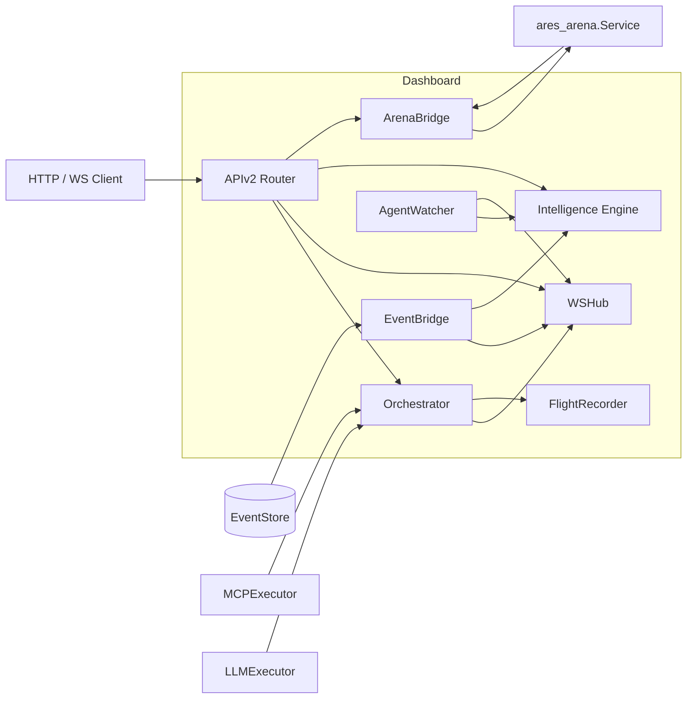

The `dashboard` package (`internal/dashboard`) is the unified web layer for
observing and operating the ARES runtime. It exposes a v2 API over HTTP and
WebSocket, runs a background intelligence engine that scores agent health and
detects anomalies, and bridges the chaos arena and flight recorder into the
same surface area.

## Responsibility

- Serve the monitoring UI (embedded static assets under `static/`) and a JSON
  API for agents, MCP servers, arena chaos actions, flight recorder data, and
  system health.
- Orchestrate the agent lifecycle: create agents from templates or custom
  requests, run them through an MCP-gathering phase followed by an LLM
  analysis phase, and broadcast progress over WebSocket.
- Compute per-agent and system-wide health scores, detect restart/error/latency
  anomalies, and surface actionable insights.
- Forward runtime events from the event store to WebSocket subscribers and the
  intelligence engine through an `EventBridge`.
- Adapt the `ares_arena` service into the dashboard's `ArenaProvider` and
  `SurvivalProvider` interfaces for chaos operations behind API-key auth.

## Architecture



The `APIv2` struct is the single router. It mounts agent, MCP, WebSocket,
arena, flight, and intelligence routes, and forwards pre-built service muxes
(eval, memory, retrieval) supplied by the wiring layer. The `Orchestrator`
runs agents in background goroutines and reports progress through the `WSHub`.
The `EventBridge` subscribes to the event store and fans events out to both the
hub and the `Engine`. The `AgentWatcher` polls the engine on a timer and pushes
proactive health snapshots. `ArenaBridge` wraps `ares_arena.Service`.

## External interfaces

These abstract interfaces are implemented by callers and injected into the
dashboard. They are extracted verbatim from the source.

```go
// AgentProvider abstracts agent listing for the dashboard.
type AgentProvider interface {
    ListAgents() []AgentInfo
    GetAgent(id string) (*AgentInfo, bool)
}

// MCPStatusProvider abstracts MCP status for the dashboard.
type MCPStatusProvider interface {
    ListServers() []MCPServerStatusView
}

// MCPExecutor abstracts MCP tool calls for the orchestrator.
type MCPExecutor interface {
    CallTool(ctx context.Context, name string, args map[string]any) (*MCPToolResult, error)
    ListTools(ctx context.Context) ([]MCPToolInfo, error)
}

// LLMExecutor abstracts LLM calls for the orchestrator.
type LLMExecutor interface {
    Generate(ctx context.Context, prompt string) (string, error)
}

// StreamLLMExecutor is an optional extension of LLMExecutor that supports streaming.
type StreamLLMExecutor interface {
    GenerateStream(ctx context.Context, prompt string) (<-chan StreamChunk, error)
}

// ArenaProvider abstracts the arena service for the dashboard.
type ArenaProvider interface {
    Execute(action ArenaAction) ArenaResult
    Stats() map[string]any
    History() []ArenaResult
}

// SurvivalProvider abstracts survival mode for the dashboard.
type SurvivalProvider interface {
    GetSurvivalStatus() map[string]any
    GetResilienceScore() map[string]any
}

// SurvivalStarter is an optional extension of SurvivalProvider that can start a run.
type SurvivalStarter interface {
    StartSurvival(ctx context.Context) error
}

// AgentLister provides the list of known agent IDs for auto-discovery.
type AgentLister interface {
    ListAgentIDs() []string
}
```

## Key types and methods

| Type | Purpose | Key methods |
|------|---------|-------------|
| `APIv2` | Unified dashboard API router | `NewAPIv2`, `Handler`, `MountGinRoutes`, `SetArena`, `SetSurvival`, `SetIntelligence`, `SetEvalMux`, `SetMemoryMux`, `SetRetrievalMux`, `SetAPIKey` |
| `Orchestrator` | Manages agent creation, execution, and resurrection | `NewOrchestrator`, `CreateAgent`, `GetAgent`, `CancelAgent`, `ListAgents`, `SetHub`, `SetEventStore`, `SetFlightRecorder`, `SetTemplates`, `SetToolAliases`, `Stop` |
| `WSHub` | WebSocket hub with channel-based pub/sub | `NewWSHub`, `Run`, `Stop`, `BroadcastToChannel`, `BroadcastAll`, `Register`, `Unregister`, `ClientCount`, `ChannelCount` |
| `WSClient` | Single WebSocket connection | `NewWSClient`, `Subscribe`, `Unsubscribe`, `Start`, `Wait`, `ReadPump`, `WritePump` |
| `Engine` | Intelligence engine for health and anomalies | `NewEngine`, `ObserveAgentEvent`, `Health`, `AllHealth`, `SystemHealth`, `Anomalies`, `ResolveAnomaly`, `Insights`, `AcknowledgeInsight`, `OnInsight` |
| `EventBridge` | Forwards events to hub and engine | `NewEventBridge`, `Start`, `Stop` |
| `ArenaBridge` | Adapts `ares_arena.Service` to dashboard providers | `NewArenaBridge`, `Execute`, `Stats`, `History`, `GetSurvivalStatus`, `GetResilienceScore` |
| `AgentWatcher` | Proactive health pusher | `NewAgentWatcher`, `Start` |
| `AgentResult` | Full result of an agent run | (struct with `ID`, `Status`, `Progress`, `Analysis`, `ResurrectionCnt`) |
| `HealthScore` | Point-in-time health assessment | (struct with `Level`, `Score`, `Latency`, `ErrorRate`, `Uptime`) |
| `Anomaly` | Unusual event pattern | (struct with `Severity`, `Category`, `Count`, `Resolved`) |
| `Insight` | Actionable observation | (struct with `Severity`, `SuggestedAction`, `Acknowledged`) |

## Module collaboration

- **ares_events**: `Orchestrator` emits lifecycle events through
  `ares_events.MemoryEventStore`; `EventBridge` subscribes to any
  `ares_events.EventStore` and forwards to the hub and engine.
- **ares_flight**: `Orchestrator.SetFlightRecorder` attaches a
  `flight.FlightRecorder`; the orchestrator records timeline events, tool
  decisions, and failure diagnostics during agent runs.
- **ares_arena**: `ArenaBridge` wraps `ares_arena.Service`, translating
  `ArenaAction` into `ares_arena.Action` and exposing survival metrics.
- **mcp**: `MCPExecutor` and `MCPStatusProvider` are implemented by the MCP
  manager and used by the orchestrator and MCP routes.
- **llm**: `LLMExecutor` (optionally `StreamLLMExecutor`) drives the analysis
  phase; streaming chunks are broadcast per-agent over WebSocket.
- **ares_observability**: `RegisterMetricsRouter` mounts the Prometheus
  metrics endpoint on the dashboard mux.

## Extension points

1. Implement `MCPExecutor` and `LLMExecutor` (optionally `StreamLLMExecutor`)
   and pass them to `NewOrchestrator` to plug in custom tool and model backends.
2. Implement `AgentProvider` or `AgentLister` so the dashboard and
   `AgentWatcher` can enumerate live agents from your runtime.
3. Implement `MCPStatusProvider` to expose MCP server state under `/mcp`.
4. Implement `ArenaProvider` and `SurvivalProvider` (optionally
   `SurvivalStarter`) and attach them with `SetArena` / `SetSurvival` to add
   chaos endpoints. Call `SetAPIKey` to require bearer auth on destructive
   routes.
5. Build an `*http.ServeMux` for eval, memory, or retrieval services and mount
   it with `SetEvalMux`, `SetMemoryMux`, or `SetRetrievalMux`; routes are
   forwarded under `/api/v1/{eval,sessions,knowledge}/*`.
6. Attach a `FlightRecorder` with `Orchestrator.SetFlightRecorder` to capture
   timeline, decision, and diagnostic data during agent execution.
7. Configure the intelligence engine via `EngineConfig` thresholds
   (`MaxRestartsPerMin`, `MaxErrorRate`, `LatencyThreshold`, cooldowns) and
   register an `OnInsight` callback for custom alerting.

## Bilingual status

This page is maintained in both English and Chinese with identical technical
content. Code identifiers, type names, and HTTP routes remain in English in
both translations.

## Maturity

Production. The package has comprehensive tests (`api_test.go`,
`orchestrator_test.go`, `event_bridge_test.go`, `ws_hub_test.go`,
`service_test.go`), is wired into the SDK entry points via `MountGinRoutes`
and the embedded static console, and carries no experimental markers.


