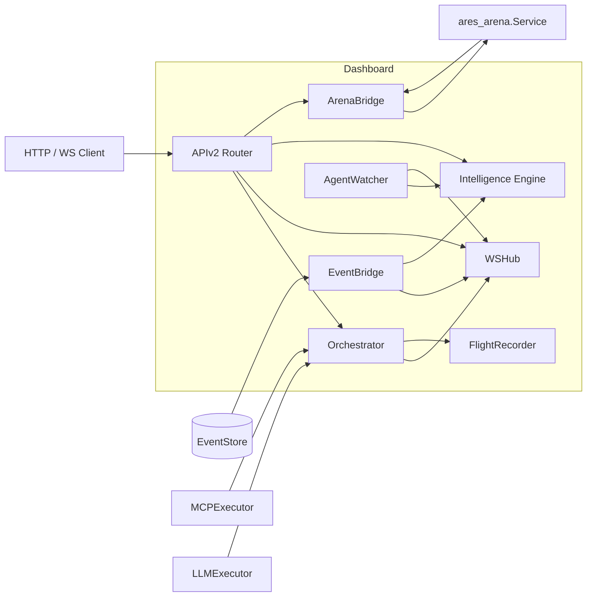

`dashboard` 包（`internal/dashboard`）是 ARES 运行时用于观察与操作的统一 Web
层。它通过 HTTP 与 WebSocket 暴露 v2 API，在后台运行用于打分 Agent 健康度并检测
异常的智能引擎，并将混沌竞技场与飞行记录器接入同一界面。

## 职责

- 提供监控 UI（`static/` 下内嵌的静态资源）以及面向 Agent、MCP 服务器、竞技场
  混沌动作、飞行记录器数据和系统健康的 JSON API。
- 编排 Agent 生命周期：基于模板或自定义请求创建 Agent，依次执行 MCP 数据采集
  阶段与 LLM 分析阶段，并通过 WebSocket 广播进度。
- 计算单 Agent 与系统级健康分数，检测重启/错误/延迟异常，并输出可操作的洞察。
- 通过 `EventBridge` 将运行时事件从事件存储转发到 WebSocket 订阅者与智能引擎。
- 将 `ares_arena` 服务适配为仪表盘的 `ArenaProvider` 与 `SurvivalProvider`
  接口，混沌端点受 API Key 鉴权保护。

## 架构图



`APIv2` 结构体是唯一的路由器。它挂载 agent、mcp、websocket、arena、flight 与
intelligence 路由，并转发由装配层提供的预构建服务 mux（eval、memory、
retrieval）。`Orchestrator` 在后台 goroutine 中运行 Agent 并通过 `WSHub` 上报
进度。`EventBridge` 订阅事件存储，将事件分发到 hub 与 `Engine`。
`AgentWatcher` 按时轮询引擎并主动推送健康快照。`ArenaBridge` 包装
`ares_arena.Service`。

## 外部接口

以下抽象接口由调用方实现并注入仪表盘，签名均从源码中逐字提取。

```go
// AgentProvider abstracts agent listing for the dashboard.
type AgentProvider interface {
    ListAgents() []AgentInfo
    GetAgent(id string) (*AgentInfo, bool)
}

// MCPStatusProvider abstracts MCP status for the dashboard.
type MCPStatusProvider interface {
    ListServers() []MCPServerStatusView
}

// MCPExecutor abstracts MCP tool calls for the orchestrator.
type MCPExecutor interface {
    CallTool(ctx context.Context, name string, args map[string]any) (*MCPToolResult, error)
    ListTools(ctx context.Context) ([]MCPToolInfo, error)
}

// LLMExecutor abstracts LLM calls for the orchestrator.
type LLMExecutor interface {
    Generate(ctx context.Context, prompt string) (string, error)
}

// StreamLLMExecutor is an optional extension of LLMExecutor that supports streaming.
type StreamLLMExecutor interface {
    GenerateStream(ctx context.Context, prompt string) (<-chan StreamChunk, error)
}

// ArenaProvider abstracts the arena service for the dashboard.
type ArenaProvider interface {
    Execute(action ArenaAction) ArenaResult
    Stats() map[string]any
    History() []ArenaResult
}

// SurvivalProvider abstracts survival mode for the dashboard.
type SurvivalProvider interface {
    GetSurvivalStatus() map[string]any
    GetResilienceScore() map[string]any
}

// SurvivalStarter is an optional extension of SurvivalProvider that can start a run.
type SurvivalStarter interface {
    StartSurvival(ctx context.Context) error
}

// AgentLister provides the list of known agent IDs for auto-discovery.
type AgentLister interface {
    ListAgentIDs() []string
}
```

## 关键类型与方法

| 类型 | 用途 | 关键方法 |
|------|------|----------|
| `APIv2` | 统一仪表盘 API 路由器 | `NewAPIv2`, `Handler`, `MountGinRoutes`, `SetArena`, `SetSurvival`, `SetIntelligence`, `SetEvalMux`, `SetMemoryMux`, `SetRetrievalMux`, `SetAPIKey` |
| `Orchestrator` | 管理 Agent 创建、执行与复活 | `NewOrchestrator`, `CreateAgent`, `GetAgent`, `CancelAgent`, `ListAgents`, `SetHub`, `SetEventStore`, `SetFlightRecorder`, `SetTemplates`, `SetToolAliases`, `Stop` |
| `WSHub` | 基于 channel 的 WebSocket pub/sub hub | `NewWSHub`, `Run`, `Stop`, `BroadcastToChannel`, `BroadcastAll`, `Register`, `Unregister`, `ClientCount`, `ChannelCount` |
| `WSClient` | 单个 WebSocket 连接 | `NewWSClient`, `Subscribe`, `Unsubscribe`, `Start`, `Wait`, `ReadPump`, `WritePump` |
| `Engine` | 健康度与异常智能引擎 | `NewEngine`, `ObserveAgentEvent`, `Health`, `AllHealth`, `SystemHealth`, `Anomalies`, `ResolveAnomaly`, `Insights`, `AcknowledgeInsight`, `OnInsight` |
| `EventBridge` | 将事件转发到 hub 与引擎 | `NewEventBridge`, `Start`, `Stop` |
| `ArenaBridge` | 将 `ares_arena.Service` 适配为仪表盘 provider | `NewArenaBridge`, `Execute`, `Stats`, `History`, `GetSurvivalStatus`, `GetResilienceScore` |
| `AgentWatcher` | 主动健康推送器 | `NewAgentWatcher`, `Start` |
| `AgentResult` | Agent 运行的完整结果 | （结构体，含 `ID`, `Status`, `Progress`, `Analysis`, `ResurrectionCnt`） |
| `HealthScore` | 某时刻的健康评估 | （结构体，含 `Level`, `Score`, `Latency`, `ErrorRate`, `Uptime`） |
| `Anomaly` | 异常事件模式 | （结构体，含 `Severity`, `Category`, `Count`, `Resolved`） |
| `Insight` | 可操作的观察 | （结构体，含 `Severity`, `SuggestedAction`, `Acknowledged`） |

## 模块协作

- **ares_events**：`Orchestrator` 通过 `ares_events.MemoryEventStore` 发射
  生命周期事件；`EventBridge` 订阅任意 `ares_events.EventStore` 并转发到 hub
  与引擎。
- **ares_flight**：`Orchestrator.SetFlightRecorder` 挂载
  `flight.FlightRecorder`；编排器在 Agent 运行期间记录时间线事件、工具决策与
  失败诊断。
- **ares_arena**：`ArenaBridge` 包装 `ares_arena.Service`，将 `ArenaAction`
  转换为 `ares_arena.Action` 并暴露生存指标。
- **mcp**：`MCPExecutor` 与 `MCPStatusProvider` 由 MCP 管理器实现，供编排器与
  MCP 路由使用。
- **llm**：`LLMExecutor`（可选 `StreamLLMExecutor`）驱动分析阶段；流式分块通过
  WebSocket 按 Agent 广播。
- **ares_observability**：`RegisterMetricsRouter` 在仪表盘 mux 上挂载 Prometheus
  指标端点。

## 扩展方式

1. 实现 `MCPExecutor` 与 `LLMExecutor`（可选 `StreamLLMExecutor`），传入
   `NewOrchestrator` 以接入自定义工具与模型后端。
2. 实现 `AgentProvider` 或 `AgentLister`，使仪表盘与 `AgentWatcher` 能从你的
   运行时枚举存活 Agent。
3. 实现 `MCPStatusProvider` 以在 `/mcp` 下暴露 MCP 服务器状态。
4. 实现 `ArenaProvider` 与 `SurvivalProvider`（可选 `SurvivalStarter`），通过
   `SetArena` / `SetSurvival` 挂载以添加混沌端点；调用 `SetAPIKey` 对破坏性路由
   启用 Bearer 鉴权。
5. 为 eval、memory 或 retrieval 服务构建 `*http.ServeMux`，通过 `SetEvalMux`、
   `SetMemoryMux` 或 `SetRetrievalMux` 挂载；路由将转发到
   `/api/v1/{eval,sessions,knowledge}/*`。
6. 通过 `Orchestrator.SetFlightRecorder` 挂载 `FlightRecorder`，以在 Agent 执行
   期间采集时间线、决策与诊断数据。
7. 通过 `EngineConfig` 阈值（`MaxRestartsPerMin`、`MaxErrorRate`、
   `LatencyThreshold` 及冷却时间）配置智能引擎，并注册 `OnInsight` 回调实现
   自定义告警。

## 双语状态

本页同时维护英文与中文版本，技术内容一致。两个译本中代码标识符、类型名与 HTTP
路由均保持英文。

## 成熟度

Production。该包拥有完整的测试（`api_test.go`、`orchestrator_test.go`、
`event_bridge_test.go`、`ws_hub_test.go`、`service_test.go`），通过
`MountGinRoutes` 与内嵌静态控制台接入 SDK 入口，且不含实验性标记。


