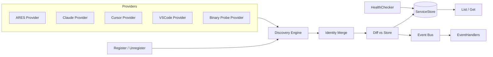

The `discovery` package provides service discovery for ARES across two layers:
the internal engine (`internal/discovery`) and the public API
(`api/discovery`). It finds MCP and other services from multiple sources, merges
duplicate observations into stable identities, verifies health, and emits
events so the runtime can react to service changes.

## Responsibility

- Run active discovery through pluggable `DiscoveryProvider` implementations
  (ARES registry, Claude, Cursor, VSCode config files, and PATH binary probe).
- Merge records from multiple sources into a single `DiscoveredService` keyed
  by a normalized endpoint, picking the highest-confidence record as the best
  source.
- Verify service health via `HealthChecker` (MCP connect + `list_tools`
  handshake) and persist results through a pluggable `ServiceStore`.
- Support passive registration, unregistration, and tag updates that emit the
  same lifecycle events as active discovery.
- Emit `EventServiceAdded`, `EventServiceUpdated`, `EventServiceRemoved`,
  `EventHealthChanged`, and `EventDiscoveryComplete` events to registered
  handlers.
- Run periodic auto-discovery with concurrent provider execution and bounded
  health checking.

## Architecture



The `Engine` collects records from all providers concurrently using an
`errgroup`, stamps each record with `LastSeen`, then merges them by normalized
endpoint. The merged set is diffed against the store to compute added, updated,
and removed services; each change is persisted and emitted as an event. The
public `api/discovery.Engine` wraps the internal engine, registers the default
providers, and re-exports the types and constants.

## External interfaces

These interfaces are the extension points of the discovery engine. Signatures
are extracted verbatim from `internal/discovery/discovery.go` and
`internal/discovery/events.go`.

```go
// DiscoveryProvider finds services from a specific source.
type DiscoveryProvider interface {
    Name() string
    Confidence() Confidence
    Discover(ctx context.Context) ([]DiscoveryRecord, error)
}

// HealthChecker verifies if a discovered service is available.
type HealthChecker interface {
    CheckHealth(ctx context.Context, svc *DiscoveredService) (*HealthStatus, error)
}

// ServiceStore persists discovered services.
type ServiceStore interface {
    Save(ctx context.Context, svc *DiscoveredService) error
    Get(ctx context.Context, id string) (*DiscoveredService, error)
    List(ctx context.Context) ([]*DiscoveredService, error)
    Delete(ctx context.Context, id string) error
}

// EventHandler processes discovery events.
type EventHandler interface {
    HandleDiscoveryEvent(evt Event)
}

// EventHandlerFunc is a function adapter for EventHandler.
type EventHandlerFunc func(Event)
```

## Key types and methods

| Type | Purpose | Key methods |
|------|---------|-------------|
| `Engine` (internal) | Orchestrates the discovery lifecycle | `NewEngine`, `AddProvider`, `AddHandler`, `DiscoverNow`, `CheckHealth`, `StartAutoDiscovery`, `List`, `Get`, `Register`, `Unregister`, `UpdateTags` |
| `Engine` (api) | Public handle wrapping the internal engine | `NewEngine`, `Start`, `DiscoverNow`, `CheckHealth`, `Register`, `Unregister`, `UpdateTags`, `List`, `Get`, `OnEvent`, `AddProvider` |
| `DiscoveredService` | Merged result of discovery records | (struct with `Identity`, `Records`, `Healthy`, `HealthMsg`, `BestSource`, `CheckedAt`) |
| `ServiceIdentity` | Stable identity of a service | (struct with `ID`, `Name`, `Type`, `Endpoint`, `Tags`, `Metadata`) |
| `DiscoveryRecord` | Single observation from one source | (struct with `Source`, `Confidence`, `Endpoint`, `Args`, `Tags`, `LastSeen`) |
| `HealthStatus` | Result of a health check | (struct with `Healthy`, `Message`, `Latency`, `CheckedAt`) |
| `Event` | Emitted when something changes | (struct with `Type`, `ServiceID`, `Service`, `Source`, `Message`, `Timestamp`) |
| `MemoryStore` | In-memory `ServiceStore` for dev/test | `NewMemoryStore`, `Save`, `Get`, `List`, `Delete` |
| `MCPHealthChecker` | Health checker for MCP services | `NewMCPHealthChecker`, `CheckHealth` |
| `FilesystemProvider` | Scans config files (Claude/Cursor/VSCode/ARES) | `NewClaudeProvider`, `NewCursorProvider`, `NewVSCodeProvider`, `NewARESProvider` |
| `BinaryProbeProvider` | Probes PATH binaries for MCP markers | `NewBinaryProbeProvider` |
| `RegisterRequest` | Input for passive registration | (struct with `Name`, `Endpoint`, `Args`, `Tags`, `Metadata`, `Confidence`) |
| `UpdateTagsRequest` | Tag add/remove mutation | (struct with `Add`, `Remove`) |

## Module collaboration

- **api/mcp**: `MCPHealthChecker` uses `api_mcp.ConnectSSE` and
  `api_mcp.ConnectStdio` to perform the initialize -> list_tools -> close
  handshake during health checks.
- **internal/errors**: `MemoryStore.Get` returns `apperrors.ErrNotFound` when a
  service is missing; `UpdateTags` checks `errors.Is(err, ErrNotFound)`.
- **internal/logger**: both `discovery` and `discovery.providers` packages
  obtain a structured logger via `logger.Module`.
- **ares_events / runtime**: discovery events feed consumers that react to
  service additions, removals, and health transitions.

## Extension points

1. Implement `DiscoveryProvider` (with `Name`, `Confidence`, and `Discover`)
   and register it through `api/discovery.Engine.AddProvider` or
   `internal.Engine.AddProvider` to scan a new source.
2. Implement `ServiceStore` (for example a SQLite-backed store) and pass it via
   `EngineConfig.Store` to `api/discovery.NewEngine`; the default is
   `MemoryStore`.
3. Implement `HealthChecker` and pass it via `EngineConfig.Health` to skip or
   customize health verification. The built-in `MCPHealthChecker` connects and
   lists tools with a configurable timeout.
4. Subscribe to changes by registering a callback via `Engine.OnEvent` (api) or
   `Engine.AddHandler` with an `EventHandlerFunc` (internal) to persist events
   to a database or trigger runtime actions.
5. Use passive registration (`Engine.Register` / `Unregister` /
   `UpdateTags`) for services that self-announce, which emit the same events
   as active discovery.
6. Tune auto-discovery by calling `Engine.Start(ctx, interval)`; the engine
   runs an immediate cycle, then periodically re-runs discovery and health
   checks until the context is cancelled.

## Bilingual status

This page is maintained in both English and Chinese with identical technical
content. Code identifiers, type names, and event constants remain in English in
both translations.

## Maturity

Production. The package has tests for the engine, events, health, identity
merge, store, and both providers (`engine_test.go`, `events_test.go`,
`health_test.go`, `identity_test.go`, `store_test.go`, `providers/*_test.go`,
`api/discovery/discovery_test.go`), ships a stable public API in
`api/discovery`, and carries no experimental markers.


