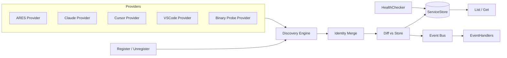

`discovery` 包在两个层面为 ARES 提供服务发现：内部引擎（`internal/discovery`）与
公开 API（`api/discovery`）。它从多种来源发现 MCP 及其他服务，将重复观测合并为
稳定身份，校验健康并发射事件，使运行时能对服务变化作出响应。

## 职责

- 通过可插拔的 `DiscoveryProvider` 实现（ARES registry、Claude、Cursor、VSCode
  配置文件及 PATH 二进制探测）执行主动发现。
- 将来自多源的记录按归一化端点合并为单个 `DiscoveredService`，选取置信度最高的
  记录作为最佳来源。
- 通过 `HealthChecker`（MCP connect + `list_tools` 握手）校验服务健康，并通过
  可插拔的 `ServiceStore` 持久化结果。
- 支持被动注册、注销与标签更新，这些操作与主动发现发射相同的生命周期事件。
- 向已注册的 handler 发射 `EventServiceAdded`、`EventServiceUpdated`、
  `EventServiceRemoved`、`EventHealthChanged` 与 `EventDiscoveryComplete` 事件。
- 以并发 provider 执行与有界健康检查运行周期性自动发现。

## 架构图



`Engine` 使用 `errgroup` 并发收集所有 provider 的记录，为每条记录盖上
`LastSeen`，然后按归一化端点合并。合并结果与存储做 diff，计算新增、更新与移除的
服务；每个变更被持久化并以事件形式发射。公开的 `api/discovery.Engine` 包装内部
引擎，注册默认 provider，并重新导出类型与常量。

## 外部接口

以下接口是发现引擎的扩展点，签名均从 `internal/discovery/discovery.go` 与
`internal/discovery/events.go` 中逐字提取。

```go
// DiscoveryProvider finds services from a specific source.
type DiscoveryProvider interface {
    Name() string
    Confidence() Confidence
    Discover(ctx context.Context) ([]DiscoveryRecord, error)
}

// HealthChecker verifies if a discovered service is available.
type HealthChecker interface {
    CheckHealth(ctx context.Context, svc *DiscoveredService) (*HealthStatus, error)
}

// ServiceStore persists discovered services.
type ServiceStore interface {
    Save(ctx context.Context, svc *DiscoveredService) error
    Get(ctx context.Context, id string) (*DiscoveredService, error)
    List(ctx context.Context) ([]*DiscoveredService, error)
    Delete(ctx context.Context, id string) error
}

// EventHandler processes discovery events.
type EventHandler interface {
    HandleDiscoveryEvent(evt Event)
}

// EventHandlerFunc is a function adapter for EventHandler.
type EventHandlerFunc func(Event)
```

## 关键类型与方法

| 类型 | 用途 | 关键方法 |
|------|------|----------|
| `Engine`（internal） | 编排发现生命周期 | `NewEngine`, `AddProvider`, `AddHandler`, `DiscoverNow`, `CheckHealth`, `StartAutoDiscovery`, `List`, `Get`, `Register`, `Unregister`, `UpdateTags` |
| `Engine`（api） | 包装内部引擎的公开句柄 | `NewEngine`, `Start`, `DiscoverNow`, `CheckHealth`, `Register`, `Unregister`, `UpdateTags`, `List`, `Get`, `OnEvent`, `AddProvider` |
| `DiscoveredService` | 发现记录的合并结果 | （结构体，含 `Identity`, `Records`, `Healthy`, `HealthMsg`, `BestSource`, `CheckedAt`） |
| `ServiceIdentity` | 服务的稳定身份 | （结构体，含 `ID`, `Name`, `Type`, `Endpoint`, `Tags`, `Metadata`） |
| `DiscoveryRecord` | 来自单个来源的一次观测 | （结构体，含 `Source`, `Confidence`, `Endpoint`, `Args`, `Tags`, `LastSeen`） |
| `HealthStatus` | 健康检查结果 | （结构体，含 `Healthy`, `Message`, `Latency`, `CheckedAt`） |
| `Event` | 发生变更时发射 | （结构体，含 `Type`, `ServiceID`, `Service`, `Source`, `Message`, `Timestamp`） |
| `MemoryStore` | 用于开发/测试的内存 `ServiceStore` | `NewMemoryStore`, `Save`, `Get`, `List`, `Delete` |
| `MCPHealthChecker` | MCP 服务的健康检查器 | `NewMCPHealthChecker`, `CheckHealth` |
| `FilesystemProvider` | 扫描配置文件（Claude/Cursor/VSCode/ARES） | `NewClaudeProvider`, `NewCursorProvider`, `NewVSCodeProvider`, `NewARESProvider` |
| `BinaryProbeProvider` | 探测 PATH 中的二进制以发现 MCP 标记 | `NewBinaryProbeProvider` |
| `RegisterRequest` | 被动注册的输入 | （结构体，含 `Name`, `Endpoint`, `Args`, `Tags`, `Metadata`, `Confidence`） |
| `UpdateTagsRequest` | 标签增删变更 | （结构体，含 `Add`, `Remove`） |

## 模块协作

- **api/mcp**：`MCPHealthChecker` 在健康检查期间使用 `api_mcp.ConnectSSE` 与
  `api_mcp.ConnectStdio` 执行 initialize -> list_tools -> close 握手。
- **internal/errors**：`MemoryStore.Get` 在服务缺失时返回
  `apperrors.ErrNotFound`；`UpdateTags` 使用 `errors.Is(err, ErrNotFound)` 判断。
- **internal/logger**：`discovery` 与 `discovery.providers` 包均通过
  `logger.Module` 获取结构化 logger。
- **ares_events / runtime**：发现事件供消费方对服务新增、移除与健康状态变化作出
  响应。

## 扩展方式

1. 实现 `DiscoveryProvider`（含 `Name`、`Confidence` 与 `Discover`），通过
   `api/discovery.Engine.AddProvider` 或 `internal.Engine.AddProvider` 注册以扫描
   新来源。
2. 实现 `ServiceStore`（例如基于 SQLite 的存储），通过 `EngineConfig.Store`
   传入 `api/discovery.NewEngine`；默认为 `MemoryStore`。
3. 实现 `HealthChecker`，通过 `EngineConfig.Health` 传入以跳过或自定义健康校验。
   内置 `MCPHealthChecker` 以可配置超时进行连接并列出工具。
4. 通过 `Engine.OnEvent`（api）或 `Engine.AddHandler` 配合 `EventHandlerFunc`
   （internal）注册回调订阅变更，将事件持久化到数据库或触发运行时动作。
5. 对自宣告的服务使用被动注册（`Engine.Register` / `Unregister` /
   `UpdateTags`），它们会发射与主动发现相同的事件。
6. 通过调用 `Engine.Start(ctx, interval)` 调整自动发现；引擎会先执行一次即时
   周期，然后周期性重跑发现与健康检查，直到 context 被取消。

## 双语状态

本页同时维护英文与中文版本，技术内容一致。两个译本中代码标识符、类型名与事件常量
均保持英文。

## 成熟度

Production。该包对引擎、事件、健康、身份合并、存储及两个 provider 均有测试
（`engine_test.go`、`events_test.go`、`health_test.go`、`identity_test.go`、
`store_test.go`、`providers/*_test.go`、`api/discovery/discovery_test.go`），在
`api/discovery` 提供稳定的公开 API，且不含实验性标记。


