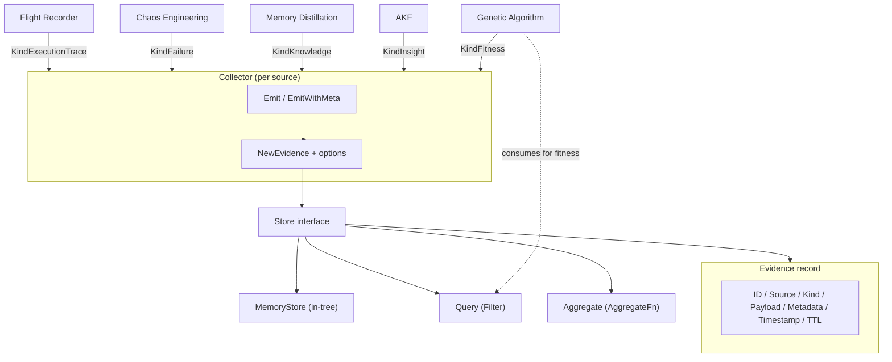

# evidence

## Responsibility

The `evidence` package (Go import path `internal/evidence`, package name
`evidence`) provides the universal data primitive that every ARES subsystem
produces and consumes. Evidence is explicitly NOT a metric: it carries
arbitrary structured payloads classified by `Kind`, with `Source` identifying
the producer.

The package defines three concerns:

- **Evidence record** - the `Evidence` struct (ID, Source, Kind, Payload,
  Metadata, Timestamp, TTL) is the canonical unit produced by Flight Recorder,
  Chaos Engineering, Memory Distillation, AKF, and the Genetic Algorithm (GA).
- **Store contract** - the `Store` interface (`Append`, `Query`, `Aggregate`)
  persists and queries evidence. `MemoryStore` is the in-tree reference
  implementation.
- **Collection helper** - the `Collector` wraps a `Store` with type-safe
  `Emit` / `EmitWithMeta` helpers so subsystems produce evidence without
  touching `json.RawMessage` directly.

The five evidence kinds map one-to-one to producing subsystems: Flight Recorder
emits `execution_trace`, Chaos emits `failure`, Memory emits `knowledge`, AKF
emits `insight`, and GA emits `fitness`. The GA consumes evidence to compute
fitness.

## Architecture



## External interfaces

Signatures are extracted verbatim from source.

```go
// Store persists and queries evidence.
type Store interface {
    Append(ctx context.Context, e Evidence) error
    Query(ctx context.Context, filter Filter) ([]Evidence, error)
    Aggregate(ctx context.Context, filter Filter, fn AggregateFn) (float64, error)
}

// Constructors and helpers.
func NewMemoryStore() *MemoryStore
func NewEvidence(source string, kind EvidenceKind, payload any, opts ...EvidenceOption) Evidence
func NewCollector(store Store, source string) *Collector

// Collector methods.
func (c *Collector) Emit(ctx context.Context, kind EvidenceKind, payload any, opts ...EvidenceOption) error
func (c *Collector) EmitWithMeta(ctx context.Context, kind EvidenceKind, payload any, keysAndValues ...string) error

// Options.
func WithMetadata(key, value string) EvidenceOption
func WithTTL(ttl time.Duration) EvidenceOption
func WithID(id string) EvidenceOption

// AggregateFn computes a single float64 from a slice of float64 values.
type AggregateFn func(values []float64) float64
```

## Key types and methods

| Type / Method | Kind | Purpose |
| --- | --- | --- |
| `Evidence` | struct | Universal record: ID, Source, Kind, Payload (json.RawMessage), Metadata, Timestamp, TTL. |
| `EvidenceKind` | type | String enum: execution_trace, failure, knowledge, insight, fitness. |
| `KindExecutionTrace` | const | Flight Recorder evidence. |
| `KindFailure` | const | Chaos Engineering evidence. |
| `KindKnowledge` | const | Memory Distillation evidence. |
| `KindInsight` | const | AKF evidence. |
| `KindFitness` | const | Genetic Algorithm evidence. |
| `Store` | interface | 3-method contract: Append, Query, Aggregate. |
| `MemoryStore` | struct | In-memory reference implementation; thread-safe via `sync.RWMutex`. |
| `Filter` | struct | Query criteria: Source, Kind, Since, Until, Limit. |
| `AggregateFn` | type | Function over `[]float64` producing a single metric. |
| `Collector` | struct | Convenience wrapper binding a `Store` to a `source` label. |
| `NewEvidence` | function | Canonical constructor; auto-generates ID and timestamp, marshals payload. |
| `EvidenceOption` | type | Functional option for `NewEvidence` (metadata, TTL, ID). |
| `WithMetadata` | function | Adds a key-value pair to evidence metadata. |
| `WithTTL` | function | Sets the retention duration; zero means no expiry. |
| `WithID` | function | Overrides the auto-generated evidence ID. |

## Module collaboration

- **ares_memory** - the production memory manager accepts an `EvidenceCollector`
  (a locally-defined narrow interface matching `Collector.Emit`) to emit memory
  lifecycle evidence.
- **knowledge** - `KnowledgeRuntime.WithEvidenceStore` wires an `evidence.Store`;
  the runtime emits `KindInsight` evidence after each `Execute` run carrying
  goal, node count, edge count, and budget.
- **Genetic Algorithm** - GA consumes `KindFitness` (and other kinds) via
  `Store.Query` and `Store.Aggregate` to compute fitness for evolution.
- **Flight Recorder / Chaos** - produce `KindExecutionTrace` and `KindFailure`
  evidence respectively, feeding the same store.

## Extension points

1. **Add a persistent store backend.** Implement the 3-method `Store` interface
   (`Append`, `Query`, `Aggregate`) against your database. `MemoryStore` is the
   reference shape: `Append` appends under a write lock, `Query` filters by
   Source/Kind/Since/Until under a read lock, `Aggregate` extracts float64
   values from each matching payload and applies the caller's `AggregateFn`.
2. **Emit evidence from a new subsystem.** Construct a `Collector` via
   `NewCollector(store, "your_source")`, then call `Emit` or `EmitWithMeta`
   with one of the five `EvidenceKind` constants. When `store` is nil, `Emit`
   is a silent no-op, so callers need not guard against missing stores.
3. **Add a custom evidence kind.** Define a new `EvidenceKind` string constant
   and document its producer; `Filter.Kind` and `Query` already accept any
   `EvidenceKind` value without code changes.
4. **Aggregate a custom metric.** Pass an `AggregateFn` (e.g. mean, max, p95)
   to `Store.Aggregate` along with a `Filter`. The store extracts float64 from
   each matching payload via JSON unmarshalling before invoking your function.
5. **Attach metadata for downstream filtering.** Use `WithMetadata` (or
   `EmitWithMeta` key-value pairs) so consumers can correlate evidence by
   task ID, session ID, or tenant.

## Bilingual status

Source code, identifiers, type names, and code comments are in English. This
English page is the canonical reference. A Chinese translation with identical
structure and technical content is published alongside as `evidence.zh.md`;
all code blocks, signatures, and identifiers remain in English in both pages.

## Maturity

Beta. The package is functional and covered by `evidence_test.go`, which
exercises every `EvidenceKind` constant, `MemoryStore` Append/Query/Aggregate,
and the `Collector` helpers. The `Store` interface is stable, but the package
is still evolving its aggregation and persistence story (only an in-memory
backend ships in-tree), so it is classified Beta rather than Production.


