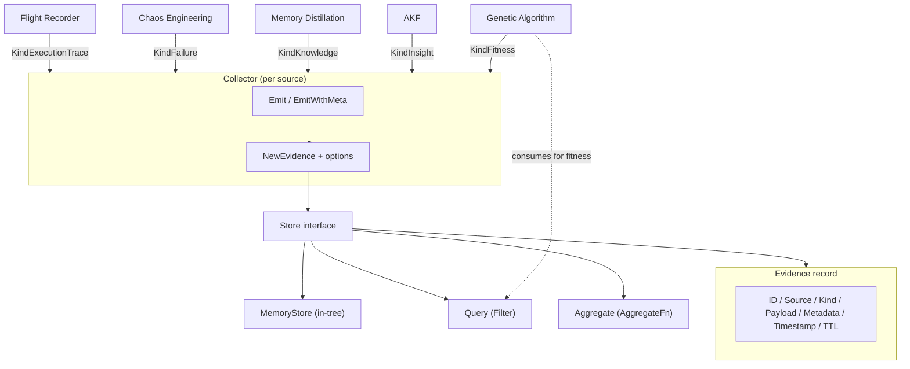

# evidence

## 职责

`evidence` 包（Go 导入路径 `internal/evidence`，包名 `evidence`）提供 ARES 所有子系统
产生与消费的通用数据原语。证据明确不是指标：它携带按 `Kind` 分类的任意结构化 payload，
由 `Source` 标识生产者。

该包定义三类关注点：

- **证据记录** —— `Evidence` 结构体（ID、Source、Kind、Payload、Metadata、Timestamp、TTL）
  是 Flight Recorder、Chaos Engineering、Memory Distillation、AKF 与遗传算法（GA）产出的标准单元。
- **存储契约** —— `Store` 接口（`Append`、`Query`、`Aggregate`）负责持久化与查询证据。
  `MemoryStore` 是包内自带的参考实现。
- **采集助手** —— `Collector` 以类型安全的 `Emit` / `EmitWithMeta` 包装 `Store`，使子系统
  无需直接处理 `json.RawMessage` 即可产出证据。

五种证据类型与生产子系统一一对应：Flight Recorder 产出 `execution_trace`，Chaos 产出
`failure`，Memory 产出 `knowledge`，AKF 产出 `insight`，GA 产出 `fitness`。GA 消费证据以
计算适应度。

## 架构图



## 外部接口

下列签名均逐字取自源码。

```go
// Store persists and queries evidence.
type Store interface {
    Append(ctx context.Context, e Evidence) error
    Query(ctx context.Context, filter Filter) ([]Evidence, error)
    Aggregate(ctx context.Context, filter Filter, fn AggregateFn) (float64, error)
}

// Constructors and helpers.
func NewMemoryStore() *MemoryStore
func NewEvidence(source string, kind EvidenceKind, payload any, opts ...EvidenceOption) Evidence
func NewCollector(store Store, source string) *Collector

// Collector methods.
func (c *Collector) Emit(ctx context.Context, kind EvidenceKind, payload any, opts ...EvidenceOption) error
func (c *Collector) EmitWithMeta(ctx context.Context, kind EvidenceKind, payload any, keysAndValues ...string) error

// Options.
func WithMetadata(key, value string) EvidenceOption
func WithTTL(ttl time.Duration) EvidenceOption
func WithID(id string) EvidenceOption

// AggregateFn computes a single float64 from a slice of float64 values.
type AggregateFn func(values []float64) float64
```

## 关键类型与方法

| 类型 / 方法 | 类别 | 用途 |
| --- | --- | --- |
| `Evidence` | struct | 通用记录：ID、Source、Kind、Payload（json.RawMessage）、Metadata、Timestamp、TTL。 |
| `EvidenceKind` | type | 字符串枚举：execution_trace、failure、knowledge、insight、fitness。 |
| `KindExecutionTrace` | const | Flight Recorder 证据。 |
| `KindFailure` | const | Chaos Engineering 证据。 |
| `KindKnowledge` | const | Memory Distillation 证据。 |
| `KindInsight` | const | AKF 证据。 |
| `KindFitness` | const | 遗传算法证据。 |
| `Store` | interface | 3 方法契约：Append、Query、Aggregate。 |
| `MemoryStore` | struct | 内存参考实现；通过 `sync.RWMutex` 保证线程安全。 |
| `Filter` | struct | 查询条件：Source、Kind、Since、Until、Limit。 |
| `AggregateFn` | type | 对 `[]float64` 计算单一指标的函数。 |
| `Collector` | struct | 将 `Store` 绑定到某个 `source` 标签的便捷包装。 |
| `NewEvidence` | function | 标准构造函数；自动生成 ID 与时间戳，并序列化 payload。 |
| `EvidenceOption` | type | `NewEvidence` 的函数式选项（metadata、TTL、ID）。 |
| `WithMetadata` | function | 向证据 metadata 添加键值对。 |
| `WithTTL` | function | 设置保留时长；零值表示不过期。 |
| `WithID` | function | 覆盖自动生成的证据 ID。 |

## 模块协作

- **ares_memory** —— 生产版 memory manager 接受 `EvidenceCollector`（与
  `Collector.Emit` 匹配的本地窄接口），用于发射记忆生命周期证据。
- **knowledge** —— `KnowledgeRuntime.WithEvidenceStore` 注入 `evidence.Store`；runtime
  在每次 `Execute` 之后发射 `KindInsight` 证据，携带 goal、节点数、边数与预算。
- **遗传算法** —— GA 通过 `Store.Query` 与 `Store.Aggregate` 消费 `KindFitness`（及其他类型）
  以计算进化所需的适应度。
- **Flight Recorder / Chaos** —— 分别产出 `KindExecutionTrace` 与 `KindFailure` 证据，
  写入同一存储。

## 扩展方式

1. **新增持久化存储后端。** 针对你的数据库实现 3 方法的 `Store` 接口（`Append`、`Query`、
   `Aggregate`）。`MemoryStore` 是参考形态：`Append` 在写锁下追加，`Query` 在读锁下按
   Source/Kind/Since/Until 过滤，`Aggregate` 从每个匹配 payload 中提取 float64 再调用
   调用方传入的 `AggregateFn`。
2. **从新子系统发射证据。** 通过 `NewCollector(store, "your_source")` 构造 `Collector`，
   再用五种 `EvidenceKind` 常量之一调用 `Emit` 或 `EmitWithMeta`。当 `store` 为 nil 时，
   `Emit` 静默 no-op，调用方无需针对缺失存储做判空。
3. **新增自定义证据类型。** 定义新的 `EvidenceKind` 字符串常量并记录其生产者；`Filter.Kind`
   与 `Query` 已能接受任意 `EvidenceKind` 值，无需改动代码。
4. **聚合自定义指标。** 向 `Store.Aggregate` 传入 `AggregateFn`（如 mean、max、p95）与
   `Filter`。存储会先通过 JSON 反序列化从每个匹配 payload 提取 float64，再调用你的函数。
5. **附加 metadata 供下游过滤。** 使用 `WithMetadata`（或 `EmitWithMeta` 的键值对），使
   消费者能按 task ID、session ID 或租户关联证据。

## 双语状态

源码、标识符、类型名与代码注释均为英文，本英文页面为权威参考。中文译本以相同结构与同等
技术内容随附发布为 `evidence.zh.md`；两份页面中的所有代码块、签名与标识符均保持英文。

## 成熟度

Beta。该包功能完备，并由 `evidence_test.go` 覆盖，测试涉及每个 `EvidenceKind` 常量、
`MemoryStore` 的 Append/Query/Aggregate 以及 `Collector` 助手。`Store` 接口稳定，但包的
聚合与持久化方案仍在演进（包内仅自带内存后端），故归类为 Beta 而非 Production。


