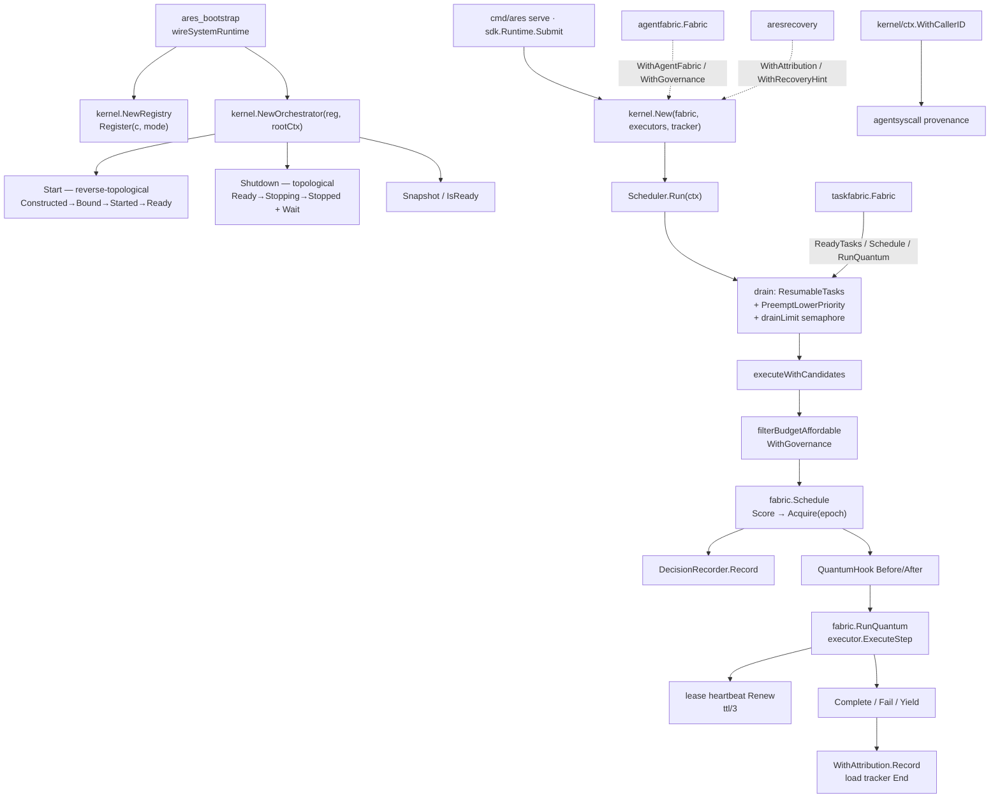

The `internal/kernel` package (package `kernel`) is the ARES **scheduling
kernel** and also hosts the **system-level control plane**. Per
`internal/kernel/doc.go`, it is the former `kernelscheduler`, `kernelctx`,
and `system_runtime` unified; package comments still describe the scheduling
role (`executor.go`) and the control-plane role (`component.go`) separately.

Kernel is the **only place scheduling decisions are made**: quantum-based
task draining (`Schedule → Acquire → RunQuantum`), executor registry and
scoring, load tracking, decision recording, and shadow hooks. It owns no
agents and stores no domain state — lifecycle lives in `agentfabric`, tasks
in `taskfabric`, services in `internal/runtime/`. Everything the kernel
needs arrives per quantum; everything it decides goes back as a routing
verdict.

The control-plane half (component `Registry`, dependency-aware
`TopologicalOrder`, `Orchestrator` lifecycle orchestration, `Snapshot` /
`IsReady`) is the former `system_runtime` package; `ares_bootstrap` wires it
once for serve/start/SDK. It is distinct from the `Manager` in
`internal/runtime` (agent lifecycle + plugin bus).

## Responsibility

- Run the quantum scheduling loop: `Scheduler.Run` periodically drains
  READY/SUSPENDED tasks from `taskfabric`; the path is capability-aware
  `Schedule` → lease `Acquire` → `RunQuantum` (one agent step) → finalize
  (`COMPLETED` / `FAILED` / `SUSPENDED`).
- Own the executor registry: static registration (`RegisterExecutor` /
  `RegisterExecutorIfAbsent`), recovery replacements bound per task
  (`RegisterExecutorForTask`), `LookupExecutor` / `HasCapableExecutor` /
  `Capabilities`; when a fabric is attached, live IDLE fabric agents join the
  candidate set (`WithAgentFabric`), and SDK hybrid mode keeps static and
  fabric pools side by side (`WithStaticPoolHybrid`).
- Maintain `LoadTracker`: in-flight load, per-agent/per-capability
  confidence overrides, priority; `TryBegin` / `End` for admission and
  settlement; `Snapshot` for observability.
- Enforce drain concurrency limits: `drainLimit()` (explicit
  `WithMaxConcurrent`, else max of static executor count and live fabric
  candidates; floor 1, cap 32).
- Keep lease heartbeats during a quantum: renew at `ttl/3` (minimum 5s) so
  long steps are not requeued by expiry.
- Record scheduling decisions: every `Schedule` appends to a bounded ring
  (`DecisionRecorder`, default 200) with candidate score breakdown and
  winner/epoch for the Scheduling Observatory.
- Provide observability extension points: `QuantumHook`
  (`BeforeQuantum` / `AfterQuantum`; hook errors are logged and never abort
  a quantum); non-blocking `WithRecoveryHint` for stale-winner recovery;
  `WithGovernance` for pre-quantum budget/deadline gates;
  `WithAttribution` for `aresrecovery.ExecutionAttribution`.
- Cooperative priority preemption: `PreemptLowerPriority` before a drain,
  at quantum boundaries, returning work to READY with checkpoint preserved.
- L2 graph integration: the L2 router peer enters the same scheduling loop
  via agentfabric; the hybrid pool cooperates with the `planprojection`
  compile path (compilation stays in the cmd layer, never inside kernel).
- Host the system control plane: `Component` / `Binder` / `Starter` /
  `ReadinessChecker` / `Stopper` / `Waiter` / `Resolver`, `Mode`,
  `Registry`, the `State` machine, `Orchestrator` (reverse-topological
  Start, topological Shutdown, `Adopt`, `Go` / `GoBackground`), and
  `Snapshot` / `IsReady`.
- Subpackage `internal/kernel/ctx`: stamps kernel-validated caller agent
  identity into context for `agentsyscall` and tool execution (provenance
  is never trusted from LLM-supplied arguments).
- Architecture red line: `architecture_test.go` forbids kernel from
  importing `internal/runtime` or `internal/fabric/task/workflow/engine` —
  adapters inject dependencies from `cmd/ares`, never the reverse.

## Architecture



## External interfaces

```go
package kernel

// --- Scheduler (sole scheduling site) ---

type Scheduler struct {
    PollInterval time.Duration // drain cadence; default 500ms
}
func New(fabric *taskfabric.Fabric, executors map[string]CapabilityExecutor, tracker *LoadTracker) *Scheduler
func (s *Scheduler) WithAttribution(a *aresrecovery.ExecutionAttribution) *Scheduler
func (s *Scheduler) WithAgentFabric(f *agentfabric.Fabric) *Scheduler
func (s *Scheduler) WithStaticPoolHybrid() *Scheduler
func (s *Scheduler) WithMaxConcurrent(n int) *Scheduler
func (s *Scheduler) WithTTL(ttl time.Duration) *Scheduler
func (s *Scheduler) WithEventStore(store ares_events.EventStore) *Scheduler
func (s *Scheduler) WithRecoveryHint(fn func(taskID string)) *Scheduler
func (s *Scheduler) WithGovernance(g *agentfabric.Fabric) *Scheduler
func (s *Scheduler) WithQuantumHook(h QuantumHook) *Scheduler
func (s *Scheduler) Run(ctx context.Context)          // drains until ctx done
func (s *Scheduler) Running() bool
func (s *Scheduler) Snapshot() SchedulerSnapshot
func (s *Scheduler) DecisionsSnapshot() []ScheduleDecision
func (s *Scheduler) RegisterExecutor(agentID string, executor CapabilityExecutor)
func (s *Scheduler) RegisterExecutorIfAbsent(agentID string, executor CapabilityExecutor) (CapabilityExecutor, bool)
func (s *Scheduler) RegisterExecutorForTask(taskID, agentID string, executor CapabilityExecutor)
func (s *Scheduler) UnregisterExecutor(agentID string)
func (s *Scheduler) LookupExecutor(agentID string) (CapabilityExecutor, bool)
func (s *Scheduler) HasCapableExecutor(taskID string) bool
func (s *Scheduler) HasStaticExecutorFor(capability string) bool
func (s *Scheduler) ExecutorCount() int
func (s *Scheduler) Capabilities() []string
func (s *Scheduler) PreemptLowerPriority(ready []string)
func (s *Scheduler) ToModelTask(tk *taskfabric.Task) *models.Task

// CapabilityExecutor is the minimal schedulable contract (identity,
// declared capability, one quantum). sub.Agent already satisfies it.
type CapabilityExecutor interface {
    ID() string
    Type() models.AgentType
    ExecuteStep(ctx context.Context, task *models.Task) (*sub.StepOutcome, error)
}

// QuantumHook is observational only: BeforeQuantum errors are logged and
// never abort a quantum; hooks must be non-blocking and concurrency-safe.
type QuantumHook interface {
    BeforeQuantum(ctx context.Context, taskID, agentID string) error
    AfterQuantum(ctx context.Context, taskID, agentID string, err error)
}

// --- Load tracking ---

type LoadTracker struct { /* mu-guarded stats maps */ }
func NewLoadTracker() *LoadTracker
func (t *LoadTracker) SetPriority(agentID string, priority float64)
func (t *LoadTracker) Priority(agentID string) float64
func (t *LoadTracker) Begin(agentID string)
func (t *LoadTracker) TryBegin(agentID string, maxLoad int) bool
func (t *LoadTracker) End(agentID string, success bool)
func (t *LoadTracker) EndNeutral(agentID string)
func (t *LoadTracker) Forget(agentID string)
func (t *LoadTracker) Load(agentID string) float64
func (t *LoadTracker) Confidence(agentID string) float64
func (t *LoadTracker) SetAgentConfidence(agentID string, confidence float64)
func (t *LoadTracker) SetCapabilityConfidence(agentID, capability string, confidence float64)
func (t *LoadTracker) ConfidenceFor(agentID, capability string) float64
func (t *LoadTracker) ConfidenceForMeasured(agentID, capability string) (float64, bool)
func (t *LoadTracker) Snapshot() LoadTrackerSnapshot

// --- Decision recording (Scheduling Observatory) ---

type CandidateScore struct {
    AgentID       string
    Capabilities  []string
    Overlap       float64
    Load          float64
    Confidence    float64
    PriorityBoost float64
    Score         float64
}
type ScheduleDecision struct {
    TaskID     string
    Capability string
    Candidates []CandidateScore
    Winner     string
    Epoch      uint64
    Time       time.Time
    Err        string // set when Schedule failed
}

// --- Component control plane (former system_runtime) ---

type Component interface {
    Name() string
    Dependencies() []string
}
type Binder interface {
    Bind(ctx context.Context, deps Resolver) error
}
type Starter interface {
    Start(ctx context.Context) error
}
type ReadinessChecker interface {
    Ready(ctx context.Context) error
}
type Stopper interface {
    Stop(ctx context.Context) error
}
type Waiter interface {
    Wait() error
}
type Resolver interface {
    Get(name string) any
}

type Mode int
const (
    ModeRequired Mode = iota
    ModeOptional
    ModeDegraded
)
func (m Mode) String() string

type State int
const (
    StateConstructed State = iota
    StateBound
    StateStarted
    StateReady
    StateDegraded
    StateFailed
    StateStopping
    StateStopped
    StateDisabled
)
func (s State) String() string
func (s State) IsHealthy() bool // Ready | Degraded

type ComponentStatus struct {
    Name       string
    Mode       Mode
    State      State
    Reason     string
    StartedAt  time.Time
    InstanceID string
}

type Registry struct { /* entries map + registration order */ }
func NewRegistry() *Registry
func (r *Registry) Register(c Component, mode Mode) error
func (r *Registry) Get(name string) any
func (r *Registry) GetComponent(name string) Component
func (r *Registry) GetMode(name string) (Mode, bool)
func (r *Registry) GetStatus(name string) (ComponentStatus, bool)
func (r *Registry) SetStatus(name string, status ComponentStatus)
func (r *Registry) UpdateStatus(name string, fn func(*ComponentStatus))
func (r *Registry) AllStatuses() []ComponentStatus
func (r *Registry) Names() []string
func (r *Registry) TopologicalOrder() ([]string, error) // Kahn; fail loud
func (r *Registry) IsReady() bool
func (r *Registry) Snapshot() Snapshot

type Orchestrator struct { /* reg, rootCtx, started, statuses */ }
func NewOrchestrator(reg *Registry, rootCtx context.Context) *Orchestrator
func (o *Orchestrator) Start(ctx context.Context) error
func (o *Orchestrator) Shutdown(ctx context.Context) error
func (o *Orchestrator) Adopt(ctx context.Context, c Component, mode Mode) error
func (o *Orchestrator) Go(fn func() error)
func (o *Orchestrator) GoBackground(name string, fn func(ctx context.Context) error)
func (o *Orchestrator) SetEventSink(store ares_events.EventStore)
func (o *Orchestrator) Snapshot() Snapshot
func (o *Orchestrator) RootContext() context.Context
func (o *Orchestrator) Cancel()

type Snapshot struct {
    TakenAt    time.Time
    Components []ComponentStatus
    Summary    SnapshotSummary
}
type SnapshotSummary struct {
    Total, Ready, Degraded, Failed, Disabled, Stopped int
}
func (s Snapshot) JSON() ([]byte, error)

type SchedulerSnapshot struct { /* PollInterval, MaxConcurrent, ... */ }

// --- Kernel context (subpackage internal/kernel/ctx) ---

// package ctx
func WithCallerID(ctx context.Context, agentID string) context.Context
func CallerID(ctx context.Context) string

// --- Sentinels ---

var ErrNilStepOutcome // executor returned nil step outcome
var ErrShuttingDown   // orchestrator is shutting down
```

## Key types and methods

| Type / method | Purpose |
| --- | --- |
| `Scheduler` / `New` | Sole scheduling site; binds a `taskfabric.Fabric`, executor map, and optional shared `LoadTracker`. |
| `Scheduler.Run` | Drain loop: `ResumableTasks` → preemption → concurrent `execute` under `drainLimit`. |
| `CapabilityExecutor` | Consumer-side minimal schedulable contract (`ID` / `Type` / `ExecuteStep`); `sub.Agent` already satisfies it. |
| `RegisterExecutor*` / `LookupExecutor` | Static and per-task recovery-replacement executor registry. |
| `WithAgentFabric` / `WithStaticPoolHybrid` | Peer mode (fabric as candidate source) and SDK hybrid pool. |
| `drainLimit` (via `WithMaxConcurrent`) | Per-drain concurrency cap: explicit value or max(static, fabric IDLE), ∈[1,32]. |
| `WithTTL` | Lease duration (default 5m); heartbeat renew at `ttl/3` during a quantum. |
| `WithGovernance` | Pre-quantum budget/deadline filter (`filterBudgetAffordable`) to avoid acquire/release livelock. |
| `WithRecoveryHint` | Non-blocking stale-winner hint so `aresrecovery` can sweep now. |
| `WithQuantumHook` | Observational quantum-boundary hook; errors are logged only. |
| `LoadTracker` | load/confidence/priority tracking and admission (`TryBegin`/`End`). |
| `DecisionRecorder` / `ScheduleDecision` | Bounded ring explaining *why* a task was assigned to an agent. |
| `Component` + companions | Managed component identity, deps, bind, start, readiness, stop, drain. |
| `Mode` | `ModeRequired` / `ModeOptional` / `ModeDegraded`. |
| `Registry` / `TopologicalOrder` | Component registry; Kahn topological order; fail loud on cycle/unregistered dep. |
| `Orchestrator` | Reverse-topological Start, topological Shutdown, mid-boot rollback, `Adopt`, managed background work. |
| `State` / `ComponentStatus` / `Snapshot` | Lifecycle state machine and status data plane; `IsReady` aggregates readiness. |
| `kernel/ctx.CallerID` | Read the kernel-stamped caller agent from context (syscall provenance). |

## Module collaboration

- `kernel` -> `internal/fabric/task` (`taskfabric`): `ResumableTasks` /
  `Schedule` / `Acquire` / `RunQuantum` / `Complete|Fail|Yield`; the kernel
  stores no task state.
- `kernel` -> `internal/fabric/agent` (`agentfabric`): `WithAgentFabric`
  makes live agents candidates; `WithGovernance` reads budgets; recovery
  binds replacements via `RegisterExecutorForTask`.
- `kernel` -> `internal/aresrecovery`: `WithAttribution` records quantum
  outcomes; `WithRecoveryHint` triggers lease/death sweeps.
- `kernel` -> `internal/ares_events`: `WithEventStore` wakes the drain on
  dependency-relevant task events; `Orchestrator.SetEventSink` optionally
  forwards component status.
- `ares_bootstrap` -> `kernel`: `wireSystemRuntime` builds the `Registry`
  and `Orchestrator` and registers EventStore/Runtime/Memory/MCP/LLM etc.
  as components (`system_runtime_wiring.go`).
- `cmd/ares` / `sdk` -> `kernel`: both use `kernel.New` for production and
  SDK Submit paths (one scheduling engine); cmd adapters inject `runtime`
  plugins through `QuantumHook` without reverse imports.
- `internal/agentsyscall` + executors -> `kernel/ctx`: `WithCallerID` stamps
  / `CallerID` reads so syscall provenance is enforced.

## Extension points

1. **Register a schedulable executor**: implement `CapabilityExecutor` and
   attach via `RegisterExecutor` / `RegisterExecutorIfAbsent`; a capability
   match with the task puts it in the `Score` candidate set.
2. **Attach observation hooks**: implement `QuantumHook` and
   `WithQuantumHook(h)`; metrics, audit, and tool allowlists must not block
   the drain.
3. **Wire experience confidence**: share a `LoadTracker` or call
   `SetCapabilityConfidence` / `SetAgentConfidence`; the schedule path
   combines `ConfidenceForMeasured` with the fabric `PriorConfidence`.
4. **Recovery wiring**: `WithRecoveryHint(fn)` must be a non-blocking
   trigger (capacity-1 channel, drop-on-full); recovery executors use
   `RegisterExecutorForTask` and unbind at terminal state.
5. **Governance budgets**: `WithGovernance(agentfabric.Fabric)`; candidates
   are filtered by `filterBudgetAffordable` before `Schedule`, and
   `consumeBudget` runs after the quantum.
6. **Extend the control plane**: implement `Component` and needed companions,
   then `Registry.Register(c, mode)`; use `Orchestrator.Adopt` for hot
   attach; expose status via `Snapshot.JSON()`.
7. **Keep the dependency red line**: kernel must not import
   `internal/runtime` or the workflow engine — put adapters in `cmd/ares`
   (`architecture_test.go` fails the build otherwise).

## Bilingual status

This page is a structural mirror of the English reference. All code
identifiers, type names, and signatures remain English in both files; only
narrative prose differs. The English page is published as `kernel.en.md`.

## Maturity

Production. The package is covered by 35 `*_test.go` files including
`scheduler_*`, `orchestrator_*`, `registry_test.go`,
`l2_graph_scheduler_integration_test.go`, `hybrid_pool_test.go`,
`lease_heartbeat_test.go`, `drain_limit_test.go`,
`architecture_test.go` (import red line), and `leak_test.go`. It implements
fenced quantum scheduling and component lifecycle orchestration, is
integrated through `ares_bootstrap` / `cmd/ares` / `sdk` entry points, and
carries no experimental markers (tech-debt TODOs only).


