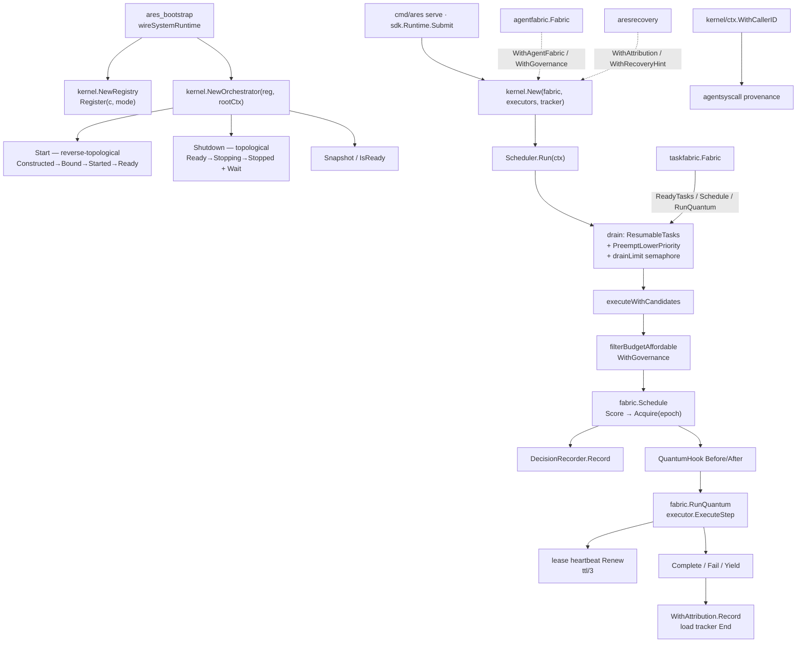

`internal/kernel` 包（包名 `kernel`）是 ARES 的 **调度内核**，同时承载
**系统级控制面**。按 `internal/kernel/doc.go`，它是前 `kernelscheduler`、
`kernelctx` 与 `system_runtime` 统一后的包；包内注释仍分别描述调度职责
（`executor.go`）与控制面职责（`component.go`）。

kernel 是 **唯一做调度决策的地方**：基于 quantum 的任务排水
（`Schedule → Acquire → RunQuantum`）、executor 注册与评分、负载跟踪、
decision 记录与 shadow 钩子。它不拥有 agent、不存领域状态——生命周期在
`agentfabric`，任务在 `taskfabric`，服务在 `internal/runtime/`。kernel 每个
quantum 所需的一切由外部注入，决策结果以 routing verdict 回写。

控制面半壁（组件 `Registry`、依赖感知 `TopologicalOrder`、`Orchestrator`
生命周期编排、`Snapshot` / `IsReady`）即原 `system_runtime` 包内容；由
`ares_bootstrap` 在 serve/start/SDK 统一装配。与 `internal/runtime` 的
`Manager`（Agent 生命周期 + 插件总线）是不同子系统。

## 职责

- 提供 quantum 调度循环：`Scheduler.Run` 周期性 drain `taskfabric` 的
  READY/SUSPENDED 任务；路径为 capability-aware `Schedule` → 租约
  `Acquire` → `RunQuantum`（一个 agent step）→ finalize
  （COMPLETED / FAILED / SUSPENDED）。
- 管理 executor 注册表：静态注册（`RegisterExecutor` /
  `RegisterExecutorIfAbsent`）、按任务绑定的恢复替换
  （`RegisterExecutorForTask`）、`LookupExecutor` / `HasCapableExecutor` /
  `Capabilities`；fabric 在场时把 live IDLE fabric agent 并入候选
  （`WithAgentFabric`），SDK 混合模式经 `WithStaticPoolHybrid` 让静态池与
  fabric 池并存。
- 维护 `LoadTracker`：in-flight load、按 agent/能力的 confidence 覆盖、
  priority；`TryBegin` / `End` 做准入与结算，`Snapshot` 供观测。
- 强制 drain 并发上限：`drainLimit()`（显式 `WithMaxConcurrent`，否则取
  静态注册数与 live fabric 候选数之 max，下限 1、上限 32）。
- 维持租约心跳：quantum 执行期间按 `ttl/3`（最小 5s）续约，避免长步被
  过期重排队。
- 记录调度决策：每次 `Schedule` 写入有界环（`DecisionRecorder`，
  默认 200 条），含候选分数分解与 winner/epoch，供 Scheduling Observatory。
- 观测扩展点：`QuantumHook`（`BeforeQuantum` / `AfterQuantum`，失败只记日志
  不中止 quantum）；`WithRecoveryHint` 非阻塞触发 stale-winner 恢复；
  `WithGovernance` 做 quantum 前预算/截止闸门；`WithAttribution` 接
  `aresrecovery.ExecutionAttribution`。
- 协作式优先级抢占：drain 前 `PreemptLowerPriority`，量子边界交回 READY
  并保留 checkpoint。
- L2 图集成：L2 router peer 经 agentfabric 进入同一调度循环；混合池与
  `planprojection` 编译路径配合（编译在 cmd 层，不在 kernel 内）。
- 承载系统控制面：`Component` / `Binder` / `Starter` / `ReadinessChecker` /
  `Stopper` / `Waiter` / `Resolver`、`Mode`、`Registry`、`State` 状态机、
  `Orchestrator`（逆拓扑 Start、拓扑 Shutdown、`Adopt`、`Go` /
  `GoBackground`）、`Snapshot` / `IsReady`。
- 子包 `internal/kernel/ctx`：把 kernel 校验过的 caller agent ID 压入
  context，供 `agentsyscall` 与工具执行读取（provenance 不信任 LLM 参数）。
- 架构红线：`architecture_test.go` 禁止 kernel import `internal/runtime`
  与 `internal/fabric/task/workflow/engine`——依赖方向由 cmd/ares 适配器
  注入，永不反转。

## 架构图



## 外部接口

```go
package kernel

// --- Scheduler (sole scheduling site) ---

type Scheduler struct {
    PollInterval time.Duration // drain cadence; default 500ms
}
func New(fabric *taskfabric.Fabric, executors map[string]CapabilityExecutor, tracker *LoadTracker) *Scheduler
func (s *Scheduler) WithAttribution(a *aresrecovery.ExecutionAttribution) *Scheduler
func (s *Scheduler) WithAgentFabric(f *agentfabric.Fabric) *Scheduler
func (s *Scheduler) WithStaticPoolHybrid() *Scheduler
func (s *Scheduler) WithMaxConcurrent(n int) *Scheduler
func (s *Scheduler) WithTTL(ttl time.Duration) *Scheduler
func (s *Scheduler) WithEventStore(store ares_events.EventStore) *Scheduler
func (s *Scheduler) WithRecoveryHint(fn func(taskID string)) *Scheduler
func (s *Scheduler) WithGovernance(g *agentfabric.Fabric) *Scheduler
func (s *Scheduler) WithQuantumHook(h QuantumHook) *Scheduler
func (s *Scheduler) Run(ctx context.Context)          // drains until ctx done
func (s *Scheduler) Running() bool
func (s *Scheduler) Snapshot() SchedulerSnapshot
func (s *Scheduler) DecisionsSnapshot() []ScheduleDecision
func (s *Scheduler) RegisterExecutor(agentID string, executor CapabilityExecutor)
func (s *Scheduler) RegisterExecutorIfAbsent(agentID string, executor CapabilityExecutor) (CapabilityExecutor, bool)
func (s *Scheduler) RegisterExecutorForTask(taskID, agentID string, executor CapabilityExecutor)
func (s *Scheduler) UnregisterExecutor(agentID string)
func (s *Scheduler) LookupExecutor(agentID string) (CapabilityExecutor, bool)
func (s *Scheduler) HasCapableExecutor(taskID string) bool
func (s *Scheduler) HasStaticExecutorFor(capability string) bool
func (s *Scheduler) ExecutorCount() int
func (s *Scheduler) Capabilities() []string
func (s *Scheduler) PreemptLowerPriority(ready []string)
func (s *Scheduler) ToModelTask(tk *taskfabric.Task) *models.Task

// CapabilityExecutor is the minimal schedulable contract (identity,
// declared capability, one quantum). sub.Agent already satisfies it.
type CapabilityExecutor interface {
    ID() string
    Type() models.AgentType
    ExecuteStep(ctx context.Context, task *models.Task) (*sub.StepOutcome, error)
}

// QuantumHook is observational only: BeforeQuantum errors are logged and
// never abort a quantum; hooks must be non-blocking and concurrency-safe.
type QuantumHook interface {
    BeforeQuantum(ctx context.Context, taskID, agentID string) error
    AfterQuantum(ctx context.Context, taskID, agentID string, err error)
}

// --- Load tracking ---

type LoadTracker struct { /* mu-guarded stats maps */ }
func NewLoadTracker() *LoadTracker
func (t *LoadTracker) SetPriority(agentID string, priority float64)
func (t *LoadTracker) Priority(agentID string) float64
func (t *LoadTracker) Begin(agentID string)
func (t *LoadTracker) TryBegin(agentID string, maxLoad int) bool
func (t *LoadTracker) End(agentID string, success bool)
func (t *LoadTracker) EndNeutral(agentID string)
func (t *LoadTracker) Forget(agentID string)
func (t *LoadTracker) Load(agentID string) float64
func (t *LoadTracker) Confidence(agentID string) float64
func (t *LoadTracker) SetAgentConfidence(agentID string, confidence float64)
func (t *LoadTracker) SetCapabilityConfidence(agentID, capability string, confidence float64)
func (t *LoadTracker) ConfidenceFor(agentID, capability string) float64
func (t *LoadTracker) ConfidenceForMeasured(agentID, capability string) (float64, bool)
func (t *LoadTracker) Snapshot() LoadTrackerSnapshot

// --- Decision recording (Scheduling Observatory) ---

type CandidateScore struct {
    AgentID       string
    Capabilities  []string
    Overlap       float64
    Load          float64
    Confidence    float64
    PriorityBoost float64
    Score         float64
}
type ScheduleDecision struct {
    TaskID     string
    Capability string
    Candidates []CandidateScore
    Winner     string
    Epoch      uint64
    Time       time.Time
    Err        string // set when Schedule failed
}

// --- Component control plane (former system_runtime) ---

type Component interface {
    Name() string
    Dependencies() []string
}
type Binder interface {
    Bind(ctx context.Context, deps Resolver) error
}
type Starter interface {
    Start(ctx context.Context) error
}
type ReadinessChecker interface {
    Ready(ctx context.Context) error
}
type Stopper interface {
    Stop(ctx context.Context) error
}
type Waiter interface {
    Wait() error
}
type Resolver interface {
    Get(name string) any
}

type Mode int
const (
    ModeRequired Mode = iota
    ModeOptional
    ModeDegraded
)
func (m Mode) String() string

type State int
const (
    StateConstructed State = iota
    StateBound
    StateStarted
    StateReady
    StateDegraded
    StateFailed
    StateStopping
    StateStopped
    StateDisabled
)
func (s State) String() string
func (s State) IsHealthy() bool // Ready | Degraded

type ComponentStatus struct {
    Name       string
    Mode       Mode
    State      State
    Reason     string
    StartedAt  time.Time
    InstanceID string
}

type Registry struct { /* entries map + registration order */ }
func NewRegistry() *Registry
func (r *Registry) Register(c Component, mode Mode) error
func (r *Registry) Get(name string) any
func (r *Registry) GetComponent(name string) Component
func (r *Registry) GetMode(name string) (Mode, bool)
func (r *Registry) GetStatus(name string) (ComponentStatus, bool)
func (r *Registry) SetStatus(name string, status ComponentStatus)
func (r *Registry) UpdateStatus(name string, fn func(*ComponentStatus))
func (r *Registry) AllStatuses() []ComponentStatus
func (r *Registry) Names() []string
func (r *Registry) TopologicalOrder() ([]string, error) // Kahn; fail loud
func (r *Registry) IsReady() bool
func (r *Registry) Snapshot() Snapshot

type Orchestrator struct { /* reg, rootCtx, started, statuses */ }
func NewOrchestrator(reg *Registry, rootCtx context.Context) *Orchestrator
func (o *Orchestrator) Start(ctx context.Context) error
func (o *Orchestrator) Shutdown(ctx context.Context) error
func (o *Orchestrator) Adopt(ctx context.Context, c Component, mode Mode) error
func (o *Orchestrator) Go(fn func() error)
func (o *Orchestrator) GoBackground(name string, fn func(ctx context.Context) error)
func (o *Orchestrator) SetEventSink(store ares_events.EventStore)
func (o *Orchestrator) Snapshot() Snapshot
func (o *Orchestrator) RootContext() context.Context
func (o *Orchestrator) Cancel()

type Snapshot struct {
    TakenAt    time.Time
    Components []ComponentStatus
    Summary    SnapshotSummary
}
type SnapshotSummary struct {
    Total, Ready, Degraded, Failed, Disabled, Stopped int
}
func (s Snapshot) JSON() ([]byte, error)

type SchedulerSnapshot struct { /* PollInterval, MaxConcurrent, ... */ }

// --- Kernel context (subpackage internal/kernel/ctx) ---

// package ctx
func WithCallerID(ctx context.Context, agentID string) context.Context
func CallerID(ctx context.Context) string

// --- Sentinels ---

var ErrNilStepOutcome // executor returned nil step outcome
var ErrShuttingDown   // orchestrator is shutting down
```

## 关键类型与方法

| 类型 / 方法 | 用途 |
| --- | --- |
| `Scheduler` / `New` | 唯一调度决策点；绑定 `taskfabric.Fabric`、executor 映射与可选共享 `LoadTracker`。 |
| `Scheduler.Run` | 循环 drain：`ResumableTasks` → 抢占 → `drainLimit` 并发执行 `execute`。 |
| `CapabilityExecutor` | 消费者侧最小可调度契约（`ID` / `Type` / `ExecuteStep`）；`sub.Agent` 已满足。 |
| `RegisterExecutor*` / `LookupExecutor` | 静态与按任务恢复替换的 executor 注册表。 |
| `WithAgentFabric` / `WithStaticPoolHybrid` | peer 模式（fabric 为候选源）与 SDK 混合池。 |
| `drainLimit`（经 `WithMaxConcurrent`） | 单次 drain 并发上限：显式值或 max(静态, fabric IDLE)，∈[1,32]。 |
| `WithTTL` | 租约时长（默认 5m）；quantum 期间 `ttl/3` 心跳续约。 |
| `WithGovernance` | quantum 前预算/截止过滤（`filterBudgetAffordable`），防 acquire/release 活锁。 |
| `WithRecoveryHint` | stale-winner 时非阻塞提示 `aresrecovery` 立即扫描。 |
| `WithQuantumHook` | quantum 边界观测钩子；错误只记日志。 |
| `LoadTracker` | load/confidence/priority 跟踪与准入（`TryBegin`/`End`）。 |
| `DecisionRecorder` / `ScheduleDecision` | 有界调度决策环，解释「为何派给该 agent」。 |
| `Component` + companions | 受管组件身份、依赖、绑定、启动、就绪、停止、排空。 |
| `Mode` | `ModeRequired` / `ModeOptional` / `ModeDegraded`。 |
| `Registry` / `TopologicalOrder` | 组件注册表；Kahn 拓扑；未注册依赖或环 fail loud。 |
| `Orchestrator` | 逆拓扑 Start、拓扑 Shutdown、启动失败回滚、`Adopt` 纳管、受管后台。 |
| `State` / `ComponentStatus` / `Snapshot` | 生命周期状态机与状态数据面；`IsReady` 聚合就绪。 |
| `kernel/ctx.CallerID` | 从 context 读取 kernel 盖章的 caller agent（syscall provenance）。 |

## 模块协作

- `kernel` -> `internal/fabric/task`（`taskfabric`）：`ResumableTasks` /
  `Schedule` / `Acquire` / `RunQuantum` / `Complete|Fail|Yield`；kernel 不存
  任务状态。
- `kernel` -> `internal/fabric/agent`（`agentfabric`）：`WithAgentFabric`
  把 live agent 并入候选；`WithGovernance` 读预算；恢复经
  `RegisterExecutorForTask` 绑定替换。
- `kernel` -> `internal/aresrecovery`：`WithAttribution` 记录 quantum 结果；
  `WithRecoveryHint` 触发租约/死亡扫描。
- `kernel` -> `internal/ares_events`：`WithEventStore` 让排水响应依赖相关
  task 事件；`Orchestrator.SetEventSink` 可选转发组件状态。
- `ares_bootstrap` -> `kernel`：`wireSystemRuntime` 构造 `Registry` 与
  `Orchestrator`，把 EventStore/Runtime/Memory/MCP/LLM 等注册为组件
  （`system_runtime_wiring.go`）。
- `cmd/ares` / `sdk` -> `kernel`：共用 `kernel.New` 驱动生产与 SDK 提交路径
  （同一调度引擎）；cmd 侧适配器把 `runtime` 插件经 `QuantumHook` 注入，
  不反向 import。
- `internal/agentsyscall` + 执行体 -> `kernel/ctx`：`WithCallerID` 盖章 /
  `CallerID` 读取，强制 syscall provenance。

## 扩展方式

1. **注册可调度执行体**：实现 `CapabilityExecutor`，经
   `RegisterExecutor` / `RegisterExecutorIfAbsent` 挂载；capability 与任务
   `Capability` 匹配后进入 `Score` 候选。
2. **挂观测钩子**：实现 `QuantumHook` 并 `WithQuantumHook(h)`；metrics、
   audit、tool allowlist 不得阻塞 drain。
3. **接入经验置信**：共享 `LoadTracker` 或 `SetCapabilityConfidence` /
   `SetAgentConfidence`；schedule 路径用 `ConfidenceForMeasured` 与 fabric
   `PriorConfidence` 合成 confidence。
4. **恢复接线**：`WithRecoveryHint(fn)` 指向非阻塞扫描（cap-1 channel、
   drop-on-full）；恢复执行体经 `RegisterExecutorForTask`，终态后自动解绑。
5. **治理预算**：`WithGovernance(agentfabric.Fabric)`；候选在 `Schedule`
   前被 `filterBudgetAffordable` 过滤，quantum 后 `consumeBudget`。
6. **扩展控制面**：实现 `Component` 及所需伴生接口，`Registry.Register(c,
   mode)`；需要热接入用 `Orchestrator.Adopt`；状态经 `Snapshot.JSON()` 暴露。
7. **保持依赖红线**：不得让 kernel import `internal/runtime` 或
   workflow engine——适配放在 `cmd/ares`（`architecture_test.go` 会失败）。

## 双语状态

本页为英文参考的结构镜像中文版。所有代码标识符、类型名与签名在两份文件中均
保持英文，仅叙述性文字不同。英文版发布为 `kernel.en.md`。

## 成熟度

Production。该包有 35 个 `*_test.go` 覆盖，含 `scheduler_*`、
`orchestrator_*`、`registry_test.go`、`l2_graph_scheduler_integration_test.go`、
`hybrid_pool_test.go`、`lease_heartbeat_test.go`、`drain_limit_test.go`、
`architecture_test.go`（import 红线）、`leak_test.go` 等；实现包含带 fencing
的 quantum 调度与组件生命周期编排，经 `ares_bootstrap` / `cmd/ares` / `sdk`
入口集成，无实验性标记（源码仅有 tech-debt TODO，无 experimental 标记）。


