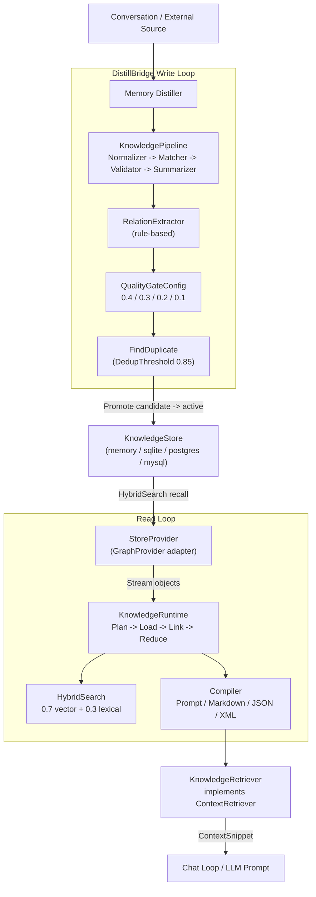

# knowledge

## Responsibility

The `knowledge` package (Go import path `internal/knowledge`, package name
`knowledge`) is the core of the ARES Knowledge Fabric (AKF). It converts
arbitrary external data sources into a universal `KnowledgeObject`
representation and orchestrates a Plan -> Load -> Link -> Reduce -> Compile
pipeline that produces LLM-ready context.

Core responsibilities:

- **Universal representation** - the three-layer `KnowledgeObject` (Raw ->
  Normalized -> Summary) preserves original bytes while optimizing for LLM
  consumption. Embeddings live in a separate `Representation` type so multiple
  embedding models can coexist without data migration.
- **Quality-gated write loop** - the `DistillBridge` runs conversations through
  the Memory Distiller, then applies rule-based relation extraction, embedding
  + dedup, quality-gate scoring, and lifecycle promotion
  (candidate -> active) before persisting.
- **Hybrid search** - vector cosine recall (weight 0.7) blended with lexical
  Jaccard overlap (weight 0.3) for ranking stored facts.
- **Intent-driven retrieval** - the `Retriever` and `KnowledgeRetriever`
  adapter surface AKG facts to the chat loop via the
  `ares_memory/context.ContextRetriever` interface.

NOTE: This subsystem is flagged Experimental per the AKG design notes. The
public API (store backends, quality-gate weights, lifecycle statuses) is still
evolving; consumers should expect breaking changes between minor versions.

## Architecture



## External interfaces

Signatures are extracted verbatim from source. The `KnowledgeStore` interface
defines 11 persistence methods.

```go
// KnowledgeStore is an optional persistence layer for KnowledgeObjects.
type KnowledgeStore interface {
    Save(ctx context.Context, objects ...*KnowledgeObject) error
    Get(ctx context.Context, id string) (*KnowledgeObject, error)
    Query(ctx context.Context, q Query) ([]*KnowledgeObject, error)
    Delete(ctx context.Context, id string) error
    Search(ctx context.Context, text string, model string, limit int) ([]*KnowledgeObject, error)
    SaveRepresentation(ctx context.Context, rep *Representation) error
    GetRepresentation(ctx context.Context, objectID string, model string) (*Representation, error)
    HybridSearch(ctx context.Context, req HybridSearchRequest) ([]ScoredObject, error)
    ListByStatus(ctx context.Context, ns string, status ObjectStatus, limit int) ([]*KnowledgeObject, error)
    UpdateStatus(ctx context.Context, id string, status ObjectStatus) error
    Promote(ctx context.Context, id string, q *Quality) error
}

// KnowledgeRuntime is the central execution engine of AKF.
type KnowledgeRuntime struct { /* fields */ }
func New(p planner.KnowledgePlanner, d planner.SourceDiscovery, reg *provider.ProviderRegistry, pipe *KnowledgePipeline, linkers []Linker, reducers []Reducer) *KnowledgeRuntime
func (r *KnowledgeRuntime) Execute(ctx context.Context, goal string, budget knowledge.TokenBudget, cfg *Config) (*knowledge.WorkingGraph, error)

// DistillBridge connects Memory Distillation to AKF.
type DistillBridge struct { /* fields */ }
func NewDistillBridge(distiller ConversationDistiller, pipeline *KnowledgePipeline, store KnowledgeStore, namespace string) *DistillBridge
func NewDistillBridgeWithGate(distiller ConversationDistiller, pipeline *KnowledgePipeline, store KnowledgeStore, emb embedding.EmbeddingService, gate QualityGateConfig, extractor *RelationExtractor, namespace, model string) *DistillBridge

// KnowledgeRetriever adapts AKG to the ContextRetriever interface.
type KnowledgeRetriever struct { /* fields */ }
func NewKnowledgeRetriever(_ context.Context, runtime *knowledgeruntime.KnowledgeRuntime, minScore float64) (*KnowledgeRetriever, error)

// StoreProvider adapts a KnowledgeStore into a GraphProvider (read side of AKG loop).
type StoreProvider struct { /* fields */ }
func New(name string, st knowledge.KnowledgeStore, emb embedding.EmbeddingService, model, ns string) *StoreProvider

// QualityGateConfig + scoring helpers.
type QualityGateConfig struct {
    MinExtraction     float64
    MinConsistency    float64
    MinFinalScore     float64
    MaxFactsPerIngest int
    EnableDedup       bool
    DedupThreshold    float64
}
func DefaultQualityGateConfig() QualityGateConfig
func (c QualityGateConfig) ComputeFinal(q *Quality) float64
func (c QualityGateConfig) Evaluate(obj *KnowledgeObject) *Quality
func ScoreHybrid(objects []*KnowledgeObject, reps map[string]*Representation, queryVec []float32, query string) []ScoredObject
```

`DefaultQualityGateConfig` returns the 0.2.9 defaults: `MinFinalScore` 0.55,
`DedupThreshold` 0.85, `MaxFactsPerIngest` 50. `ComputeFinal` folds a `Quality`
into a single confidence using weights 0.4 * Extraction + 0.3 * Consistency +
0.2 * Freshness + 0.1 * Usage. `ScoreHybrid` blends vector and lexical scores:
`FinalScore = 0.7 * VectorScore + 0.3 * LexicalScore` when a vector is
available, otherwise `FinalScore = LexicalScore`.

Four store backends ship in-tree under `internal/knowledge/store/`:
`memory` (in-memory), `sqlite`, `postgres`, and `mysql`.

## Key types and methods

| Type / Method | Kind | Purpose |
| --- | --- | --- |
| `KnowledgeObject` | struct | Universal three-layer representation (Raw, Normalized, Summary) with Status, Quality, Relations. |
| `ObjectType` | type | 12 object kinds: memory, user, project, code, issue, commit, decision, document, tool_result, workflow, runtime, architecture. |
| `ObjectStatus` | type | Lifecycle: candidate -> active -> superseded / rejected. |
| `Quality` | struct | Multi-dimensional scores: Extraction, Consistency, Freshness, Usage (each [0, 1]). |
| `QualityGateConfig` | struct | Gate config; weights 0.4/0.3/0.2/0.1, MinFinalScore 0.55, DedupThreshold 0.85. |
| `Representation` | struct | Embedding vector stored separately; keyed by model name. |
| `Relation` | struct | Graph edge and fact-level outgoing relation; predicate restricted by `AllowedPredicates`. |
| `KnowledgeStore` | interface | 11-method persistence contract; four backends implement it. |
| `KnowledgeRuntime` | struct | Executes Plan -> Load -> Link -> Reduce -> Graph. |
| `KnowledgePipeline` | struct | Normalizer -> EntityMatcher -> Validator -> Summarizer stages. |
| `DistillBridge` | struct | Writes distilled conversations into the store with full 0.2.9 quality loop. |
| `StoreProvider` | struct | Adapts `KnowledgeStore` to `GraphProvider` for the read loop. |
| `KnowledgeRetriever` | struct | Adapts AKG to `ContextRetriever`; HybridSearch-backed or runtime-backed. |
| `HybridSearchRequest` | struct | Query, QueryVector, TopK, FinalK, MinScore, Model, StatusFilter. |
| `ScoredObject` | struct | HybridSearch result with VectorScore, LexicalScore, FinalScore. |
| `ScoreHybrid` | function | Blends 0.7 * vector + 0.3 * lexical into FinalScore. |
| `FindDuplicate` | function | Vector-only duplicate detection at DedupThreshold. |

## Module collaboration

- **ares_memory** - `KnowledgeRetriever` implements
  `ares_memory/context.ContextRetriever` (mirrored locally to avoid an import
  cycle) and is registered via `MemoryManager.SetRetrievers` to inject AKG
  facts into the LLM prompt.
- **ares_memory/distillation** - `DistillBridge` wraps the existing
  `distillation.Distiller` (`ConversationDistiller` interface) and converts
  its `Memory` outputs into `KnowledgeObject`s.
- **evidence** - `KnowledgeRuntime.WithEvidenceStore` wires an
  `evidence.Store`; the runtime emits `KindInsight` evidence after each
  `Execute` run with goal, node count, edge count, and budget.
- **knowledge/provider** - `GraphProvider` is the pluggable source contract;
  `StoreProvider` (in `provider/store`) adapts a `KnowledgeStore` back into a
  provider to close the write -> read loop.
- **knowledge/runtime, compiler, linker, planner, pipeline** - subpackages
  that implement the Plan -> Load -> Link -> Reduce -> Compile stages.

## Extension points

1. **Add a store backend.** Implement the 11-method `KnowledgeStore` interface
   against your database, mirroring `store/sqlite` or `store/postgres`. The
   `HybridSearch` and `SaveRepresentation` methods are the only non-trivial
   ones; the rest follow a standard CRUD shape.
2. **Add a data source provider.** Implement `provider.GraphProvider`
   (`Name`, `IntentMatch`, `Stream`) to feed a new external source
   (e.g. S3, Git) into the runtime. Register it with `ProviderRegistry`.
3. **Customize the quality gate.** Construct a `QualityGateConfig` with your
   own `MinFinalScore`, `DedupThreshold`, or per-dimension minimums, then pass
   it to `NewDistillBridgeWithGate`. The fold weights (0.4/0.3/0.2/0.1) live in
   `ComputeFinal`; override by re-implementing the fold if needed.
4. **Add a linker or reducer.** Implement the `Linker` or `Reducer` interface
   in `knowledge/runtime` and pass them to `runtime.New` to customize relation
   generation or graph compression.
5. **Swap the summarizer.** Provide a custom `Summarizer` (or `Normalizer`,
   `EntityMatcher`, `Validator`) and assemble a `KnowledgePipeline` with it
   before handing the pipeline to `runtime.New`.
6. **Plug AKG into the chat loop.** Construct a `KnowledgeRetriever` with the
   runtime (and optional store), then register it via
   `MemoryManager.SetRetrievers` so RAG retrieval surfaces AKG facts.

## Bilingual status

Source code, identifiers, type names, and code comments are in English. This
English page is the canonical reference. A Chinese translation with identical
structure and technical content is published alongside as `knowledge.zh.md`;
all code blocks, signatures, and identifiers remain in English in both pages.

## Maturity

Experimental. The subsystem is functional and exercised by
`knowledge_test.go`, `quality_test.go`, `hybrid_test.go`,
`relation_extract_test.go`, `vector_index_test.go`, `e2e_test.go`, and
`docs_articles_test.go`, but the AKG design notes flag the public API as
undergoing significant rework. Store backends, quality-gate weights, and
lifecycle statuses may change between minor versions. Consumers should pin
versions and expect breaking changes.


