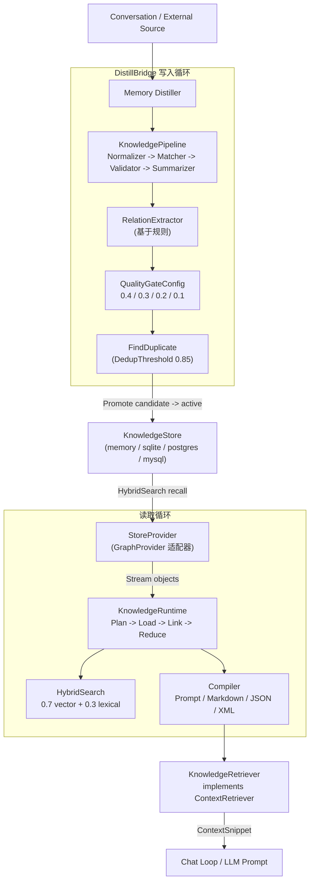

# knowledge

## 职责

`knowledge` 包（Go 导入路径 `internal/knowledge`，包名 `knowledge`）是 ARES
Knowledge Fabric（AKF）的核心。它将任意外部数据源转换为通用的 `KnowledgeObject`
表示，并编排 Plan -> Load -> Link -> Reduce -> Compile 流水线，产出 LLM 可用的上下文。

核心职责：

- **通用表示** —— 三层结构的 `KnowledgeObject`（Raw -> Normalized -> Summary）在保留
  原始字节的同时为 LLM 消费做优化。嵌入向量存放在独立的 `Representation` 类型中，使多个
  嵌入模型可以共存而无需数据迁移。
- **质量门控写入循环** —— `DistillBridge` 将对话送入 Memory Distiller，随后依次执行基于
  规则的关系抽取、嵌入 + 去重、质量门打分，以及生命周期晋升（candidate -> active），最后落库。
- **混合检索** —— 向量余弦召回（权重 0.7）与词法 Jaccard 重叠（权重 0.3）融合，对存储事实排序。
- **意图驱动检索** —— `Retriever` 与 `KnowledgeRetriever` 适配器通过
  `ares_memory/context.ContextRetriever` 接口向对话循环暴露 AKG 事实。

注意：依据 AKG 设计说明，该子系统被标记为 Experimental。公开 API（存储后端、质量门权重、
生命周期状态）仍在演进；消费者应预期小版本之间会出现破坏性变更。

## 架构图



## 外部接口

下列签名均逐字取自源码。`KnowledgeStore` 接口定义了 11 个持久化方法。

```go
// KnowledgeStore is an optional persistence layer for KnowledgeObjects.
type KnowledgeStore interface {
    Save(ctx context.Context, objects ...*KnowledgeObject) error
    Get(ctx context.Context, id string) (*KnowledgeObject, error)
    Query(ctx context.Context, q Query) ([]*KnowledgeObject, error)
    Delete(ctx context.Context, id string) error
    Search(ctx context.Context, text string, model string, limit int) ([]*KnowledgeObject, error)
    SaveRepresentation(ctx context.Context, rep *Representation) error
    GetRepresentation(ctx context.Context, objectID string, model string) (*Representation, error)
    HybridSearch(ctx context.Context, req HybridSearchRequest) ([]ScoredObject, error)
    ListByStatus(ctx context.Context, ns string, status ObjectStatus, limit int) ([]*KnowledgeObject, error)
    UpdateStatus(ctx context.Context, id string, status ObjectStatus) error
    Promote(ctx context.Context, id string, q *Quality) error
}

// KnowledgeRuntime is the central execution engine of AKF.
type KnowledgeRuntime struct { /* fields */ }
func New(p planner.KnowledgePlanner, d planner.SourceDiscovery, reg *provider.ProviderRegistry, pipe *KnowledgePipeline, linkers []Linker, reducers []Reducer) *KnowledgeRuntime
func (r *KnowledgeRuntime) Execute(ctx context.Context, goal string, budget knowledge.TokenBudget, cfg *Config) (*knowledge.WorkingGraph, error)

// DistillBridge connects Memory Distillation to AKF.
type DistillBridge struct { /* fields */ }
func NewDistillBridge(distiller ConversationDistiller, pipeline *KnowledgePipeline, store KnowledgeStore, namespace string) *DistillBridge
func NewDistillBridgeWithGate(distiller ConversationDistiller, pipeline *KnowledgePipeline, store KnowledgeStore, emb embedding.EmbeddingService, gate QualityGateConfig, extractor *RelationExtractor, namespace, model string) *DistillBridge

// KnowledgeRetriever adapts AKG to the ContextRetriever interface.
type KnowledgeRetriever struct { /* fields */ }
func NewKnowledgeRetriever(_ context.Context, runtime *knowledgeruntime.KnowledgeRuntime, minScore float64) (*KnowledgeRetriever, error)

// StoreProvider adapts a KnowledgeStore into a GraphProvider (read side of AKG loop).
type StoreProvider struct { /* fields */ }
func New(name string, st knowledge.KnowledgeStore, emb embedding.EmbeddingService, model, ns string) *StoreProvider

// QualityGateConfig + scoring helpers.
type QualityGateConfig struct {
    MinExtraction     float64
    MinConsistency    float64
    MinFinalScore     float64
    MaxFactsPerIngest int
    EnableDedup       bool
    DedupThreshold    float64
}
func DefaultQualityGateConfig() QualityGateConfig
func (c QualityGateConfig) ComputeFinal(q *Quality) float64
func (c QualityGateConfig) Evaluate(obj *KnowledgeObject) *Quality
func ScoreHybrid(objects []*KnowledgeObject, reps map[string]*Representation, queryVec []float32, query string) []ScoredObject
```

`DefaultQualityGateConfig` 返回 0.2.9 默认值：`MinFinalScore` 0.55、
`DedupThreshold` 0.85、`MaxFactsPerIngest` 50。`ComputeFinal` 按权重
0.4 * Extraction + 0.3 * Consistency + 0.2 * Freshness + 0.1 * Usage 将 `Quality`
折算为单一置信度。`ScoreHybrid` 融合向量与词法分数：有向量时
`FinalScore = 0.7 * VectorScore + 0.3 * LexicalScore`，否则
`FinalScore = LexicalScore`。

四个存储后端随包提供，位于 `internal/knowledge/store/`：`memory`（内存）、
`sqlite`、`postgres` 与 `mysql`。

## 关键类型与方法

| 类型 / 方法 | 类别 | 用途 |
| --- | --- | --- |
| `KnowledgeObject` | struct | 通用三层表示（Raw、Normalized、Summary），含 Status、Quality、Relations。 |
| `ObjectType` | type | 12 种对象类型：memory、user、project、code、issue、commit、decision、document、tool_result、workflow、runtime、architecture。 |
| `ObjectStatus` | type | 生命周期：candidate -> active -> superseded / rejected。 |
| `Quality` | struct | 多维分数：Extraction、Consistency、Freshness、Usage（各 [0, 1]）。 |
| `QualityGateConfig` | struct | 门控配置；权重 0.4/0.3/0.2/0.1，MinFinalScore 0.55，DedupThreshold 0.85。 |
| `Representation` | struct | 独立存放的嵌入向量；按模型名索引。 |
| `Relation` | struct | 图边与事实级出边关系；谓词受 `AllowedPredicates` 限制。 |
| `KnowledgeStore` | interface | 11 方法的持久化契约；由四个后端实现。 |
| `KnowledgeRuntime` | struct | 执行 Plan -> Load -> Link -> Reduce -> Graph。 |
| `KnowledgePipeline` | struct | Normalizer -> EntityMatcher -> Validator -> Summarizer 阶段。 |
| `DistillBridge` | struct | 将蒸馏对话按完整 0.2.9 质量循环写入存储。 |
| `StoreProvider` | struct | 将 `KnowledgeStore` 适配为 `GraphProvider`，供读取循环使用。 |
| `KnowledgeRetriever` | struct | 将 AKG 适配为 `ContextRetriever`；由 HybridSearch 或 runtime 支撑。 |
| `HybridSearchRequest` | struct | Query、QueryVector、TopK、FinalK、MinScore、Model、StatusFilter。 |
| `ScoredObject` | struct | HybridSearch 结果，含 VectorScore、LexicalScore、FinalScore。 |
| `ScoreHybrid` | function | 将 0.7 * vector + 0.3 * lexical 融合为 FinalScore。 |
| `FindDuplicate` | function | 仅基于向量的重复检测，阈值为 DedupThreshold。 |

## 模块协作

- **ares_memory** —— `KnowledgeRetriever` 实现
  `ares_memory/context.ContextRetriever`（在本地镜像以避免循环导入），经
  `MemoryManager.SetRetrievers` 注册后向 LLM 提示词注入 AKG 事实。
- **ares_memory/distillation** —— `DistillBridge` 包装既有的
  `distillation.Distiller`（`ConversationDistiller` 接口），将其 `Memory` 输出转换为
  `KnowledgeObject`。
- **evidence** —— `KnowledgeRuntime.WithEvidenceStore` 注入 `evidence.Store`；runtime
  在每次 `Execute` 之后发射 `KindInsight` 证据，携带 goal、节点数、边数与预算。
- **knowledge/provider** —— `GraphProvider` 是可插拔的数据源契约；
  `StoreProvider`（位于 `provider/store`）将 `KnowledgeStore` 反向适配为 provider，闭合
  写入 -> 读取循环。
- **knowledge/runtime、compiler、linker、planner、pipeline** —— 实现
  Plan -> Load -> Link -> Reduce -> Compile 各阶段的子包。

## 扩展方式

1. **新增存储后端。** 针对你的数据库实现 11 方法的 `KnowledgeStore` 接口，参照
   `store/sqlite` 或 `store/postgres`。`HybridSearch` 与 `SaveRepresentation` 是仅有的
   非平凡方法，其余遵循标准 CRUD 形态。
2. **新增数据源 provider。** 实现 `provider.GraphProvider`（`Name`、`IntentMatch`、
   `Stream`）将新的外部源（如 S3、Git）接入 runtime，并用 `ProviderRegistry` 注册。
3. **自定义质量门。** 构造一个带有自定义 `MinFinalScore`、`DedupThreshold` 或各维度
   下限的 `QualityGateConfig`，传给 `NewDistillBridgeWithGate`。折算权重（0.4/0.3/0.2/0.1）
   位于 `ComputeFinal`；如需改写折算方式可重新实现该函数。
4. **新增 linker 或 reducer。** 在 `knowledge/runtime` 中实现 `Linker` 或 `Reducer` 接口，
   传入 `runtime.New` 以定制关系生成或图压缩。
5. **替换 summarizer。** 提供自定义的 `Summarizer`（或 `Normalizer`、`EntityMatcher`、
   `Validator`），用它组装 `KnowledgePipeline`，再交给 `runtime.New`。
6. **将 AKG 接入对话循环。** 用 runtime（及可选 store）构造 `KnowledgeRetriever`，再经
   `MemoryManager.SetRetrievers` 注册，使 RAG 检索暴露 AKG 事实。

## 双语状态

源码、标识符、类型名与代码注释均为英文，本英文页面为权威参考。中文译本以相同结构与同等
技术内容随附发布为 `knowledge.zh.md`；两份页面中的所有代码块、签名与标识符均保持英文。

## 成熟度

Experimental。该子系统功能完备，并由 `knowledge_test.go`、`quality_test.go`、
`hybrid_test.go`、`relation_extract_test.go`、`vector_index_test.go`、`e2e_test.go` 与
`docs_articles_test.go` 覆盖，但 AKG 设计说明将公开 API 标记为正在大幅重构。存储后端、
质量门权重与生命周期状态可能在小版本间变更。消费者应固定版本并预期破坏性变更。


