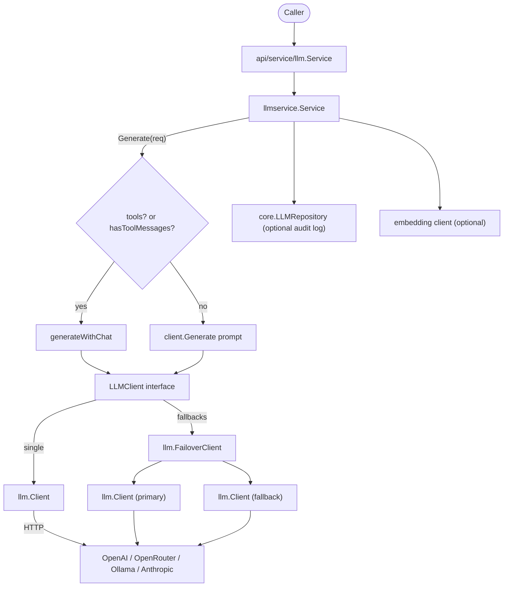

The `llm` module is split across `internal/llmservice` (the routing service
that decides between plain generate and the Chat API), `internal/llm` (the
multi-provider HTTP client and failover layer), and `api/service/llm` (the
thin public wrapper that hides internal types from embedders).

## Responsibility

- Own the `LLMClient` interface (7 methods) satisfied by both `*llm.Client`
  and `*llm.FailoverClient`, so the service layer is provider-agnostic.
- Route `Service.Generate`: when tools are present or any message carries
  tool-call data (`ToolCalls`/`ToolCallID`), delegate to
  `generateWithChat`; otherwise fall back to plain prompt generation.
- Talk to OpenAI, OpenRouter, Ollama, and Anthropic over a single
  `*llm.Client` with streaming, tracing, callbacks, rate limiting, and
  prompt sanitization.
- Provide `FailoverClient` for multi-provider resilience: per-provider
  cooldowns, automatic retry on rate-limit (HTTP 429) and transient errors,
  and a scorer that picks the healthiest client.
- Wrap everything behind `api/service/llm.Service` so external code never
  imports `internal/llm` or `internal/llmservice`.

## Architecture



## External interfaces

```go
// internal/llmservice
type LLMClient interface {
    Generate(ctx context.Context, prompt string) (string, error)
    GenerateStream(ctx context.Context, prompt string) (<-chan llm.StreamChunk, error)
    Chat(ctx context.Context, messages []*core.LLMMessage, tools []core.Tool, params map[string]any) (*core.GenerateResponse, error)
    IsEnabled() bool
    GetProvider() string
    GetModel() string
    Close()
}

type Service struct { /* unexported */ }
func NewService(config *Config) (*Service, error)
func (s *Service) Generate(ctx context.Context, request *core.GenerateRequest) (*core.GenerateResponse, error)
func (s *Service) GenerateSimple(ctx context.Context, prompt string) (string, error)
func (s *Service) GenerateEmbedding(ctx context.Context, request *core.EmbeddingRequest) (*core.EmbeddingResponse, error)
func (s *Service) GetConfig() *core.LLMConfig
func (s *Service) IsEnabled() bool
func (s *Service) GetProvider() core.LLMProvider
func (s *Service) GetModel() string
func (s *Service) Close()

type Config struct {
    BaseConfig       *core.BaseConfig
    LLMConfig        *core.LLMConfig
    Fallbacks        []*llm.Config
    Repo             core.LLMRepository
    EmbeddingClient  any
    Tracer           ares_observability.Tracer
    CallbackRegistry *ares_callbacks.Registry
}

// internal/llm
type Config struct {
    Provider        string
    APIKey          string
    BaseURL         string
    Model           string
    Timeout         int
    MaxTokens       int
    MaxPromptLength int
    Extra           map[string]string
}

type Client struct { /* unexported */ }
type Option func(*Client)
func WithCallbacks(emitter ares_callbacks.Emitter) Option
func WithRateLimiter(limiter ares_ratelimit.Limiter) Option
func WithSanitizer(s *ares_security.Sanitizer) Option
func NewClient(config *Config, opts ...Option) (*Client, error)
func NewClientFromEnv() (*Client, error)
func (c *Client) Generate(ctx context.Context, prompt string) (string, error)
func (c *Client) GenerateWithParams(ctx context.Context, prompt string, params map[string]any) (string, error)
func (c *Client) GenerateStream(ctx context.Context, prompt string) (<-chan StreamChunk, error)
func (c *Client) Chat(ctx context.Context, messages []*core.LLMMessage, tools []core.Tool, params map[string]any) (*core.GenerateResponse, error)
func (c *Client) IsEnabled() bool
func (c *Client) GetProvider() string
func (c *Client) GetModel() string
func (c *Client) SetTracer(t ares_observability.Tracer)
func (c *Client) Close()

type StreamChunk struct {
    Content string
    Err     error
}

type FailoverClient struct { /* unexported */ }
type FailoverOption func(*FailoverClient)
func WithCooldownDuration(d time.Duration) FailoverOption
func NewFailoverClient(configs []*Config, timeout time.Duration, rate float64, burst int, opts ...FailoverOption) (*FailoverClient, error)
func NewFailoverScorer(configs []*Config, timeout time.Duration, rate float64, burst int) (*FailoverClient, error)
func (fc *FailoverClient) Generate(ctx context.Context, prompt string) (string, error)
func (fc *FailoverClient) GenerateStream(ctx context.Context, prompt string) (<-chan StreamChunk, error)
func (fc *FailoverClient) Chat(ctx context.Context, messages []*core.LLMMessage, tools []core.Tool, params map[string]any) (*core.GenerateResponse, error)
func (fc *FailoverClient) IsEnabled() bool
func (fc *FailoverClient) GetProvider() string
func (fc *FailoverClient) GetModel() string
func (fc *FailoverClient) SetTracer(t ares_observability.Tracer)
func (fc *FailoverClient) Clients() []*Client
func (fc *FailoverClient) ActiveProviders() []string
func (fc *FailoverClient) Close()

// api/service/llm (public wrapper, no internal/ imports in its API)
type Service struct { /* unexported */ }
func NewService(cfg *Config) (*Service, error)
func (s *Service) Generate(ctx context.Context, request *core.GenerateRequest) (*core.GenerateResponse, error)
func (s *Service) GenerateSimple(ctx context.Context, prompt string) (string, error)
func (s *Service) GenerateEmbedding(ctx context.Context, request *core.EmbeddingRequest) (*core.EmbeddingResponse, error)
func (s *Service) GetConfig() *core.LLMConfig
func (s *Service) IsEnabled() bool
func (s *Service) GetProvider() core.LLMProvider
func (s *Service) GetModel() string
func (s *Service) Close()
```

## Key types and methods

| Type | Method | Purpose |
|------|--------|---------|
| `llmservice.LLMClient` | interface (7 methods) | Common contract for `*llm.Client` and `*llm.FailoverClient`. |
| `llmservice.Service` | `NewService(*Config)` | Build the service; picks single client or `FailoverClient` based on `Fallbacks`. |
| `llmservice.Service` | `Generate(ctx, *GenerateRequest)` | Route to `generateWithChat` when `len(Tools) > 0` or `hasToolMessages`; else plain generate. |
| `llmservice.Service` | `hasToolMessages(msgs)` | True if any message has `ToolCalls` or `ToolCallID` set. |
| `llmservice.Service` | `GenerateEmbedding(ctx, *EmbeddingRequest)` | Delegate to the optional embedding client via interface assertion. |
| `llm.Config` | fields `Provider`, `APIKey`, `BaseURL`, `Model`, `Timeout`, `MaxTokens`, `MaxPromptLength` | Per-provider HTTP config. |
| `llm.Client` | `NewClient(*Config, opts...)` | Build a provider client; wires tracer/callbacks/rate limiter/sanitizer. |
| `llm.Client` | `NewClientFromEnv()` | Build a client from `ARES_LLM_*` env vars. |
| `llm.Client` | `Chat(ctx, msgs, tools, params)` | Provider-aware Chat API (OpenAI/OpenRouter/Anthropic/Ollama). |
| `llm.Client` | `GenerateStream(ctx, prompt)` | Stream `StreamChunk` over a channel; per-provider SSE parsers. |
| `llm.FailoverClient` | `NewFailoverClient(configs, timeout, rate, burst, opts...)` | Multi-provider client with cooldown + scorer. |
| `llm.FailoverClient` | `Clients()` / `ActiveProviders()` | Introspect registered and currently-available providers. |
| `llm.StreamChunk` | fields `Content`, `Err` | One streamed token chunk or a terminal error. |
| `api/service/llm.Service` | `NewService(*Config)` | Public wrapper; converts `core.LLMConfig` fallbacks to `llm.Config` and delegates. |
| `core.LLMProvider` | consts `LLMProviderOpenAI`, `LLMProviderOpenRouter`, `LLMProviderOllama`, `LLMProviderAnthropic` | Provider enum. |

## Module collaboration

- `api/service/llm.Service` is the only public entry. Its `Config.toInternal`
  converts `core.LLMConfig` fallbacks into `llm.Config` and forwards to
  `llmservice.NewService`.
- `llmservice.NewService` decides the wiring: when `Config.Fallbacks` is
  non-empty it builds a `FailoverClient` (primary + fallbacks); otherwise a
  single `llm.Client`. Tracer and `ares_callbacks.Registry` are attached to
  every underlying client.
- `llmservice.Service.Generate` is the routing seam. `hasToolMessages`
  inspects each `*core.LLMMessage` for `ToolCalls`/`ToolCallID`; if any is
  set, or `request.Tools` is non-empty, the call goes through
  `generateWithChat` so the model can emit tool calls. Plain text generation
  otherwise concatenates messages into a `[role]: content` prompt.
- `llm.Client` performs the actual HTTP calls per provider:
  `chatOpenAI`/`chatAnthropic`/`chatOllama` for Chat,
  `generateOpenRouter`/`generateOllama`/`generateAnthropic` for plain
  generate, each with its own SSE parser (`streamOllama`,
  `streamAnthropic`, `streamOpenRouter`).
- `llm.FailoverClient` wraps multiple `*llm.Client`s. On `HTTPError{429}`
  or transient errors it marks the client cooled down (configurable via
  `WithCooldownDuration`) and retries the next provider. The scorer tracks
  per-provider health so `ActiveProviders()` reflects current availability.
- An optional `core.LLMRepository` receives `LogGeneration` calls for audit;
  an optional embedding client (anything implementing
  `Embed(ctx, text) ([]float64, error)` and `GetModel() string`) backs
  `GenerateEmbedding`.

## Extension points

1. **Add a new LLM provider.** Implement provider-specific `generate*` and
   `chat*` helpers on `*llm.Client` (mirroring `chatOpenAI`), dispatch on a
   new `ProviderType` constant in `Chat`/`Generate`, and add the provider
   name to `core.LLMProvider`.
2. **Use failover across providers.** Populate `Config.Fallbacks` with
   additional `*core.LLMConfig` entries. `llmservice.NewService` will build
   a `FailoverClient`; tune cooldown with
   `llm.WithCooldownDuration` passed via the underlying client options.
3. **Plug in observability.** Pass `ares_observability.Tracer` via
   `Config.Tracer` and an `ares_callbacks.Registry` via
   `Config.CallbackRegistry`. `NewService` attaches both to every
   underlying `*llm.Client` (including failover children).
4. **Add an embedding backend.** Set `Config.EmbeddingClient` to any value
   implementing `Embed(ctx, text) ([]float64, error)`; `GenerateEmbedding`
   type-asserts and converts `float64` to `float32`.
5. **Use from the public API.** Build `api/service/llm.Service` via
   `llm.NewService(&llm.Config{LLMConfig: ..., Fallbacks: ...})`, then call
   `Generate`/`GenerateSimple`/`GenerateEmbedding`. The wrapper hides all
   `internal/llm` types.

## Bilingual status

This page is maintained in both English (`llm.en.md`) and Chinese
(`llm.zh.md`). Code blocks, type names, method names, and identifiers are
kept verbatim across both languages; prose is translated.

## Maturity

Production. The module is covered by `llmservice_test.go`,
`client_test.go`, `chat_test.go`, `failover_test.go`,
`client_stream_test.go`, and `client_callback_test.go`, is wired into the
SDK via `sdk.WithLLMConfig`/`sdk.WithFallbackLLM`, and ships no
experimental markers.


