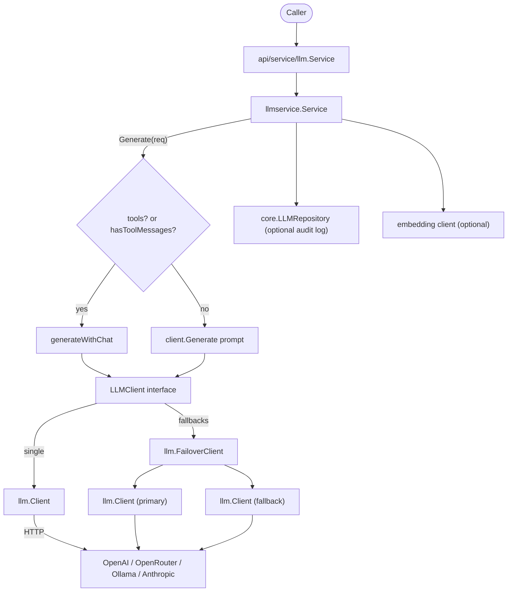

`llm` 模块分布在三处：`internal/llmservice`（决定走普通生成还是 Chat API
的路由服务）、`internal/llm`（多供应商 HTTP 客户端与故障转移层），以及
`api/service/llm`（对嵌入者隐藏 internal 类型的薄封装）。

## 职责

- 持有 `LLMClient` 接口（7 个方法），由 `*llm.Client` 与
  `*llm.FailoverClient` 同时实现，使服务层与供应商解耦。
- 路由 `Service.Generate`：当存在 tools 或某条消息携带 tool-call 数据
  （`ToolCalls`/`ToolCallID`）时委托给 `generateWithChat`；否则回退到普通
  提示生成。
- 通过单一 `*llm.Client` 与 OpenAI、OpenRouter、Ollama、Anthropic 通信，
  支持流式、tracing、callbacks、限流与提示清洗。
- 提供 `FailoverClient` 实现多供应商容错：按供应商冷却、对限流
  （HTTP 429）与瞬时错误自动重试，并由 scorer 选择最健康的客户端。
- 一切都通过 `api/service/llm.Service` 暴露，外部代码无需导入
  `internal/llm` 或 `internal/llmservice`。

## 架构图



## 外部接口

```go
// internal/llmservice
type LLMClient interface {
    Generate(ctx context.Context, prompt string) (string, error)
    GenerateStream(ctx context.Context, prompt string) (<-chan llm.StreamChunk, error)
    Chat(ctx context.Context, messages []*core.LLMMessage, tools []core.Tool, params map[string]any) (*core.GenerateResponse, error)
    IsEnabled() bool
    GetProvider() string
    GetModel() string
    Close()
}

type Service struct { /* unexported */ }
func NewService(config *Config) (*Service, error)
func (s *Service) Generate(ctx context.Context, request *core.GenerateRequest) (*core.GenerateResponse, error)
func (s *Service) GenerateSimple(ctx context.Context, prompt string) (string, error)
func (s *Service) GenerateEmbedding(ctx context.Context, request *core.EmbeddingRequest) (*core.EmbeddingResponse, error)
func (s *Service) GetConfig() *core.LLMConfig
func (s *Service) IsEnabled() bool
func (s *Service) GetProvider() core.LLMProvider
func (s *Service) GetModel() string
func (s *Service) Close()

type Config struct {
    BaseConfig       *core.BaseConfig
    LLMConfig        *core.LLMConfig
    Fallbacks        []*llm.Config
    Repo             core.LLMRepository
    EmbeddingClient  any
    Tracer           ares_observability.Tracer
    CallbackRegistry *ares_callbacks.Registry
}

// internal/llm
type Config struct {
    Provider        string
    APIKey          string
    BaseURL         string
    Model           string
    Timeout         int
    MaxTokens       int
    MaxPromptLength int
    Extra           map[string]string
}

type Client struct { /* unexported */ }
type Option func(*Client)
func WithCallbacks(emitter ares_callbacks.Emitter) Option
func WithRateLimiter(limiter ares_ratelimit.Limiter) Option
func WithSanitizer(s *ares_security.Sanitizer) Option
func NewClient(config *Config, opts ...Option) (*Client, error)
func NewClientFromEnv() (*Client, error)
func (c *Client) Generate(ctx context.Context, prompt string) (string, error)
func (c *Client) GenerateWithParams(ctx context.Context, prompt string, params map[string]any) (string, error)
func (c *Client) GenerateStream(ctx context.Context, prompt string) (<-chan StreamChunk, error)
func (c *Client) Chat(ctx context.Context, messages []*core.LLMMessage, tools []core.Tool, params map[string]any) (*core.GenerateResponse, error)
func (c *Client) IsEnabled() bool
func (c *Client) GetProvider() string
func (c *Client) GetModel() string
func (c *Client) SetTracer(t ares_observability.Tracer)
func (c *Client) Close()

type StreamChunk struct {
    Content string
    Err     error
}

type FailoverClient struct { /* unexported */ }
type FailoverOption func(*FailoverClient)
func WithCooldownDuration(d time.Duration) FailoverOption
func NewFailoverClient(configs []*Config, timeout time.Duration, rate float64, burst int, opts ...FailoverOption) (*FailoverClient, error)
func NewFailoverScorer(configs []*Config, timeout time.Duration, rate float64, burst int) (*FailoverClient, error)
func (fc *FailoverClient) Generate(ctx context.Context, prompt string) (string, error)
func (fc *FailoverClient) GenerateStream(ctx context.Context, prompt string) (<-chan StreamChunk, error)
func (fc *FailoverClient) Chat(ctx context.Context, messages []*core.LLMMessage, tools []core.Tool, params map[string]any) (*core.GenerateResponse, error)
func (fc *FailoverClient) IsEnabled() bool
func (fc *FailoverClient) GetProvider() string
func (fc *FailoverClient) GetModel() string
func (fc *FailoverClient) SetTracer(t ares_observability.Tracer)
func (fc *FailoverClient) Clients() []*Client
func (fc *FailoverClient) ActiveProviders() []string
func (fc *FailoverClient) Close()

// api/service/llm (public wrapper, no internal/ imports in its API)
type Service struct { /* unexported */ }
func NewService(cfg *Config) (*Service, error)
func (s *Service) Generate(ctx context.Context, request *core.GenerateRequest) (*core.GenerateResponse, error)
func (s *Service) GenerateSimple(ctx context.Context, prompt string) (string, error)
func (s *Service) GenerateEmbedding(ctx context.Context, request *core.EmbeddingRequest) (*core.EmbeddingResponse, error)
func (s *Service) GetConfig() *core.LLMConfig
func (s *Service) IsEnabled() bool
func (s *Service) GetProvider() core.LLMProvider
func (s *Service) GetModel() string
func (s *Service) Close()
```

## 关键类型与方法

| 类型 | 方法 | 用途 |
|------|------|------|
| `llmservice.LLMClient` | interface（7 个方法） | `*llm.Client` 与 `*llm.FailoverClient` 的共同契约。 |
| `llmservice.Service` | `NewService(*Config)` | 构建服务；依据 `Fallbacks` 选择单客户端或 `FailoverClient`。 |
| `llmservice.Service` | `Generate(ctx, *GenerateRequest)` | 当 `len(Tools) > 0` 或 `hasToolMessages` 为真时走 `generateWithChat`；否则普通生成。 |
| `llmservice.Service` | `hasToolMessages(msgs)` | 任一消息含 `ToolCalls` 或 `ToolCallID` 即返回真。 |
| `llmservice.Service` | `GenerateEmbedding(ctx, *EmbeddingRequest)` | 通过接口断言委托给可选的 embedding 客户端。 |
| `llm.Config` | 字段 `Provider`、`APIKey`、`BaseURL`、`Model`、`Timeout`、`MaxTokens`、`MaxPromptLength` | 单供应商 HTTP 配置。 |
| `llm.Client` | `NewClient(*Config, opts...)` | 构建供应商客户端，串联 tracer/callbacks/限流器/清洗器。 |
| `llm.Client` | `NewClientFromEnv()` | 从 `ARES_LLM_*` 环境变量构建客户端。 |
| `llm.Client` | `Chat(ctx, msgs, tools, params)` | 供应商感知的 Chat API（OpenAI/OpenRouter/Anthropic/Ollama）。 |
| `llm.Client` | `GenerateStream(ctx, prompt)` | 通过 channel 流式输出 `StreamChunk`；每供应商有独立 SSE 解析器。 |
| `llm.FailoverClient` | `NewFailoverClient(configs, timeout, rate, burst, opts...)` | 带冷却与 scorer 的多供应商客户端。 |
| `llm.FailoverClient` | `Clients()` / `ActiveProviders()` | 内省已注册与当前可用供应商。 |
| `llm.StreamChunk` | 字段 `Content`、`Err` | 单个流式 token 或终止错误。 |
| `api/service/llm.Service` | `NewService(*Config)` | 公开封装；将 `core.LLMConfig` fallback 转为 `llm.Config` 后委托。 |
| `core.LLMProvider` | 常量 `LLMProviderOpenAI`、`LLMProviderOpenRouter`、`LLMProviderOllama`、`LLMProviderAnthropic` | 供应商枚举。 |

## 模块协作

- `api/service/llm.Service` 是唯一的公开入口。其 `Config.toInternal` 将
  `core.LLMConfig` fallback 转换为 `llm.Config`，再转发给
  `llmservice.NewService`。
- `llmservice.NewService` 决定装配方式：当 `Config.Fallbacks` 非空时构建
  `FailoverClient`（主 + 备），否则构建单一 `llm.Client`。Tracer 与
  `ares_callbacks.Registry` 会被附加到每个底层客户端。
- `llmservice.Service.Generate` 是路由接缝。`hasToolMessages` 检查每条
  `*core.LLMMessage` 的 `ToolCalls`/`ToolCallID`；若任一存在，或
  `request.Tools` 非空，调用走 `generateWithChat` 让模型发出 tool call；
  否则将消息拼接成 `[role]: content` 提示做普通生成。
- `llm.Client` 执行实际 HTTP 调用：Chat 走 `chatOpenAI`/`chatAnthropic`/
  `chatOllama`，普通生成走 `generateOpenRouter`/`generateOllama`/
  `generateAnthropic`，流式各有 `streamOllama`/`streamAnthropic`/
  `streamOpenRouter` SSE 解析器。
- `llm.FailoverClient` 包装多个 `*llm.Client`。遇到
  `HTTPError{429}` 或瞬时错误时，将客户端标记为冷却（可通过
  `WithCooldownDuration` 调整）并重试下一个供应商。scorer 跟踪每供应商
  健康度，`ActiveProviders()` 反映当前可用集合。
- 可选的 `core.LLMRepository` 接收 `LogGeneration` 调用用于审计；可选的
  embedding 客户端（实现 `Embed(ctx, text) ([]float64, error)` 与
  `GetModel() string` 即可）支撑 `GenerateEmbedding`。

## 扩展方式

1. **新增 LLM 供应商。** 在 `*llm.Client` 上实现供应商专属的 `generate*`
   与 `chat*` 辅助函数（参考 `chatOpenAI`），在 `Chat`/`Generate` 中按
   新的 `ProviderType` 常量分派，并在 `core.LLMProvider` 加入供应商名。
2. **跨供应商故障转移。** 在 `Config.Fallbacks` 中填入额外的
   `*core.LLMConfig`。`llmservice.NewService` 会构建 `FailoverClient`；
   通过底层客户端选项传入 `llm.WithCooldownDuration` 调节冷却。
3. **接入可观测性。** 通过 `Config.Tracer` 传入
   `ares_observability.Tracer`，通过 `Config.CallbackRegistry` 传入
   `ares_callbacks.Registry`。`NewService` 会把它们附加到每个底层
   `*llm.Client`（含故障转移子客户端）。
4. **新增 embedding 后端。** 将 `Config.EmbeddingClient` 设为任何实现
   `Embed(ctx, text) ([]float64, error)` 的值；`GenerateEmbedding` 会做
   类型断言并把 `float64` 转为 `float32`。
5. **从公开 API 使用。** 通过
   `llm.NewService(&llm.Config{LLMConfig: ..., Fallbacks: ...})` 构建
   `api/service/llm.Service`，再调用 `Generate`/`GenerateSimple`/
   `GenerateEmbedding`。封装层屏蔽了所有 `internal/llm` 类型。

## 双语状态

本页同时维护英文（`llm.en.md`）与中文（`llm.zh.md`）版本。两份文档中的
代码块、类型名、方法名与标识符保持原样，仅翻译散文。

## 成熟度

Production。本模块由 `llmservice_test.go`、`client_test.go`、
`chat_test.go`、`failover_test.go`、`client_stream_test.go`、
`client_callback_test.go` 覆盖，已通过 `sdk.WithLLMConfig`/
`sdk.WithFallbackLLM` 接入 SDK，无任何实验性标记。


