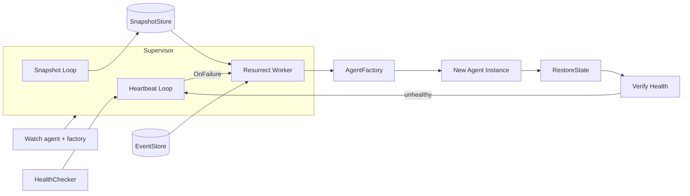

The `plugins` package hosts ARES plugins. The first and currently only plugin is
`resurrection` (`internal/plugins/resurrection`), a supervisor that monitors
agents through a `HealthChecker` and automatically recreates them when they
fail. It depends only on small interfaces, so any agent type that satisfies
`base.Agent` can be supervised.

## Responsibility

- Watch agents registered via `Watch`, each paired with an `AgentFactory` that
  builds a fresh instance on resurrection.
- Run a periodic heartbeat loop: signal liveness for non-offline agents and
  invoke `HealthChecker.CheckHealth` to detect timeouts.
- On failure, resurrect the agent with bounded retries and exponential
  backoff, deduplicating concurrent resurrection attempts per agent.
- Recover agent state by preferring a `SnapshotStore` (full state) and falling
  back to event replay from `ares_events.EventStore` (semantic reconstruction
  of session, task, and status fields).
- Periodically capture snapshots of stateful agents so resurrection can restore
  the latest committed state.
- Verify revived agents immediately; if still unhealthy, re-trigger failure
  detection instead of waiting for the next tick.

## Architecture



The `Supervisor` runs two background goroutines (heartbeat and optional
snapshot) under an `errgroup`. The `HealthChecker` reports failures through an
`OnFailure` callback; the supervisor dispatches a resurrection worker that
calls the factory, recovers state from the snapshot store or by replaying
events, starts the new instance, stops the old one, and verifies the result.
A `HeartbeatAdapter` bridges `ahp.HeartbeatMonitor` to the `HealthChecker`
interface so the plugin stays decoupled from the AHP package.

## External interfaces

These interfaces are implemented by callers and injected into the supervisor.
Signatures are extracted verbatim from the source.

```go
// HealthChecker abstracts health detection. Implementations include
// heartbeat monitors, HTTP probes, or process watchers.
type HealthChecker interface {
    RegisterAgent(agentID string)
    UnregisterAgent(agentID string)
    RecordAlive(agentID string)
    CheckHealth() []string
    OnFailure(fn func(agentID string))
}

// AgentFactory creates a fresh agent instance. Must return a new instance
// each time -- reusing old instances may carry stale state.
type AgentFactory func() base.Agent
```

The supervisor also consumes two external interfaces from `agents/base`:
`base.Agent` (with `ID`, `Type`, `Status`, `Start`, `Stop`), and optionally
`base.StatefulAgent` (with `Snapshot`, `RestoreState`), `base.Heartbeater`
(with `IsAlive`), and `base.SnapshotStore` (with `Save`, `Load`, `Delete`).

## Key types and methods

| Type | Purpose | Key methods |
|------|---------|-------------|
| `Supervisor` | Monitors agents and resurrects them on failure | `New`, `Watch`, `Unwatch`, `Start`, `Stop`, `Agent`, `Stats`, `SetSnapshotStore`, `WithSnapshotStore` |
| `Config` | Plugin configuration | (struct with `CheckInterval`, `ResurrectTimeout`, `MaxAttempts`, `HeartbeatInterval`, `MaxBackoff`, `InitialBackoff`, `SnapshotInterval`) |
| `Stats` | Supervisor statistics | (struct with `Watched`, `Alive`, `Resurrects`, `Statuses`) |
| `HeartbeatAdapter` | Adapts `ahp.HeartbeatMonitor` to `HealthChecker` | `NewHeartbeatAdapter`, `RegisterAgent`, `UnregisterAgent`, `RecordAlive`, `CheckHealth`, `OnFailure` |
| `MemorySnapshotStore` | In-memory `base.SnapshotStore` | `NewMemorySnapshotStore`, `Save`, `Load`, `Delete` |
| `HealthChecker` | Health detection contract | `RegisterAgent`, `UnregisterAgent`, `RecordAlive`, `CheckHealth`, `OnFailure` |
| `AgentFactory` | Builds a fresh agent instance | (function type `func() base.Agent`) |

## Module collaboration

- **agents/base**: `Supervisor` operates on `base.Agent`; stateful agents
  implement `base.StatefulAgent` for snapshot/restore, and heartbeater agents
  implement `base.Heartbeater` for the post-revival `IsAlive` check.
- **ares_events**: when no snapshot exists, `replayEvents` reads the agent's
  event stream, verifies integrity with `VerifyStreamIntegrity`, checks for
  truncation against `StreamVersion`, and reconstructs session/task/status
  state from `EventSessionCreated`, `EventTaskCreated`, `EventAgentStarted`,
  and `EventAgentStopped`.
- **ares_runtime**: `ares_runtime.RecoverSnapshotOrEvents` orchestrates the
  snapshot-first, events-fallback recovery strategy used during resurrection.
- **ares_protocol/ahp**: `HeartbeatAdapter` wraps `ahp.HeartbeatMonitor` and
  registers a failure callback so the supervisor stays decoupled from AHP.
- **ares_ctxutil**: `Stop` on the old agent uses
  `ares_ctxutil.WithDetachedTimeout` so the shutdown is not cancelled by the
  supervisor's own context.

## Extension points

1. Implement `HealthChecker` (or reuse `HeartbeatAdapter` wrapping an
   `ahp.HeartbeatMonitor`) and pass it to `New` along with a `Config`.
2. For each agent, call `Watch(agent, factory)` where `factory` returns a
   brand-new `base.Agent` instance; the supervisor registers it with the
   health checker.
3. To preserve state across revivals, implement `base.StatefulAgent`
   (`Snapshot` / `RestoreState`) on your agent and attach a `SnapshotStore`
   via `SetSnapshotStore` or `WithSnapshotStore` before `Start`; configure
   `Config.SnapshotInterval` to enable periodic snapshots.
4. Optionally pass an `ares_events.EventStore` to `New` so resurrection can
   fall back to event replay when no snapshot is available.
5. Tune retry behavior through `Config`: `MaxAttempts`, `InitialBackoff`, and
   `MaxBackoff` control the exponential backoff; `ResurrectTimeout` bounds a
   single attempt; `HeartbeatInterval` and `CheckInterval` drive the
   background loop.
6. Start the supervisor with `Start(ctx)` and stop it with `Stop()`, which
   cancels the context and waits for all background goroutines to exit.

## Bilingual status

This page is maintained in both English and Chinese with identical technical
content. Code identifiers, type names, and configuration fields remain in
English in both translations.

## Maturity

Production. The package has extensive tests (`resurrection_test.go`,
`resurrection_extra_test.go`, `snapshot_store_test.go`) covering resurrection,
snapshots, event replay, backoff, and the heartbeat adapter, and it is
integrated with the runtime through the `base.Agent` and `ares_runtime`
recovery APIs. There are no experimental markers; deprecated paths are limited
to `MetricsCollector` deprecations in the sibling `ares_arena` package.


