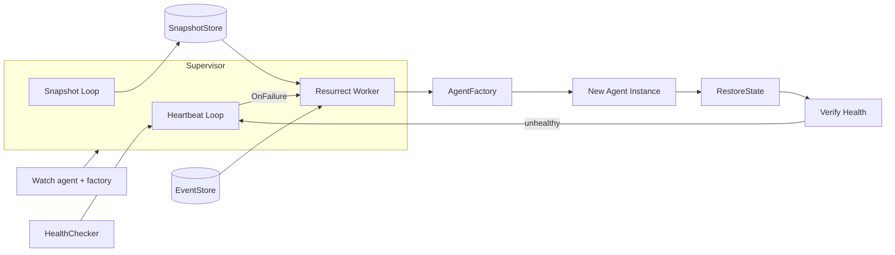

`plugins` 包承载 ARES 的插件。当前唯一的插件是 `resurrection`
（`internal/plugins/resurrection`），它是一个监督器，通过 `HealthChecker`
监控 Agent，并在其失败时自动重建。它仅依赖少量接口，因此任何满足 `base.Agent`
的 Agent 类型均可被监督。

## 职责

- 监督通过 `Watch` 注册的 Agent，每个 Agent 配有一个在复活时构建新实例的
  `AgentFactory`。
- 运行周期性心跳循环：为非离线 Agent 发送存活信号，并调用
  `HealthChecker.CheckHealth` 检测超时。
- 在失败时以有界重试与指数退避复活 Agent，并对同一 Agent 的并发复活去重。
- 恢复 Agent 状态：优先使用 `SnapshotStore`（完整状态），回退到从
  `ares_events.EventStore` 回放事件（语义化重建 session、task 与 status 字段）。
- 周期性对有状态 Agent 采集快照，使复活能恢复最近已提交的状态。
- 复活后立即校验；若仍不健康，则重新触发失败检测，而非等待下一个 tick。

## 架构图



`Supervisor` 在 `errgroup` 下运行两个后台 goroutine（心跳与可选的快照）。
`HealthChecker` 通过 `OnFailure` 回调上报失败；监督器派发一个复活 worker，调用
工厂、从快照存储或事件回放恢复状态、启动新实例、停止旧实例并校验结果。
`HeartbeatAdapter` 将 `ahp.HeartbeatMonitor` 桥接到 `HealthChecker` 接口，使插件
与 AHP 包解耦。

## 外部接口

以下接口由调用方实现并注入监督器，签名均从源码中逐字提取。

```go
// HealthChecker abstracts health detection. Implementations include
// heartbeat monitors, HTTP probes, or process watchers.
type HealthChecker interface {
    RegisterAgent(agentID string)
    UnregisterAgent(agentID string)
    RecordAlive(agentID string)
    CheckHealth() []string
    OnFailure(fn func(agentID string))
}

// AgentFactory creates a fresh agent instance. Must return a new instance
// each time -- reusing old instances may carry stale state.
type AgentFactory func() base.Agent
```

监督器还消费来自 `agents/base` 的两个外部接口：`base.Agent`（含 `ID`、`Type`、
`Status`、`Start`、`Stop`），以及可选的 `base.StatefulAgent`（含 `Snapshot`、
`RestoreState`）、`base.Heartbeater`（含 `IsAlive`）与 `base.SnapshotStore`（含
`Save`、`Load`、`Delete`）。

## 关键类型与方法

| 类型 | 用途 | 关键方法 |
|------|------|----------|
| `Supervisor` | 监控 Agent 并在失败时复活 | `New`, `Watch`, `Unwatch`, `Start`, `Stop`, `Agent`, `Stats`, `SetSnapshotStore`, `WithSnapshotStore` |
| `Config` | 插件配置 | （结构体，含 `CheckInterval`, `ResurrectTimeout`, `MaxAttempts`, `HeartbeatInterval`, `MaxBackoff`, `InitialBackoff`, `SnapshotInterval`） |
| `Stats` | 监督器统计 | （结构体，含 `Watched`, `Alive`, `Resurrects`, `Statuses`） |
| `HeartbeatAdapter` | 将 `ahp.HeartbeatMonitor` 适配为 `HealthChecker` | `NewHeartbeatAdapter`, `RegisterAgent`, `UnregisterAgent`, `RecordAlive`, `CheckHealth`, `OnFailure` |
| `MemorySnapshotStore` | 内存版 `base.SnapshotStore` | `NewMemorySnapshotStore`, `Save`, `Load`, `Delete` |
| `HealthChecker` | 健康检测契约 | `RegisterAgent`, `UnregisterAgent`, `RecordAlive`, `CheckHealth`, `OnFailure` |
| `AgentFactory` | 构建全新 Agent 实例 | （函数类型 `func() base.Agent`） |

## 模块协作

- **agents/base**：`Supervisor` 操作 `base.Agent`；有状态 Agent 实现
  `base.StatefulAgent` 以支持快照/恢复，心跳型 Agent 实现 `base.Heartbeater`
  用于复活后的 `IsAlive` 校验。
- **ares_events**：当无快照时，`replayEvents` 读取 Agent 事件流，使用
  `VerifyStreamIntegrity` 校验完整性，对照 `StreamVersion` 检测截断，并从
  `EventSessionCreated`、`EventTaskCreated`、`EventAgentStarted`、
  `EventAgentStopped` 重建 session/task/status 状态。
- **ares_runtime**：`ares_runtime.RecoverSnapshotOrEvents` 编排“先快照、后事件回放”
  的恢复策略，供复活时使用。
- **ares_protocol/ahp**：`HeartbeatAdapter` 包装 `ahp.HeartbeatMonitor` 并注册失败
  回调，使监督器与 AHP 解耦。
- **ares_ctxutil**：停止旧 Agent 时使用 `ares_ctxutil.WithDetachedTimeout`，使关闭
  不会因监督器自身 context 被取消。

## 扩展方式

1. 实现 `HealthChecker`（或复用包装 `ahp.HeartbeatMonitor` 的
   `HeartbeatAdapter`），与 `Config` 一并传入 `New`。
2. 对每个 Agent 调用 `Watch(agent, factory)`，其中 `factory` 返回全新的
   `base.Agent` 实例；监督器会将其注册到健康检查器。
3. 为在复活间保留状态，在 Agent 上实现 `base.StatefulAgent`
   （`Snapshot` / `RestoreState`），并在 `Start` 前通过 `SetSnapshotStore` 或
   `WithSnapshotStore` 挂载 `SnapshotStore`；配置 `Config.SnapshotInterval` 以启用
   周期性快照。
4. 可选地将 `ares_events.EventStore` 传入 `New`，使复活在无快照时可回退到事件
   回放。
5. 通过 `Config` 调整重试行为：`MaxAttempts`、`InitialBackoff`、`MaxBackoff`
   控制指数退避；`ResurrectTimeout` 约束单次尝试；`HeartbeatInterval` 与
   `CheckInterval` 驱动后台循环。
6. 用 `Start(ctx)` 启动监督器，用 `Stop()` 停止——后者会取消 context 并等待所有
   后台 goroutine 退出。

## 双语状态

本页同时维护英文与中文版本，技术内容一致。两个译本中代码标识符、类型名与配置字段
均保持英文。

## 成熟度

Production。该包拥有覆盖复活、快照、事件回放、退避与心跳适配器的详尽测试
（`resurrection_test.go`、`resurrection_extra_test.go`、
`snapshot_store_test.go`），并通过 `base.Agent` 与 `ares_runtime` 恢复 API 集成
进运行时。无实验性标记；废弃路径仅限于同级 `ares_arena` 包中
`MetricsCollector` 的废弃声明。


