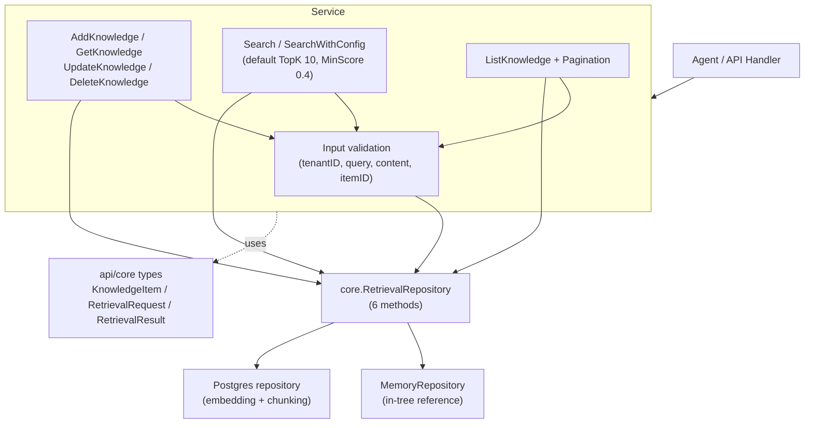

# retrievalservice

## Responsibility

The `retrievalservice` package (Go import path `internal/retrievalservice`,
package name `retrievalservice`) is the service layer for tenant-scoped
knowledge base operations. It wraps a `core.RetrievalRepository` with
validation, ID generation, timestamp management, and pagination, exposing a
small surface for knowledge CRUD and search.

Core responsibilities:

- **Knowledge CRUD** - `AddKnowledge`, `GetKnowledge`, `UpdateKnowledge`,
  `DeleteKnowledge` manage `core.KnowledgeItem` records with tenant isolation
  and ownership checks.
- **Search** - `Search` and `SearchWithConfig` delegate to the repository's
  `SearchKnowledge`, defaulting to simple mode, TopK 10, MinScore 0.4.
- **Listing and pagination** - `ListKnowledge` returns items plus a computed
  `PaginationResponse` (total, page, page size, total pages, has-more).
- **Repository abstraction** - the service depends on
  `core.RetrievalRepository` (6 methods), so the storage backend is
  pluggable. `MemoryRepository` is the in-tree reference implementation for
  development and testing.

The package is deliberately thin: it enforces input contracts and tenant
scope, then delegates persistence and vector search to the repository. The
production repository (under `storage/postgres`) handles embedding-based
search and chunking; this service layer is backend-agnostic.

## Architecture



## External interfaces

Signatures are extracted verbatim from source.

```go
// Service provides retrieval operations for knowledge base.
type Service struct {
    repo   core.RetrievalRepository
    config *core.BaseConfig
}

type Config struct {
    BaseConfig *core.BaseConfig
    Repo       core.RetrievalRepository
}

func NewService(config *Config) (*Service, error)

func (s *Service) Search(ctx context.Context, tenantID, query string) ([]*core.RetrievalResult, error)
func (s *Service) SearchWithConfig(ctx context.Context, request *core.RetrievalRequest) ([]*core.RetrievalResult, error)
func (s *Service) AddKnowledge(ctx context.Context, item *core.KnowledgeItem) (*core.KnowledgeItem, error)
func (s *Service) GetKnowledge(ctx context.Context, tenantID, itemID string) (*core.KnowledgeItem, error)
func (s *Service) UpdateKnowledge(ctx context.Context, tenantID string, item *core.KnowledgeItem) (*core.KnowledgeItem, error)
func (s *Service) DeleteKnowledge(ctx context.Context, tenantID, itemID string) error
func (s *Service) ListKnowledge(ctx context.Context, tenantID string, filter *core.KnowledgeFilter) ([]*core.KnowledgeItem, *core.PaginationResponse, error)

// In-memory repository implementation.
type MemoryRepository struct { /* fields */ }
func NewMemoryRepository() *MemoryRepository

// core.RetrievalRepository (the contract the service depends on).
type RetrievalRepository interface {
    CreateKnowledge(ctx context.Context, item *KnowledgeItem) error
    GetKnowledge(ctx context.Context, tenantID, itemID string) (*KnowledgeItem, error)
    UpdateKnowledge(ctx context.Context, item *KnowledgeItem) error
    DeleteKnowledge(ctx context.Context, itemID string) error
    SearchKnowledge(ctx context.Context, request *RetrievalRequest) ([]*RetrievalResult, error)
    ListKnowledge(ctx context.Context, tenantID string, filter *KnowledgeFilter) ([]*KnowledgeItem, error)
}
```

When `Config.BaseConfig` is nil, `NewService` defaults to `RequestTimeout`
30s, `MaxRetries` 3, `RetryDelay` 1s. `Search` defaults to
`RetrievalModeSimple`, TopK 10, MinScore 0.4.

## Key types and methods

| Type / Method | Kind | Purpose |
| --- | --- | --- |
| `Service` | struct | Wraps a `core.RetrievalRepository` with validation and pagination. |
| `Config` | struct | Service config: `BaseConfig` and the `RetrievalRepository`. |
| `NewService` | function | Constructs the service; defaults BaseConfig when nil. |
| `Search` | method | Tenant-scoped search with simple-mode defaults (TopK 10, MinScore 0.4). |
| `SearchWithConfig` | method | Search with a caller-supplied `RetrievalRequest` / `RetrievalConfig`. |
| `AddKnowledge` | method | Creates a knowledge item; auto-generates ID (`kb_<uuid>`) and timestamps. |
| `GetKnowledge` | method | Retrieves an item by ID within tenant scope. |
| `UpdateKnowledge` | method | Updates an item after verifying existence and tenant ownership. |
| `DeleteKnowledge` | method | Deletes an item after verifying existence and tenant ownership. |
| `ListKnowledge` | method | Lists items with optional `KnowledgeFilter`; computes pagination. |
| `MemoryRepository` | struct | In-memory `RetrievalRepository` for dev/testing; thread-safe. |
| `NewMemoryRepository` | function | Constructs the in-memory repository. |
| `generateKnowledgeID` | function | Produces `kb_<uuid>` IDs for items without one. |

## Module collaboration

- **api/core** - the service is built entirely on `core` types:
  `RetrievalRepository`, `KnowledgeItem`, `RetrievalRequest`,
  `RetrievalConfig`, `RetrievalResult`, `KnowledgeFilter`, `BaseConfig`, and
  `PaginationResponse`.
- **storage/postgres** - the production `RetrievalRepository` implementation
  lives in the storage layer, where embedding-based vector search and
  chunking are handled against pgvector.
- **ares_memory** - retrieved `KnowledgeItem` content can feed memory
  distillation and RAG context via the `ContextRetriever` adapters.
- **errors** - sentinel errors (`ErrInvalidTenantID`, `ErrInvalidQuery`,
  `ErrKnowledgeNotFound`) wrap `apperrors.ErrNotFound` for generic
  `errors.Is` checks.

## Extension points

1. **Swap the repository backend.** Implement the 6-method
   `core.RetrievalRepository` interface against your storage, then pass it to
   `NewService` via `Config.Repo`. The service is backend-agnostic; only the
   repository knows about embeddings or chunking.
2. **Use the in-memory repository for tests.** Construct the service with
   `NewMemoryRepository()` to run knowledge CRUD and search without a
   database. The in-memory repo enforces tenant isolation and returns copies
   to prevent mutation.
3. **Customize search behavior.** Call `SearchWithConfig` with a
   `RetrievalRequest` whose `Config` sets `Mode` (simple / advanced / hybrid),
   `TopK`, `MinScore`, `Rerank`, and `Filters`. The repository interprets
   these; the service only validates tenant and query.
4. **Tune base config.** Provide a `core.BaseConfig` in `Config.BaseConfig`
   to set `RequestTimeout`, `MaxRetries`, and `RetryDelay`; otherwise the
   service applies the 30s / 3 / 1s defaults.
5. **Add a new validation rule.** Extend the validation block at the top of
   each `Service` method (the existing pattern checks tenant ID, query, item
   ID, and content against the sentinel errors in `errors.go`).

## Bilingual status

Source code, identifiers, type names, and code comments are in English. This
English page is the canonical reference. A Chinese translation with identical
structure and technical content is published alongside as
`retrievalservice.zh.md`; all code blocks, signatures, and identifiers remain
in English in both pages.

## Maturity

Beta. The package is functional and covered by `retrievalservice_test.go`
(exercising the service and the in-memory repository across CRUD, search,
pagination, and tenant-isolation paths). The public `Service` API is stable,
but the package is classified Beta because the repository contract and
retrieval modes (simple / advanced / hybrid) are still evolving alongside the
storage-layer embedding and chunking work.


