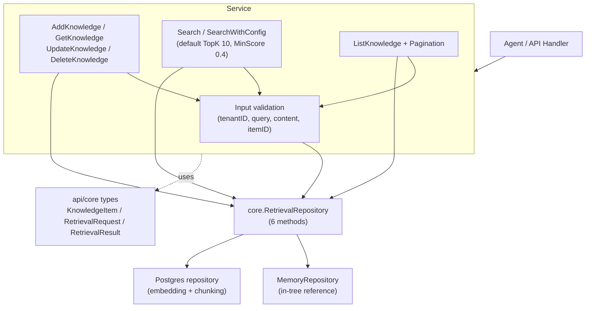

# retrievalservice

## 职责

`retrievalservice` 包（Go 导入路径 `internal/retrievalservice`，包名
`retrievalservice`）是租户作用域知识库操作的服务层。它包装 `core.RetrievalRepository`，
提供校验、ID 生成、时间戳管理与分页，暴露精简的知识 CRUD 与搜索接口。

核心职责：

- **知识 CRUD** —— `AddKnowledge`、`GetKnowledge`、`UpdateKnowledge`、`DeleteKnowledge`
  管理 `core.KnowledgeItem` 记录，含租户隔离与归属校验。
- **搜索** —— `Search` 与 `SearchWithConfig` 委托给仓储的 `SearchKnowledge`，默认 simple
  模式、TopK 10、MinScore 0.4。
- **列表与分页** —— `ListKnowledge` 返回条目及计算出的 `PaginationResponse`（total、page、
  page size、total pages、has-more）。
- **仓储抽象** —— 服务依赖 `core.RetrievalRepository`（6 个方法），存储后端可插拔。
  `MemoryRepository` 是包内自带的开发与测试参考实现。

该包刻意保持精简：它只负责强制输入契约与租户作用域，然后将持久化与向量检索委托给仓储。
生产仓储（位于 `storage/postgres`）处理基于嵌入的检索与分块；本服务层与后端无关。

## 架构图



## 外部接口

下列签名均逐字取自源码。

```go
// Service provides retrieval operations for knowledge base.
type Service struct {
    repo   core.RetrievalRepository
    config *core.BaseConfig
}

type Config struct {
    BaseConfig *core.BaseConfig
    Repo       core.RetrievalRepository
}

func NewService(config *Config) (*Service, error)

func (s *Service) Search(ctx context.Context, tenantID, query string) ([]*core.RetrievalResult, error)
func (s *Service) SearchWithConfig(ctx context.Context, request *core.RetrievalRequest) ([]*core.RetrievalResult, error)
func (s *Service) AddKnowledge(ctx context.Context, item *core.KnowledgeItem) (*core.KnowledgeItem, error)
func (s *Service) GetKnowledge(ctx context.Context, tenantID, itemID string) (*core.KnowledgeItem, error)
func (s *Service) UpdateKnowledge(ctx context.Context, tenantID string, item *core.KnowledgeItem) (*core.KnowledgeItem, error)
func (s *Service) DeleteKnowledge(ctx context.Context, tenantID, itemID string) error
func (s *Service) ListKnowledge(ctx context.Context, tenantID string, filter *core.KnowledgeFilter) ([]*core.KnowledgeItem, *core.PaginationResponse, error)

// In-memory repository implementation.
type MemoryRepository struct { /* fields */ }
func NewMemoryRepository() *MemoryRepository

// core.RetrievalRepository (the contract the service depends on).
type RetrievalRepository interface {
    CreateKnowledge(ctx context.Context, item *KnowledgeItem) error
    GetKnowledge(ctx context.Context, tenantID, itemID string) (*KnowledgeItem, error)
    UpdateKnowledge(ctx context.Context, item *KnowledgeItem) error
    DeleteKnowledge(ctx context.Context, itemID string) error
    SearchKnowledge(ctx context.Context, request *RetrievalRequest) ([]*RetrievalResult, error)
    ListKnowledge(ctx context.Context, tenantID string, filter *KnowledgeFilter) ([]*KnowledgeItem, error)
}
```

当 `Config.BaseConfig` 为 nil 时，`NewService` 默认 `RequestTimeout` 30s、`MaxRetries` 3、
`RetryDelay` 1s。`Search` 默认 `RetrievalModeSimple`、TopK 10、MinScore 0.4。

## 关键类型与方法

| 类型 / 方法 | 类别 | 用途 |
| --- | --- | --- |
| `Service` | struct | 包装 `core.RetrievalRepository`，提供校验与分页。 |
| `Config` | struct | 服务配置：`BaseConfig` 与 `RetrievalRepository`。 |
| `NewService` | function | 构造服务；BaseConfig 为 nil 时使用默认值。 |
| `Search` | method | 租户作用域搜索，simple 模式默认（TopK 10、MinScore 0.4）。 |
| `SearchWithConfig` | method | 使用调用方提供的 `RetrievalRequest` / `RetrievalConfig` 搜索。 |
| `AddKnowledge` | method | 创建知识条目；自动生成 ID（`kb_<uuid>`）与时间戳。 |
| `GetKnowledge` | method | 在租户作用域内按 ID 取条目。 |
| `UpdateKnowledge` | method | 校验存在性与租户归属后更新条目。 |
| `DeleteKnowledge` | method | 校验存在性与租户归属后删除条目。 |
| `ListKnowledge` | method | 按可选 `KnowledgeFilter` 列出条目并计算分页。 |
| `MemoryRepository` | struct | 用于开发/测试的内存版 `RetrievalRepository`；线程安全。 |
| `NewMemoryRepository` | function | 构造内存仓储。 |
| `generateKnowledgeID` | function | 为缺失 ID 的条目生成 `kb_<uuid>`。 |

## 模块协作

- **api/core** —— 服务完全基于 `core` 类型构建：`RetrievalRepository`、`KnowledgeItem`、
  `RetrievalRequest`、`RetrievalConfig`、`RetrievalResult`、`KnowledgeFilter`、`BaseConfig`
  与 `PaginationResponse`。
- **storage/postgres** —— 生产版 `RetrievalRepository` 实现位于存储层，针对 pgvector 处理
  基于嵌入的向量检索与分块。
- **ares_memory** —— 检索到的 `KnowledgeItem` 内容可通过 `ContextRetriever` 适配器喂给记忆
  蒸馏与 RAG 上下文。
- **errors** —— 哨兵错误（`ErrInvalidTenantID`、`ErrInvalidQuery`、`ErrKnowledgeNotFound`）
  包装 `apperrors.ErrNotFound`，支持通用的 `errors.Is` 检查。

## 扩展方式

1. **替换仓储后端。** 针对你的存储实现 6 方法的 `core.RetrievalRepository` 接口，再通过
   `Config.Repo` 传给 `NewService`。服务与后端无关；只有仓储了解嵌入或分块细节。
2. **测试时使用内存仓储。** 用 `NewMemoryRepository()` 构造服务，即可在无数据库环境下运行
   知识 CRUD 与搜索。内存仓储强制租户隔离，并返回副本以防篡改。
3. **自定义搜索行为。** 调用 `SearchWithConfig`，传入 `RetrievalRequest`，其 `Config` 设置
   `Mode`（simple / advanced / hybrid）、`TopK`、`MinScore`、`Rerank` 与 `Filters`。这些由
   仓储解释；服务仅校验租户与查询。
4. **调优基础配置。** 在 `Config.BaseConfig` 中提供 `core.BaseConfig` 以设置 `RequestTimeout`、
   `MaxRetries` 与 `RetryDelay`；否则服务采用 30s / 3 / 1s 默认值。
5. **新增校验规则。** 在每个 `Service` 方法顶部的校验块中扩展（现有模式按哨兵错误
   `errors.go` 检查租户 ID、查询、条目 ID 与内容）。

## 双语状态

源码、标识符、类型名与代码注释均为英文，本英文页面为权威参考。中文译本以相同结构与同等
技术内容随附发布为 `retrievalservice.zh.md`；两份页面中的所有代码块、签名与标识符均保持英文。

## 成熟度

Beta。该包功能完备，并由 `retrievalservice_test.go` 覆盖（涉及服务与内存仓储的 CRUD、搜索、
分页与租户隔离路径）。公开 `Service` API 稳定，但归为 Beta，因为仓储契约与检索模式
（simple / advanced / hybrid）仍随存储层的嵌入与分块工作一同演进。


