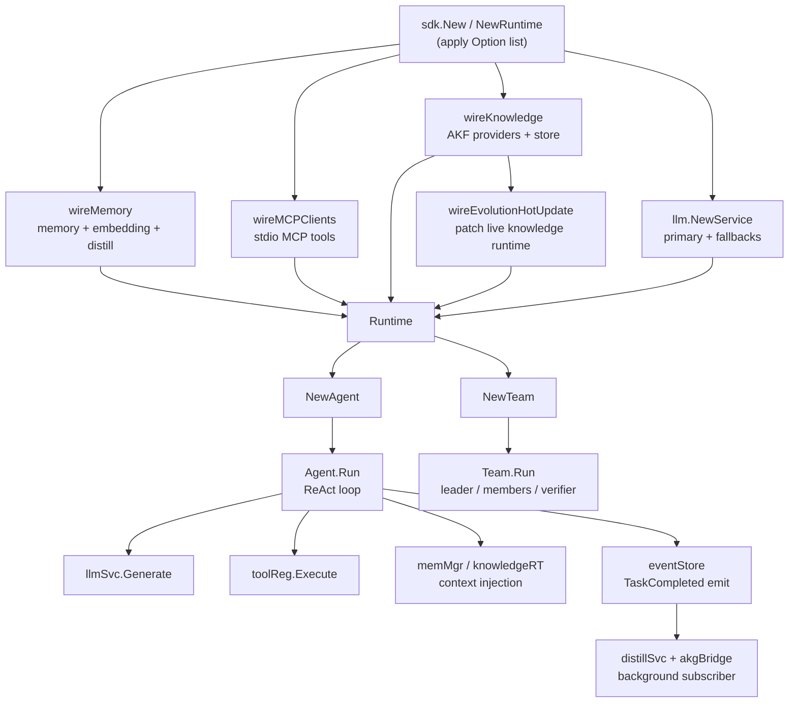

The `sdk` package (`github.com/Timwood0x10/ares/sdk`) is the single facade over
the ARES runtime. It owns the LLM client, tool registry, memory and
distillation engine, AKF Knowledge Fabric, strategy evolution, MCP
connections, and the event-driven distillation subscriber. Application code
only imports this package and drives agents and teams through `Runtime`,
`Agent`, and `Team`.

## Responsibility

- Provide one constructor (`NewRuntime` / `New`) that wires every internal
  subsystem from a list of functional options.
- Expose a ReAct agent loop (`Agent.Run`) that builds messages, calls the LLM,
  executes tool calls, persists memory, and emits `TaskCompleted` events for
  downstream distillation.
- Provide streaming (`Agent.Stream`), human-in-the-loop approval, and a
  configurable iteration cap.
- Orchestrate multi-agent work via `Team` (leader discovers, members execute
  concurrently, optional verifier, leader synthesises).
- Load and validate YAML configuration (`ares.yaml`) through `LoadConfigFile`
  and `ConfigFile.ToOptions`.
- Run a GA-based strategy evolution cycle (`Runtime.Evolve`) over an agent.

## Architecture



## External interfaces

```go
// Constructors
func NewRuntime(opts ...Option) *Runtime
func New(opts ...Option) (*Runtime, error)

// Runtime lifecycle and accessors
func (r *Runtime) Close()
func (r *Runtime) ToolRegistry() *tools.Registry
func (r *Runtime) GetModel() string
func (r *Runtime) GetProvider() string
func (r *Runtime) KnowledgeStore() knowledge.KnowledgeStore
func (r *Runtime) Evolve(ctx context.Context, agent *Agent, task string) (string, error)
func (r *Runtime) NewAgent(name string, opts ...AgentOption) *Agent
func (r *Runtime) NewTeam(name string, leader *Agent, members []*Agent) *Team

// Runtime owns (selected fields):
type Runtime struct {
    llmSvc           *llm.Service
    toolReg          *tools.Registry
    memMgr           memory.MemoryManager
    memEnabled       bool
    evoEnabled       bool
    knowledgeEnabled bool
    knowledgeRT      *khruntime.KnowledgeRuntime
    knowledgeStore   knowledge.KnowledgeStore
    evolutionStore   *memStrategyStore
    evoComponents    *ares_bootstrap.NewEvolutionComponents
    eventStore       ares_events.EventStore
    mcpClients       []*mcp.Client
    distillSvc       *aresexp.DistillationService
    akgBridge        *adapter.DistillBridge
    // ctx/cancel/eg govern background goroutine lifetime
}

// Agent entry points
type Agent struct {
    name        string
    instruction string
    tools       []tools.Tool
    runtime     *Runtime
    humanInput  HumanInputFunc
    maxIter     int
}
func (a *Agent) Run(ctx context.Context, input string) (*Result, error)
func (a *Agent) Stream(ctx context.Context, input string) (<-chan StreamChunk, error)

type Result struct {
    Output     string
    ToolCalls  int
    MemoryUsed bool
    TokenUsage TokenUsage
    Duration   time.Duration
}
type TokenUsage struct{ Input, Output, Total int }
type StreamChunk struct {
    Content string
    Done    bool
    Err     error
    Result  *Result
}
type HumanInputFunc func(ctx context.Context, toolName string, args map[string]any) (approved bool, err error)

// Options
type Option func(*config) error
type ConfigOption func(*config) error
type AgentOption func(*agentConfig)
type TeamOption func(*Team)

func WithOpenAI(model string) Option
func WithOllama(model string) Option
func WithAnthropic(model string) Option
func WithOpenRouter(model string) Option
func WithBaseURL(url string) Option
func WithAPIKey(key string) Option
func WithLLMConfig(cfg *core.LLMConfig) Option
func WithFallbackLLM(cfg *core.LLMConfig) Option
func WithDefaultMemory() Option
func WithMemoryConfig(maxHistory, maxSessions int) Option
func WithDistillation(threshold int) Option
func WithRAG(topK int, minScore float64) Option
func WithEmbeddingService(url, model string) Option
func WithPostgres(cfg DatabaseFileConfig) Option
func WithKnowledgeConfig(cfg KnowledgeFileConfig) Option
func WithEvolution() Option
func WithKnowledge() Option
func WithAKGQualityGate(q knowledge.QualityGateConfig) Option
func WithAKGEmbedding(model, baseURL string) Option
func WithKnowledgeProvider(p provider.GraphProvider) Option
func WithSQLiteKnowledgeStore(dbPath string) Option
func WithMCP(conn MCPConn) Option
func WithTrace(isEnabled bool) Option
func WithConfig(path string) ConfigOption
func WithConfigFromEnv() ConfigOption

func WithInstruction(instruction string) AgentOption
func WithTools(tt ...tools.Tool) AgentOption
func WithHumanInput(fn HumanInputFunc) AgentOption
func WithMaxIterations(n int) AgentOption

// Config file
func LoadConfigFile(path string) (*ConfigFile, error)
func (c *ConfigFile) Validate() error
func (c *ConfigFile) ToOptions() ([]Option, error)

// Team
type RunMode int
const (ModeAutoSplit RunMode = iota; ModeExplicit)
type GroupConfig struct {
    Name    string
    Indices []int
    Task    string
}
type TeamConfig struct {
    Mode           RunMode
    Groups         []GroupConfig
    VerifierIndex  int
    MaxConcurrency int
}
func DefaultTeamConfig() TeamConfig
func (t *Team) WithTeamConfig(cfg TeamConfig) *Team
func (t *Team) Run(ctx context.Context, input string) (*TeamResult, error)
type SubResult struct {
    MemberName string
    Output     string
    Error      string
    Duration   string
}
type TeamResult struct {
    Plan         string
    SubResults   []SubResult
    Verification string
    Output       string
    Duration     time.Duration
    Passed       bool
}
func WithTeamConfig(cfg TeamConfig) TeamOption
func WithAutoSplit() TeamOption
func WithExplicitGroups(groups ...GroupConfig) TeamOption
func WithVerifier(index int) TeamOption
func WithMaxConcurrency(n int) TeamOption

// Constants
const defaultMaxIterations = 10
type MCPConn struct {
    Name    string
    Command string
    Args    []string
}
```

## Key types and methods

| Type / Method | Purpose |
| --- | --- |
| `Runtime` | Top-level container owning LLM, tools, memory, knowledge, evolution, MCP, events. |
| `NewRuntime(opts ...Option) *Runtime` | Panic-on-error constructor for quickstart code. |
| `New(opts ...Option) (*Runtime, error)` | Error-returning constructor used by production code. |
| `Runtime.Close()` | Cancels background goroutines, closes LLM, memory, and MCP clients. |
| `Runtime.NewAgent` | Builds an `Agent` bound to this runtime from `AgentOption`s. |
| `Runtime.NewTeam` | Builds a `Team` (leader + members) for multi-agent orchestration. |
| `Runtime.Evolve` | Runs a 3-generation GA cycle, scoring strategies by real execution. |
| `Runtime.KnowledgeStore` | Returns the AKF store (in-memory, SQLite, or Postgres) when knowledge is enabled. |
| `Agent.Run` | ReAct loop: build messages, generate, execute tools, emit events, return `Result`. |
| `Agent.Stream` | Wraps `Run` and emits `StreamChunk` values over a channel. |
| `Option` / `ConfigOption` | Functional configurators applied to the internal `config`. |
| `ConfigFile` | Mirrors `ares.yaml`; `LoadConfigFile` reads, `Validate` checks ranges, `ToOptions` converts. |
| `Team.Run` | 5-phase orchestration: discover, assign, execute, verify, synthesise. |
| `TeamConfig` | Selects `ModeAutoSplit` vs `ModeExplicit`, verifier index, concurrency cap. |
| `HumanInputFunc` | Hook invoked before each tool call to approve, skip, or abort. |

## Module collaboration

- `sdk` -> `api/core` for `LLMConfig`, `BaseConfig`, `LLMMessage`, `Tool`,
  `GenerateRequest`, `LLMProvider` constants.
- `sdk` -> `api/service/llm` for the `llm.Service` that performs generation
  with fallback chains.
- `sdk` -> `api/tools` for the `tools.Registry` and `tools.Tool` interface.
- `sdk` -> `api/mcp` for stdio MCP clients whose tools are adapted via the
  internal `mcpToolAdapter`.
- `sdk` -> `internal/ares_memory` for the `MemoryManager` (sessions, RAG,
  distillation) wired by `wireMemory`.
- `sdk` -> `internal/knowledge` and `internal/knowledge/runtime` for the AKF
  Knowledge Fabric runtime, providers, linkers, reducers, and stores.
- `sdk` -> `internal/ares_evolution` (genome, mutation) and
  `internal/ares_bootstrap` for the strategy evolution and hot-update wiring.
- `sdk` -> `internal/ares_events` for the event store and `TaskCompleted`
  emission consumed by the distillation subscriber.
- `sdk` -> `internal/ares_experience` for `DistillationService` and the AKG
  `DistillBridge` that distils conversations into knowledge objects.

## Extension points

1. Implement the `tools.Tool` interface (`Name`, `Description`, `Parameters`,
   `Capabilities`, `Execute`) and register it via `Runtime.ToolRegistry()`
   before calling `NewAgent`, or pass it directly through `WithTools`.
2. Add an external knowledge source by implementing
   `provider.GraphProvider` and registering it with `WithKnowledgeProvider`
   alongside `WithKnowledge`.
3. Bring your own LLM provider by constructing a `*core.LLMConfig` and passing
   it through `WithLLMConfig`; add failover targets with `WithFallbackLLM`.
4. Connect external tool servers with `WithMCP(MCPConn{Name, Command, Args})`;
   each server's tools are auto-registered into the tool registry.
5. Plug human-in-the-loop approval into an agent with
   `WithHumanInput(HumanInputFunc)` to gate every tool call.
6. Drive the runtime from YAML with `LoadConfigFile("ares.yaml")` then
   `cfg.ToOptions()` passed into `New`, or use `WithConfigFromEnv()` to honour
   the `ARES_YAML` environment variable.
7. Customise multi-agent topology with `WithExplicitGroups`, `WithVerifier`,
   and `WithMaxConcurrency` on `NewTeam`.

## Bilingual status

This page is the English reference. A Chinese translation with identical
structure and technical content is published as `sdk.zh.md`. All code
identifiers, type names, and signatures are kept in English in both files;
only the prose differs.

## Maturity

Production. The `sdk` package is the documented entry point for the runtime,
is covered by `sdk_test.go`, `config_test.go`, and the `_test.go` files for
memory, evolution, distillation, and AKF wiring, exposes no experimental
markers, and integrates every internal subsystem through `New` /
`NewRuntime`.


