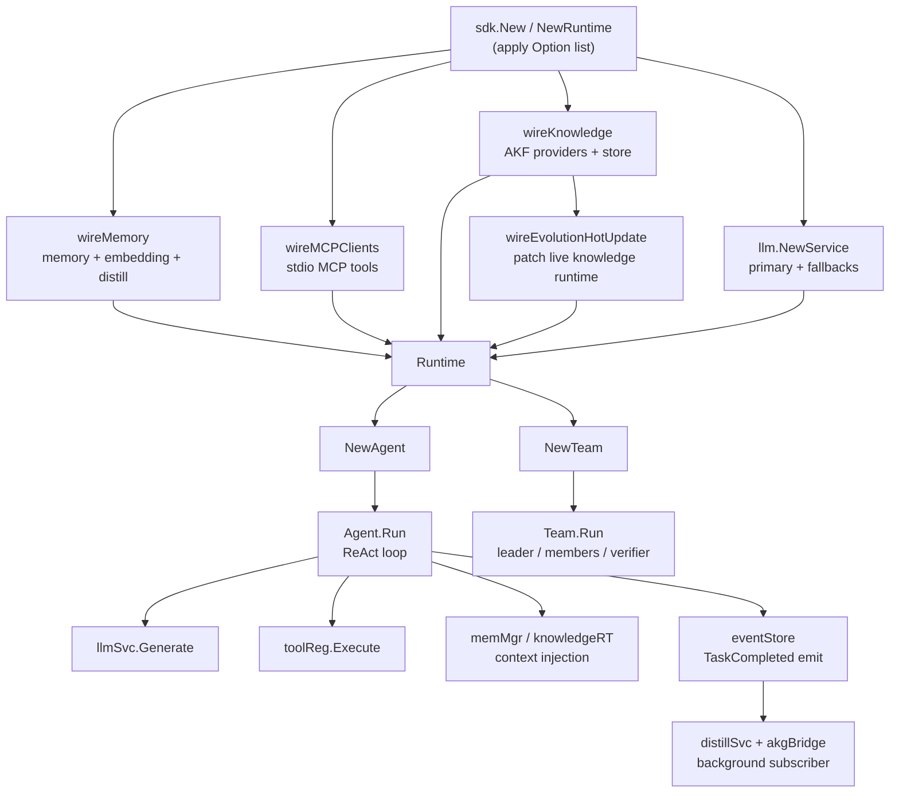

`sdk` 包（`github.com/Timwood0x10/ares/sdk`）是 ARES 运行时的唯一外观层。
它持有 LLM 客户端、工具注册表、内存与蒸馏引擎、AKF 知识织物、策略进化、MCP
连接以及事件驱动的蒸馏订阅者。应用代码只需导入该包，并通过 `Runtime`、
`Agent` 与 `Team` 驱动智能体与团队。

## 职责

- 提供单一构造函数（`NewRuntime` / `New`），从一组函数式 Option 装配所有内部子系统。
- 暴露 ReAct 智能体循环（`Agent.Run`）：构造消息、调用 LLM、执行工具调用、
  持久化内存，并对外发射 `TaskCompleted` 事件供下游蒸馏消费。
- 提供流式输出（`Agent.Stream`）、人在回路审批钩子以及可配置的迭代上限。
- 通过 `Team` 编排多智能体协作（leader 发现任务、成员并发执行、可选 verifier、
  leader 汇总）。
- 通过 `LoadConfigFile` 与 `ConfigFile.ToOptions` 加载并校验 YAML 配置
  （`ares.yaml`）。
- 通过 `Runtime.Evolve` 在智能体上运行基于遗传算法的策略进化周期。

## 架构图



## 外部接口

```go
// Constructors
func NewRuntime(opts ...Option) *Runtime
func New(opts ...Option) (*Runtime, error)

// Runtime lifecycle and accessors
func (r *Runtime) Close()
func (r *Runtime) ToolRegistry() *tools.Registry
func (r *Runtime) GetModel() string
func (r *Runtime) GetProvider() string
func (r *Runtime) KnowledgeStore() knowledge.KnowledgeStore
func (r *Runtime) Evolve(ctx context.Context, agent *Agent, task string) (string, error)
func (r *Runtime) NewAgent(name string, opts ...AgentOption) *Agent
func (r *Runtime) NewTeam(name string, leader *Agent, members []*Agent) *Team

// Runtime owns (selected fields):
type Runtime struct {
    llmSvc           *llm.Service
    toolReg          *tools.Registry
    memMgr           memory.MemoryManager
    memEnabled       bool
    evoEnabled       bool
    knowledgeEnabled bool
    knowledgeRT      *khruntime.KnowledgeRuntime
    knowledgeStore   knowledge.KnowledgeStore
    evolutionStore   *memStrategyStore
    evoComponents    *ares_bootstrap.NewEvolutionComponents
    eventStore       ares_events.EventStore
    mcpClients       []*mcp.Client
    distillSvc       *aresexp.DistillationService
    akgBridge        *adapter.DistillBridge
    // ctx/cancel/eg govern background goroutine lifetime
}

// Agent entry points
type Agent struct {
    name        string
    instruction string
    tools       []tools.Tool
    runtime     *Runtime
    humanInput  HumanInputFunc
    maxIter     int
}
func (a *Agent) Run(ctx context.Context, input string) (*Result, error)
func (a *Agent) Stream(ctx context.Context, input string) (<-chan StreamChunk, error)

type Result struct {
    Output     string
    ToolCalls  int
    MemoryUsed bool
    TokenUsage TokenUsage
    Duration   time.Duration
}
type TokenUsage struct{ Input, Output, Total int }
type StreamChunk struct {
    Content string
    Done    bool
    Err     error
    Result  *Result
}
type HumanInputFunc func(ctx context.Context, toolName string, args map[string]any) (approved bool, err error)

// Options
type Option func(*config) error
type ConfigOption func(*config) error
type AgentOption func(*agentConfig)
type TeamOption func(*Team)

func WithOpenAI(model string) Option
func WithOllama(model string) Option
func WithAnthropic(model string) Option
func WithOpenRouter(model string) Option
func WithBaseURL(url string) Option
func WithAPIKey(key string) Option
func WithLLMConfig(cfg *core.LLMConfig) Option
func WithFallbackLLM(cfg *core.LLMConfig) Option
func WithDefaultMemory() Option
func WithMemoryConfig(maxHistory, maxSessions int) Option
func WithDistillation(threshold int) Option
func WithRAG(topK int, minScore float64) Option
func WithEmbeddingService(url, model string) Option
func WithPostgres(cfg DatabaseFileConfig) Option
func WithKnowledgeConfig(cfg KnowledgeFileConfig) Option
func WithEvolution() Option
func WithKnowledge() Option
func WithAKGQualityGate(q knowledge.QualityGateConfig) Option
func WithAKGEmbedding(model, baseURL string) Option
func WithKnowledgeProvider(p provider.GraphProvider) Option
func WithSQLiteKnowledgeStore(dbPath string) Option
func WithMCP(conn MCPConn) Option
func WithTrace(isEnabled bool) Option
func WithConfig(path string) ConfigOption
func WithConfigFromEnv() ConfigOption

func WithInstruction(instruction string) AgentOption
func WithTools(tt ...tools.Tool) AgentOption
func WithHumanInput(fn HumanInputFunc) AgentOption
func WithMaxIterations(n int) AgentOption

// Config file
func LoadConfigFile(path string) (*ConfigFile, error)
func (c *ConfigFile) Validate() error
func (c *ConfigFile) ToOptions() ([]Option, error)

// Team
type RunMode int
const (ModeAutoSplit RunMode = iota; ModeExplicit)
type GroupConfig struct {
    Name    string
    Indices []int
    Task    string
}
type TeamConfig struct {
    Mode           RunMode
    Groups         []GroupConfig
    VerifierIndex  int
    MaxConcurrency int
}
func DefaultTeamConfig() TeamConfig
func (t *Team) WithTeamConfig(cfg TeamConfig) *Team
func (t *Team) Run(ctx context.Context, input string) (*TeamResult, error)
type SubResult struct {
    MemberName string
    Output     string
    Error      string
    Duration   string
}
type TeamResult struct {
    Plan         string
    SubResults   []SubResult
    Verification string
    Output       string
    Duration     time.Duration
    Passed       bool
}
func WithTeamConfig(cfg TeamConfig) TeamOption
func WithAutoSplit() TeamOption
func WithExplicitGroups(groups ...GroupConfig) TeamOption
func WithVerifier(index int) TeamOption
func WithMaxConcurrency(n int) TeamOption

// Constants
const defaultMaxIterations = 10
type MCPConn struct {
    Name    string
    Command string
    Args    []string
}
```

## 关键类型与方法

| 类型 / 方法 | 用途 |
| --- | --- |
| `Runtime` | 顶层容器，持有 LLM、工具、内存、知识、进化、MCP、事件等子系统。 |
| `NewRuntime(opts ...Option) *Runtime` | 出错即 panic 的构造函数，便于快速上手。 |
| `New(opts ...Option) (*Runtime, error)` | 返回 error 的构造函数，供生产代码使用。 |
| `Runtime.Close()` | 取消后台 goroutine，关闭 LLM、内存与 MCP 客户端。 |
| `Runtime.NewAgent` | 基于 `AgentOption` 构建绑定到该 Runtime 的 `Agent`。 |
| `Runtime.NewTeam` | 构建 `Team`（leader + 成员）用于多智能体编排。 |
| `Runtime.Evolve` | 运行 3 代 GA 周期，以真实执行结果为策略打分。 |
| `Runtime.KnowledgeStore` | 当知识功能启用时返回 AKF 存储（内存、SQLite 或 Postgres）。 |
| `Agent.Run` | ReAct 循环：构造消息、生成、执行工具、发射事件并返回 `Result`。 |
| `Agent.Stream` | 包装 `Run`，通过 channel 发射 `StreamChunk`。 |
| `Option` / `ConfigOption` | 应用于内部 `config` 的函数式配置器。 |
| `ConfigFile` | 对应 `ares.yaml`；`LoadConfigFile` 读取、`Validate` 校验、`ToOptions` 转换。 |
| `Team.Run` | 五阶段编排：发现、分配、执行、校验、汇总。 |
| `TeamConfig` | 选择 `ModeAutoSplit` 或 `ModeExplicit`、verifier 索引、并发上限。 |
| `HumanInputFunc` | 在每次工具调用前触发，用于批准、跳过或中止。 |

## 模块协作

- `sdk` -> `api/core`：使用 `LLMConfig`、`BaseConfig`、`LLMMessage`、`Tool`、
  `GenerateRequest`、`LLMProvider` 常量。
- `sdk` -> `api/service/llm`：使用带 fallback 链的 `llm.Service` 执行生成。
- `sdk` -> `api/tools`：使用 `tools.Registry` 与 `tools.Tool` 接口。
- `sdk` -> `api/mcp`：使用 stdio MCP 客户端，工具经内部 `mcpToolAdapter` 适配。
- `sdk` -> `internal/ares_memory`：使用 `MemoryManager`（会话、RAG、蒸馏），
  由 `wireMemory` 装配。
- `sdk` -> `internal/knowledge` 与 `internal/knowledge/runtime`：使用 AKF 知识织物
  runtime、provider、linker、reducer 与各类存储。
- `sdk` -> `internal/ares_evolution`（genome、mutation）与
  `internal/ares_bootstrap`：用于策略进化与热更新装配。
- `sdk` -> `internal/ares_events`：使用事件存储与 `TaskCompleted` 发射，供蒸馏订阅者消费。
- `sdk` -> `internal/ares_experience`：使用 `DistillationService` 与 AKG
  `DistillBridge`，将对话蒸馏为知识对象。

## 扩展方式

1. 实现 `tools.Tool` 接口（`Name`、`Description`、`Parameters`、`Capabilities`、
   `Execute`），在调用 `NewAgent` 前通过 `Runtime.ToolRegistry()` 注册，或直接用
   `WithTools` 传入。
2. 实现额外的知识源：实现 `provider.GraphProvider`，并通过 `WithKnowledgeProvider`
   配合 `WithKnowledge` 注册。
3. 自带 LLM provider：构造 `*core.LLMConfig` 经 `WithLLMConfig` 传入，再用
   `WithFallbackLLM` 增加故障转移目标。
4. 通过 `WithMCP(MCPConn{Name, Command, Args})` 接入外部工具服务器，其工具会自动
   注册进工具注册表。
5. 通过 `WithHumanInput(HumanInputFunc)` 为智能体插入人在回路审批，对每次工具调用把关。
6. 通过 `LoadConfigFile("ares.yaml")` 再 `cfg.ToOptions()` 传给 `New` 以 YAML 驱动
   runtime，或用 `WithConfigFromEnv()` 遵循 `ARES_YAML` 环境变量。
7. 在 `NewTeam` 上通过 `WithExplicitGroups`、`WithVerifier`、`WithMaxConcurrency`
   定制多智能体拓扑。

## 双语状态

本页为中文参考。结构与技术内容完全相同的英文版本发布为 `sdk.en.md`。两个文件中
所有代码标识符、类型名与签名均保持英文，仅叙述性文字不同。

## 成熟度

Production。`sdk` 包是 runtime 的官方入口，由 `sdk_test.go`、`config_test.go`
以及内存、进化、蒸馏、AKF 装配相关的 `_test.go` 文件覆盖，不含任何实验性标记，
并通过 `New` / `NewRuntime` 集成所有内部子系统。


