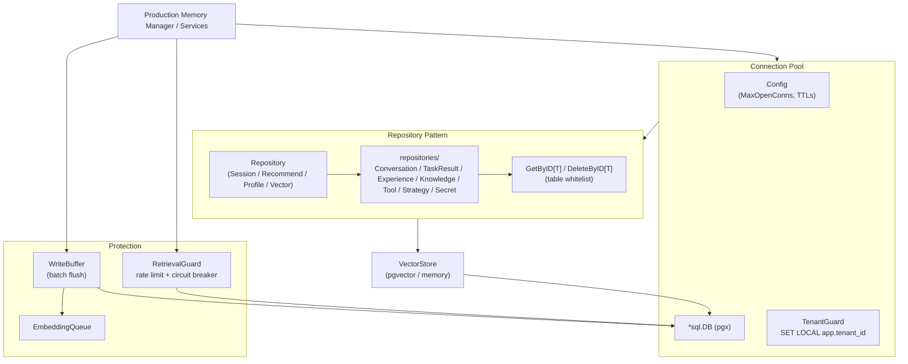

# storage

## Responsibility

The `storage` package (Go import path `internal/storage`, package name
`storage`) defines the persistence layer for ARES. It comprises a top-level
vector-store contract and a PostgreSQL subsystem under
`internal/storage/postgres` (package `postgres`) that provides connection
pooling, multi-tenant isolation, repository-pattern data access, write
batching, and retrieval protection.

Core responsibilities:

- **Vector store contract** - the `VectorStore` interface (`Search`,
  `AddEmbedding`, `CreateCollection`) is the backend-agnostic contract for
  vector similarity search. PostgreSQL (pgvector), Qdrant, Milvus, SQLite-vec,
  or in-memory all plug in here.
- **Connection pooling** - `Pool` implements the get / use / release pattern
  over `database/sql` with configurable `MaxOpenConns`, `MaxIdleConns`,
  `ConnMaxLifetime`, and `ConnMaxIdleTime`.
- **Tenant isolation** - `TenantGuard` enforces row-level isolation by setting
  `app.tenant_id` via `SET LOCAL` semantics on every tenant-scoped operation,
  preventing cross-tenant data leakage on pooled connections.
- **Repository pattern** - `Repository` aggregates `SessionRepository`,
  `RecommendRepository`, `ProfileRepository`, and a `VectorStore`; sub-package
  `repositories` adds `ConversationRepository`, `TaskResultRepository`,
  `ExperienceRepository`, `KnowledgeRepository`, `ToolRepository`,
  `StrategyRepository`, and `SecretRepository`. A generic `GetByID[T]` /
  `DeleteByID[T]` helper enforces a table whitelist against SQL injection.
- **Write batching and retrieval protection** - `WriteBuffer` batches writes
  to reduce database and embedding load; `RetrievalGuard` applies rate
  limiting, circuit breaking, and timeout protection to retrieval paths.

## Architecture



## External interfaces

Signatures are extracted verbatim from source.

```go
// VectorStore (top-level contract) - all vector backends implement this.
type VectorStore interface {
    Search(ctx context.Context, table string, embedding []float64, limit int) ([]*SearchResult, error)
    AddEmbedding(ctx context.Context, table, id string, embedding []float64, metadata map[string]any) error
    CreateCollection(ctx context.Context, name string, dimension int) error
}

// PostgreSQL pool and configuration.
type Pool struct { /* fields */ }
func NewPool(cfg *Config) (*Pool, error)
func (p *Pool) Get(ctx context.Context) (*sql.Conn, error)
func (p *Pool) Release(conn *sql.Conn)
func (p *Pool) WithConnection(ctx context.Context, fn func(*sql.Conn) error) error
func (p *Pool) GetDB() *sql.DB

type Config struct {
    Host, User, Password, Database, SSLMode string
    Port               int
    MaxOpenConns       int
    MaxIdleConns       int
    ConnMaxLifetime    time.Duration
    ConnMaxIdleTime    time.Duration
    QueryTimeout       time.Duration
    Embedding          *EmbeddingConfig
}
func DefaultConfig() *Config
func (c *Config) DSN() string
func (c *Config) Validate() error

// Tenant isolation.
type TenantGuard struct { /* fields */ }
func NewTenantGuard(pool *Pool) *TenantGuard
func (g *TenantGuard) SetTenantContext(ctx context.Context, tenantID string) error
func (g *TenantGuard) MustSetTenantContext(ctx context.Context, tenantID string) error

// Repository aggregator.
type Repository struct {
    Session   *SessionRepository
    Recommend *RecommendRepository
    Profile   *ProfileRepository
    Vector    storage.VectorStore
}
func NewRepository(pool *Pool) *Repository
func (r *Repository) Transaction(ctx context.Context, fn func(repo *Repository) error) error

// Generic helpers (table-whitelisted).
func GetByID[T any](ctx context.Context, db DBTX, table, id, tenantID string, scan func(Scannable) (*T, error)) (*T, error)

// Write batching and retrieval protection.
type WriteBuffer struct { /* fields */ }
func NewWriteBuffer(pool *Pool, queue *EmbeddingQueue, batchSize int, flushInterval time.Duration, embeddingConfig *EmbeddingConfig) *WriteBuffer

type RetrievalGuard struct { /* fields */ }
func NewRetrievalGuard(maxRequestsPerSec int, failureThreshold int, openTimeout, dbTimeout time.Duration) *RetrievalGuard
```

`DefaultConfig` returns the production-safe defaults: `Host` localhost,
`Port` 5432, `SSLMode` "require", `MaxOpenConns` 25, `MaxIdleConns` 10,
`ConnMaxLifetime` 5m, `ConnMaxIdleTime` 1m, `QueryTimeout` 30s. Password is
intentionally empty; callers must supply credentials explicitly.

## Key types and methods

| Type / Method | Kind | Purpose |
| --- | --- | --- |
| `VectorStore` | interface | 3-method backend-agnostic vector contract (Search, AddEmbedding, CreateCollection). |
| `SearchResult` | struct | Single vector search result: ID, Score, Metadata. |
| `Pool` | struct | Connection pool with get / use / release; tracks wait count and duration. |
| `Config` | struct | Pool configuration: host, port, credentials, conn limits, timeouts, embedding config. |
| `DefaultConfig` | function | Production-safe defaults (SSLMode require, 25 open / 10 idle conns, 30s timeout). |
| `TenantGuard` | struct | Enforces `app.tenant_id` via `SET LOCAL` for row-level isolation. |
| `Repository` | struct | Aggregates Session, Recommend, Profile, and Vector sub-repositories. |
| `Transaction` | method | Runs a function in a transaction with transaction-scoped sub-repositories. |
| `GetByID[T]` | function | Generic by-ID lookup; table must be on the `allowedTables` whitelist. |
| `WriteBuffer` | struct | Batches writes with periodic flush to reduce DB and embedding load. |
| `EmbeddingQueue` | struct | Async embedding processing queue. |
| `RetrievalGuard` | struct | Rate limiting + circuit breaker + DB timeout for retrieval paths. |
| `CircuitBreaker` | struct | Failure-threshold circuit breaker for embedding service. |
| `DBTX` | interface | Satisfied by `*sql.DB` and `*sql.Tx`; enables transaction-aware repos. |
| `EmbeddingConfig` | struct | Embedding defaults: model intfloat/e5-large, batch 32, retries 3. |

## Module collaboration

- **ares_memory** - `ProductionMemoryManager` depends on `postgres.Pool`,
  `TenantGuard`, `WriteBuffer`, `RetrievalGuard`, and the conversation /
  task-result repositories for its persistent backend.
- **ares_events** - `PostgresEventStore` is backed by `postgres.Pool` and
  persists events in the `events` table with optimistic concurrency control.
- **knowledge** - the `knowledge/store/postgres` backend uses a `*sql.DB`
  connection (opened independently or sourced from the pool) for its
  `KnowledgeStore` implementation.
- **retrievalservice** - the production retrieval repository path uses the
  pool and `TenantGuard` for tenant-scoped knowledge search.
- **storage/memory** - an in-memory `VectorStore` implementation used for
  testing and single-node deployments.

## Extension points

1. **Add a new vector backend.** Implement the 3-method `VectorStore`
   interface (`Search`, `AddEmbedding`, `CreateCollection`) for your backend
   (e.g. Qdrant, Milvus). Wire it into `Repository.Vector` or use it directly
   via the `context.VectorSearcher` interface in `ares_memory`.
2. **Add a domain repository.** Create a new repository struct in
   `internal/storage/postgres/repositories/` that takes a `DBTX` (so it works
   with both `*sql.DB` and `*sql.Tx`), mirroring `ExperienceRepository`. If
   it needs generic by-ID access, add its table to the `allowedTables`
   whitelist in `base_repository.go` before using `GetByID[T]`.
3. **Tune the connection pool.** Construct a `Config` via `DefaultConfig`,
   then adjust `MaxOpenConns`, `MaxIdleConns`, `ConnMaxLifetime`,
   `ConnMaxIdleTime`, and `QueryTimeout` for your workload before calling
   `NewPool`. `Validate` fills zero values with safe defaults.
4. **Run multi-statement transactions.** Use `Repository.Transaction` to
   execute a function against a transaction-scoped `Repository`; the helper
   rolls back on error and commits on success, with all sub-repositories
   bound to the same `*sql.Tx`.
5. **Enforce tenant isolation.** Call `TenantGuard.SetTenantContext(ctx,
   tenantID)` at the start of every tenant-scoped operation. The setting uses
   `SET LOCAL` semantics, so it is scoped to the current transaction and
   cannot leak across pooled connections.
6. **Protect retrieval paths.** Wrap retrieval calls with `RetrievalGuard`:
   `AllowRateLimit` gates request rate, `CheckEmbeddingCircuitBreaker` opens
   on repeated embedding failures to fall back to keyword-only search, and
   `dbTimeout` bounds each database operation.

## Bilingual status

Source code, identifiers, type names, and code comments are in English. This
English page is the canonical reference. A Chinese translation with identical
structure and technical content is published alongside as `storage.zh.md`;
all code blocks, signatures, and identifiers remain in English in both pages.

## Maturity

Production. The package is covered by `storage_test.go`, `pool_test.go`,
`config_test.go`, `repository_test.go`, `tenant_guard` usage across the
codebase, `circuit_breaker_test.go`, `security_test.go`, `timeout_test.go`,
`comprehensive_test.go`, `coverage_test.go`, and per-repository tests under
`repositories/`. It is integrated into the SDK via
`ProductionMemoryManager`, `PostgresEventStore`, and the production retrieval
path. No experimental markers remain; the table whitelist, `SET LOCAL`
tenant isolation, and SSL-by-default config are production hardening
features.


