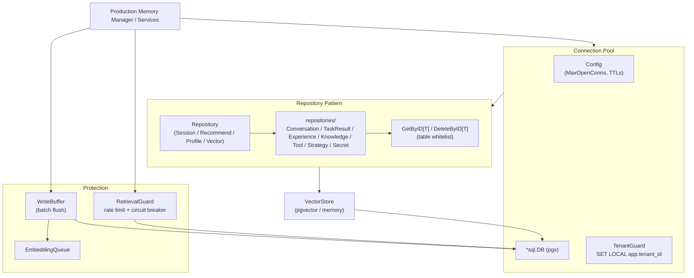

# storage

## 职责

`storage` 包（Go 导入路径 `internal/storage`，包名 `storage`）定义 ARES 的持久化层。它包含
顶层的向量存储契约，以及位于 `internal/storage/postgres`（包名 `postgres`）的 PostgreSQL 子
系统，提供连接池、多租户隔离、仓储模式数据访问、写入批处理与检索保护。

核心职责：

- **向量存储契约** —— `VectorStore` 接口（`Search`、`AddEmbedding`、`CreateCollection`）
  是后端无关的向量相似度检索契约。PostgreSQL（pgvector）、Qdrant、Milvus、SQLite-vec 或内存
  实现均可在此接入。
- **连接池** —— `Pool` 基于 `database/sql` 实现 get / use / release 模式，可配置
  `MaxOpenConns`、`MaxIdleConns`、`ConnMaxLifetime` 与 `ConnMaxIdleTime`。
- **租户隔离** —— `TenantGuard` 通过 `SET LOCAL` 语义在每次租户作用域操作上设置
  `app.tenant_id`，防止连接池中跨租户数据泄露。
- **仓储模式** —— `Repository` 聚合 `SessionRepository`、`RecommendRepository`、
  `ProfileRepository` 与 `VectorStore`；子包 `repositories` 额外提供 `ConversationRepository`、
  `TaskResultRepository`、`ExperienceRepository`、`KnowledgeRepository`、`ToolRepository`、
  `StrategyRepository` 与 `SecretRepository`。泛型 `GetByID[T]` / `DeleteByID[T]` 通过表白名单
  防范 SQL 注入。
- **写入批处理与检索保护** —— `WriteBuffer` 批量写入以降低数据库与嵌入负载；
  `RetrievalGuard` 为检索路径施加限流、熔断与超时保护。

## 架构图



## 外部接口

下列签名均逐字取自源码。

```go
// VectorStore (top-level contract) - all vector backends implement this.
type VectorStore interface {
    Search(ctx context.Context, table string, embedding []float64, limit int) ([]*SearchResult, error)
    AddEmbedding(ctx context.Context, table, id string, embedding []float64, metadata map[string]any) error
    CreateCollection(ctx context.Context, name string, dimension int) error
}

// PostgreSQL pool and configuration.
type Pool struct { /* fields */ }
func NewPool(cfg *Config) (*Pool, error)
func (p *Pool) Get(ctx context.Context) (*sql.Conn, error)
func (p *Pool) Release(conn *sql.Conn)
func (p *Pool) WithConnection(ctx context.Context, fn func(*sql.Conn) error) error
func (p *Pool) GetDB() *sql.DB

type Config struct {
    Host, User, Password, Database, SSLMode string
    Port               int
    MaxOpenConns       int
    MaxIdleConns       int
    ConnMaxLifetime    time.Duration
    ConnMaxIdleTime    time.Duration
    QueryTimeout       time.Duration
    Embedding          *EmbeddingConfig
}
func DefaultConfig() *Config
func (c *Config) DSN() string
func (c *Config) Validate() error

// Tenant isolation.
type TenantGuard struct { /* fields */ }
func NewTenantGuard(pool *Pool) *TenantGuard
func (g *TenantGuard) SetTenantContext(ctx context.Context, tenantID string) error
func (g *TenantGuard) MustSetTenantContext(ctx context.Context, tenantID string) error

// Repository aggregator.
type Repository struct {
    Session   *SessionRepository
    Recommend *RecommendRepository
    Profile   *ProfileRepository
    Vector    storage.VectorStore
}
func NewRepository(pool *Pool) *Repository
func (r *Repository) Transaction(ctx context.Context, fn func(repo *Repository) error) error

// Generic helpers (table-whitelisted).
func GetByID[T any](ctx context.Context, db DBTX, table, id, tenantID string, scan func(Scannable) (*T, error)) (*T, error)

// Write batching and retrieval protection.
type WriteBuffer struct { /* fields */ }
func NewWriteBuffer(pool *Pool, queue *EmbeddingQueue, batchSize int, flushInterval time.Duration, embeddingConfig *EmbeddingConfig) *WriteBuffer

type RetrievalGuard struct { /* fields */ }
func NewRetrievalGuard(maxRequestsPerSec int, failureThreshold int, openTimeout, dbTimeout time.Duration) *RetrievalGuard
```

`DefaultConfig` 返回生产安全默认值：`Host` localhost、`Port` 5432、`SSLMode` "require"、
`MaxOpenConns` 25、`MaxIdleConns` 10、`ConnMaxLifetime` 5m、`ConnMaxIdleTime` 1m、
`QueryTimeout` 30s。密码刻意留空，调用方必须显式提供凭证。

## 关键类型与方法

| 类型 / 方法 | 类别 | 用途 |
| --- | --- | --- |
| `VectorStore` | interface | 3 方法的后端无关向量契约（Search、AddEmbedding、CreateCollection）。 |
| `SearchResult` | struct | 单条向量检索结果：ID、Score、Metadata。 |
| `Pool` | struct | 连接池，get / use / release；记录等待次数与等待时长。 |
| `Config` | struct | 池配置：主机、端口、凭证、连接上限、超时、嵌入配置。 |
| `DefaultConfig` | function | 生产安全默认值（SSLMode require、25 open / 10 idle、30s 超时）。 |
| `TenantGuard` | struct | 通过 `SET LOCAL` 强制 `app.tenant_id`，实现行级隔离。 |
| `Repository` | struct | 聚合 Session、Recommend、Profile 与 Vector 子仓储。 |
| `Transaction` | method | 在事务中执行函数，子仓储绑定到同一事务。 |
| `GetByID[T]` | function | 泛型按 ID 查询；表必须在 `allowedTables` 白名单内。 |
| `WriteBuffer` | struct | 周期性批量刷写，降低数据库与嵌入负载。 |
| `EmbeddingQueue` | struct | 异步嵌入处理队列。 |
| `RetrievalGuard` | struct | 检索路径的限流 + 熔断 + 数据库超时。 |
| `CircuitBreaker` | struct | 针对嵌入服务的失败阈值熔断器。 |
| `DBTX` | interface | 由 `*sql.DB` 与 `*sql.Tx` 满足；支持事务感知仓储。 |
| `EmbeddingConfig` | struct | 嵌入默认值：模型 intfloat/e5-large、批 32、重试 3。 |

## 模块协作

- **ares_memory** —— `ProductionMemoryManager` 依赖 `postgres.Pool`、`TenantGuard`、
  `WriteBuffer`、`RetrievalGuard` 以及 conversation / task-result 仓储作为持久化后端。
- **ares_events** —— `PostgresEventStore` 以 `postgres.Pool` 为底层，将事件持久化到 `events`
  表，并采用乐观并发控制。
- **knowledge** —— `knowledge/store/postgres` 后端使用 `*sql.DB` 连接（独立打开或取自池）实现
  `KnowledgeStore`。
- **retrievalservice** —— 生产检索仓储路径使用连接池与 `TenantGuard` 进行租户作用域的知识检索。
- **storage/memory** —— 内存版 `VectorStore` 实现，用于测试与单节点部署。

## 扩展方式

1. **新增向量后端。** 为你的后端（如 Qdrant、Milvus）实现 3 方法的 `VectorStore` 接口
   （`Search`、`AddEmbedding`、`CreateCollection`）。将其接入 `Repository.Vector`，或直接通过
   `ares_memory` 中的 `context.VectorSearcher` 接口使用。
2. **新增领域仓储。** 在 `internal/storage/postgres/repositories/` 中创建接收 `DBTX` 的新仓储
   结构体（使其同时兼容 `*sql.DB` 与 `*sql.Tx`），参照 `ExperienceRepository`。若需泛型按 ID
   访问，请先在 `base_repository.go` 的 `allowedTables` 白名单中加入对应表，再使用 `GetByID[T]`。
3. **调优连接池。** 通过 `DefaultConfig` 构造 `Config`，再按负载调整 `MaxOpenConns`、
   `MaxIdleConns`、`ConnMaxLifetime`、`ConnMaxIdleTime` 与 `QueryTimeout`，最后调用 `NewPool`。
   `Validate` 会以安全默认值填充零值。
4. **运行多语句事务。** 使用 `Repository.Transaction` 在事务作用域的 `Repository` 上执行函数；
   该助手在出错时回滚、成功时提交，所有子仓储绑定到同一 `*sql.Tx`。
5. **强制租户隔离。** 在每次租户作用域操作开始时调用
   `TenantGuard.SetTenantContext(ctx, tenantID)`。该设置使用 `SET LOCAL` 语义，仅作用于当前事务，
   不会跨池化连接泄露。
6. **保护检索路径。** 用 `RetrievalGuard` 包装检索调用：`AllowRateLimit` 控制请求速率，
   `CheckEmbeddingCircuitBreaker` 在嵌入服务连续失败时熔断以回退到纯关键词检索，`dbTimeout`
   约束每次数据库操作时长。

## 双语状态

源码、标识符、类型名与代码注释均为英文，本英文页面为权威参考。中文译本以相同结构与同等
技术内容随附发布为 `storage.zh.md`；两份页面中的所有代码块、签名与标识符均保持英文。

## 成熟度

Production。该包由 `storage_test.go`、`pool_test.go`、`config_test.go`、
`repository_test.go`、跨代码库的 `tenant_guard` 使用、`circuit_breaker_test.go`、
`security_test.go`、`timeout_test.go`、`comprehensive_test.go`、`coverage_test.go` 以及
`repositories/` 下各仓储测试覆盖。它通过 `ProductionMemoryManager`、`PostgresEventStore`
与生产检索路径接入 SDK。无实验性标记；表白名单、`SET LOCAL` 租户隔离与默认 SSL 配置均为
生产加固特性。


