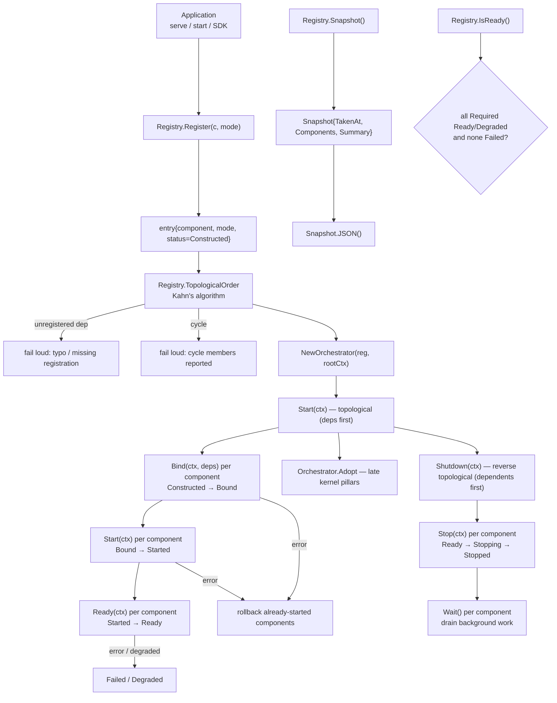
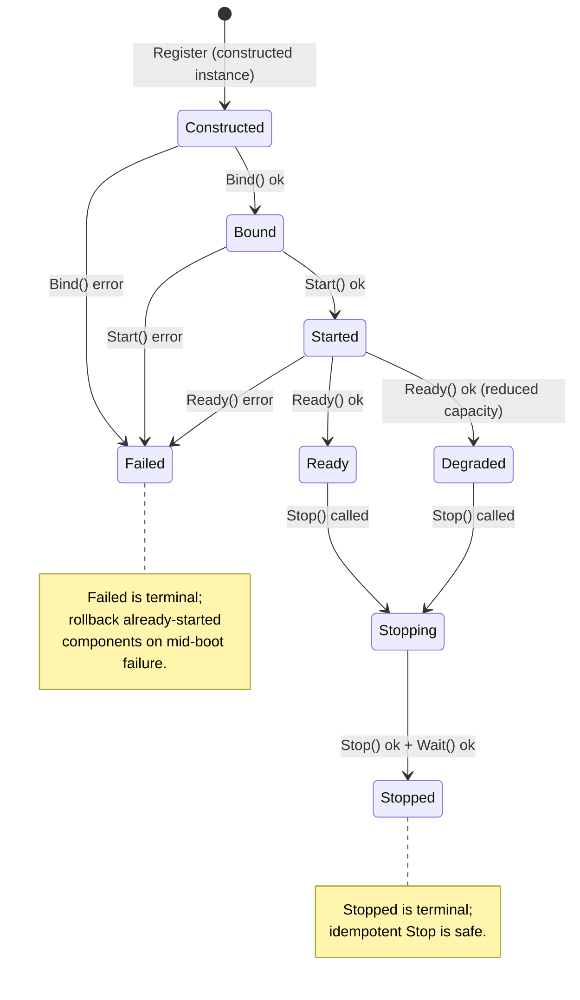

> **Status (verified 2026-09 against the source tree):** there is no
> `internal/system_runtime` package. The System Runtime control plane
> (component registry, dependency-aware orchestration, status snapshots)
> lives in **`internal/kernel`** (package `kernel`, unified with the former
> kernelscheduler/kernelctx). Bootstrap wires it via
> `internal/ares_bootstrap/system_runtime_wiring.go`; kernel pillars join
> late via `Orchestrator.Adopt`. Source is authoritative.

The System Runtime control plane in `internal/kernel` (package `kernel`) is
the **System Runtime** control plane that unifies component assembly,
dependency resolution, lifecycle orchestration, and shutdown coordination
across all entry points (`serve`, `start`, SDK).

The System Runtime is distinct from `ares_runtime.Manager`, which remains
the **Agent lifecycle** subsystem. System Runtime owns the broader component
graph: `EventStore`, `Memory`, `MCP`, `Flight`, `Evolution`, `Tools`,
`HTTP`, etc. Together with `taskfabric` (Scheduler), `agentfabric`
(Lifecycle), and `agentipc` (IPC), it completes the **ARES Kernel**: the
three pillars plus the control plane that boots and shuts them down in
dependency order.

## Responsibility

- Provide the `Component` interface and its lifecycle companions
  (`Binder`, `Starter`, `ReadinessChecker`, `Stopper`, `Waiter`):
  identity (`Name`), dependency metadata (`Dependencies`), dependency
  injection (`Bind(ctx, deps)`), active lifecycle (`Start` / `Stop`),
  readiness (`Ready`), and background drain (`Wait`).
- Provide the `Mode` taxonomy (`ModeRequired` / `ModeOptional` /
  `ModeDegraded`) that declares how a component's failure affects the
  overall system.
- Own the component `Registry`: name → `entry{component, mode, status}`,
  registration-order iteration, dependency-aware `Resolver` (`Get(name)`),
  and the status data plane (`GetStatus`, `SetStatus`, `AllStatuses`).
- Compute the dependency-aware `TopologicalOrder` via Kahn's algorithm;
  fail loud on an unregistered dependency (a typo or missing registration
  must not be silently hidden) and on a detected cycle (the cycle members
  are reported in the error).
- Orchestrate the lifecycle state machine through the `Orchestrator`:
  `Constructed → Bound → Started → Ready` on the way up (topological
  `Start` so dependencies start first); reverse-topological `Shutdown`
  (dependents stop first); rollback of already-started components on a
  mid-boot failure; `Adopt` for late kernel-pillar registration.
- Provide the status snapshot API: `Snapshot` (point-in-time view of all
  component statuses with an aggregated `SnapshotSummary`), `IsReady`
  (true iff all `ModeRequired` components are `Ready`/`Degraded` and none
  is `Failed`), and `Snapshot.JSON` for diagnostic/monitoring output.

## Architecture



## Lifecycle state machine



## External interfaces

```go
package kernel

// --- Component contracts ---

type Component interface {
    Name() string
    Dependencies() []string  // names of components that must be Ready first
}

type Binder interface {
    Bind(ctx context.Context, deps Resolver) error  // inject live references
}
type Starter interface {
    Start(ctx context.Context) error  // goroutines, connections, tickers
}
type ReadinessChecker interface {
    Ready(ctx context.Context) error  // verifies fully operational
}
type Stopper interface {
    Stop(ctx context.Context) error  // idempotent; reverse-topological order
}
type Waiter interface {
    Wait() error  // blocks until background work owned by the component completes
}

type Resolver interface {
    Get(name string) any  // returns the component instance, or nil if not found
}

// --- Mode ---

type Mode int
const (
    ModeRequired Mode = iota  // must reach Ready for system Ready
    ModeOptional              // not constructed when disabled; Required when enabled
    ModeDegraded              // may operate in reduced capacity; must report degraded state
)
func (m Mode) String() string

// --- Registry ---

type Registry struct {
    // mu sync.RWMutex
    // entries map[string]*entry
    // order []string  — registration order for deterministic iteration
}
func NewRegistry() *Registry
func (r *Registry) Register(c Component, mode Mode) error  // rejects nil / typed-nil / empty name / duplicate
func (r *Registry) Get(name string) any                    // implements Resolver
func (r *Registry) GetComponent(name string) Component
func (r *Registry) GetMode(name string) (Mode, bool)
func (r *Registry) GetStatus(name string) (ComponentStatus, bool)
func (r *Registry) SetStatus(name string, status ComponentStatus)
func (r *Registry) AllStatuses() []ComponentStatus
func (r *Registry) Names() []string
func (r *Registry) TopologicalOrder() ([]string, error)  // Kahn's algorithm; fail loud on cycle/unregistered dep
func (r *Registry) IsReady() bool                          // all Required Ready/Degraded and none Failed
func (r *Registry) Snapshot() Snapshot

// --- Orchestrator ---

type Orchestrator struct {
    // reg *Registry
    // rootCtx context.Context
    // mu sync.Mutex
    // started, stopped bool
}
func NewOrchestrator(reg *Registry, rootCtx context.Context) *Orchestrator
func (o *Orchestrator) Start(ctx context.Context) error          // topological Bind → Start → Ready (deps first)
func (o *Orchestrator) Shutdown(ctx context.Context) error       // reverse-topological Stop → Wait (dependents first)
func (o *Orchestrator) Adopt(ctx context.Context, c Component, mode Mode) error // late registration after Start
func (o *Orchestrator) Go(fn func() error)                       // managed goroutine with error capture
func (o *Orchestrator) GoBackground(name string, fn func(ctx context.Context) error)
func (o *Orchestrator) SetEventSink(store ares_events.EventStore)
func (o *Orchestrator) Snapshot() Snapshot
func (o *Orchestrator) RootContext() context.Context
func (o *Orchestrator) Cancel()

// --- State machine ---

type State int
const (
    // Registration hands over a constructed instance (no separate Declared step).
    StateConstructed State = iota
    StateBound
    StateStarted
    StateReady
    StateDegraded
    StateFailed
    StateStopping
    StateStopped
    StateDisabled
)
func (s State) String() string
func (s State) IsHealthy() bool    // Ready | Degraded

type ComponentStatus struct {
    Name       string    `json:"name"`
    Mode       Mode      `json:"mode"`
    State      State     `json:"state"`
    Reason     string    `json:"reason,omitempty"`
    StartedAt  time.Time `json:"started_at,omitempty"`
    InstanceID string    `json:"instance_id,omitempty"`
}
func (s ComponentStatus) String() string

// --- Snapshot API ---

type Snapshot struct {
    TakenAt    time.Time         `json:"taken_at"`
    Components []ComponentStatus `json:"components"`
    Summary    SnapshotSummary   `json:"summary"`
}
type SnapshotSummary struct {
    Total    int `json:"total"`
    Ready    int `json:"ready"`
    Degraded int `json:"degraded"`
    Failed   int `json:"failed"`
    Disabled int `json:"disabled"`
    Stopped  int `json:"stopped"`
}
func (s Snapshot) JSON() ([]byte, error)
```

## Key types and methods

| Type / Method | Purpose |
| --- | --- |
| `Component` / `Binder` / `Starter` / `ReadinessChecker` / `Stopper` / `Waiter` | The lifecycle companion interfaces a managed component may implement. |
| `Mode` | Declares how a component's failure affects the overall system (`ModeRequired` / `ModeOptional` / `ModeDegraded`). |
| `Registry` | Component registry; name → `entry{component, mode, status}`; registration-order iteration. |
| `Registry.Register` | Declares a component with its mode; rejects nil/typed-nil/empty-name/duplicate. |
| `Registry.TopologicalOrder` | Kahn's algorithm; dependencies appear before dependents; fail loud on cycle or unregistered dependency. |
| `Registry.Snapshot` / `Registry.IsReady` | Status snapshot API for diagnostics and monitoring. |
| `Orchestrator` | Lifecycle orchestrator; topological Start, reverse-topological Shutdown, rollback on mid-boot failure, `Adopt` for late pillars. |
| `Orchestrator.Start` | `Constructed → Bound → Started → Ready` per component in topological order (deps first). |
| `Orchestrator.Shutdown` | Reverse-topological `Stop` → `Wait` so dependents stop first. |
| `Orchestrator.Adopt` | Late registration after Start (kernel pillars); fails with `ErrShuttingDown` during/after shutdown. |
| `Orchestrator.Go` | Managed goroutine with error capture for component-owned background work. |
| `State` / `ComponentStatus` | Lifecycle state machine and per-component status data plane. |
| `Snapshot` / `SnapshotSummary` | Point-in-time view of all component statuses with aggregated counts. |

## Module collaboration

- `system_runtime` -> `internal/ares_bootstrap`: Bootstrap is the single
  assembly root; `wireSystemRuntime` registers constructed components and
  starts/stops them through the Orchestrator.
- `system_runtime` -> `internal/kernel` (same package): the component
  registry, orchestrator, mode/state/snapshot types, and the scheduling
  kernel share package `kernel`.
- `system_runtime` -> `internal/fabric/task` / `internal/fabric/agent` /
  `internal/agentipc` / `internal/aresrecovery`: kernel pillars are adopted
  late via `Orchestrator.Adopt` in `cmd/ares/kernel.go`.
- `system_runtime` -> `internal/runtime` / `internal/ares_events` /
  `internal/runtime/memory` / `internal/runtime/protocol/mcp` /
  `internal/runtime/observability` / evolution: each registered component
  declares `Dependencies()` for topological ordering.
- `system_runtime` -> `cmd/ares`: serve, start (monitor-live), and SDK all
  assemble through `ares_bootstrap.Bootstrap`; the System Runtime provides
  the `Snapshot()` API exposed by `ares status`.

## Extension points

1. **Make a subsystem a managed component** by implementing `Component`
   (`Name`, `Dependencies`) and the relevant companions (`Binder`,
   `Starter`, `ReadinessChecker`, `Stopper`, `Waiter`); register it via
   `Registry.Register(c, mode)` with the appropriate `Mode`.
2. **Declare dependencies for topological ordering** via `Dependencies()`;
   the orchestrator starts dependencies first (topological) and stops
   dependents first (reverse-topological on Shutdown). An unregistered
   dependency fails loud at `TopologicalOrder` time.
3. **Report degraded operation** by implementing `ReadinessChecker` to
   return a non-nil error when a write dependency is missing; the
   orchestrator transitions the component to `StateDegraded` with the
   reason, and `IsReady` still returns true.
4. **Drain background work on shutdown** by implementing `Waiter`; the
   orchestrator calls `Wait()` after `Stop()` so goroutines and tickers
   fully exit before the process terminates.
5. **Expose status for diagnostics** by calling `Registry.Snapshot()` and
   marshalling via `Snapshot.JSON()`; `IsSystemReady` aggregates the
   per-component `State` into a single readiness verdict.
6. **Verify dual-entry equivalence** by asserting that the component graph
  built through `ares_bootstrap.Bootstrap` is equivalent across `serve`,
  `start`, and SDK entries — the contract test that locks entry
  unification.

## Bilingual status

This page is the English reference. A Chinese translation with identical
structure and technical content is published as `system_runtime.zh.md`.
All code identifiers, type names, and signatures are kept in English in
both files; only the prose differs.

## Maturity

Production. The control plane is covered by `internal/kernel`'s
`orchestrator_test.go`, `registry_test.go`, related orchestrator tests, and
`internal/ares_bootstrap`'s `system_runtime_wiring_test.go` plus the
`closure_entry_equivalence_test.go` contract (build tag `closure`). It
implements the component lifecycle state machine with dependency-aware
topological ordering, integrates all ARES subsystems through
`ares_bootstrap`, and exposes no experimental markers.


