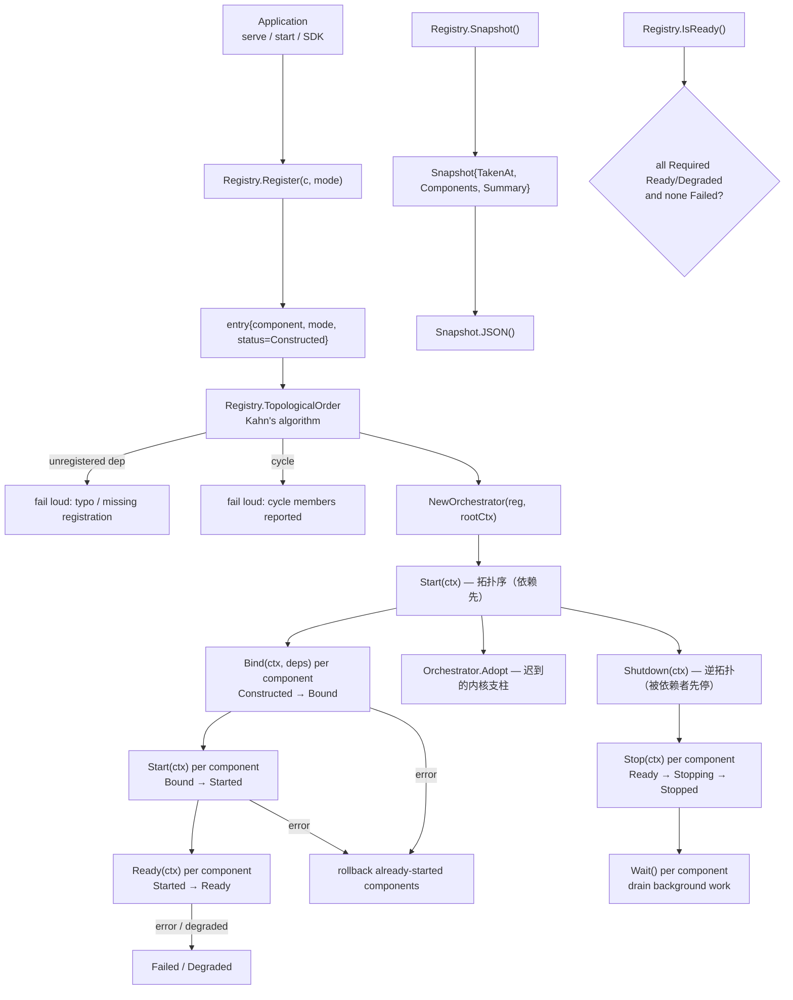
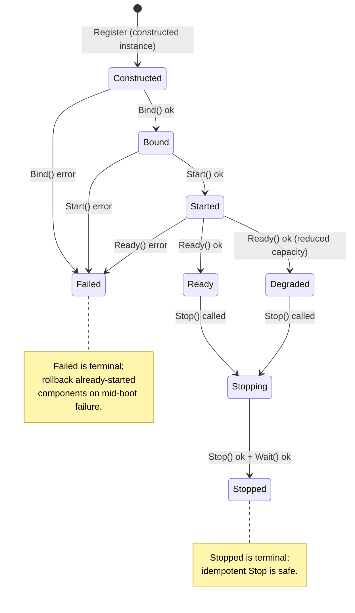

> **状态（2026-09 对照源码树核实）：** 不存在 `internal/system_runtime`
> 包。System Runtime 控制面（组件注册表、依赖感知编排、状态快照）位于
> **`internal/kernel`**（包名 `kernel`，与原 kernelscheduler/kernelctx
> 合并）。Bootstrap 经 `internal/ares_bootstrap/system_runtime_wiring.go`
> 接线；内核支柱经 `Orchestrator.Adopt` 迟到加入。以源码为准。

`internal/kernel`（包名 `kernel`）中的 System Runtime 控制面统一组件装配、
依赖解析、生命周期编排与停机协调，贯穿所有入口（`serve`、`start`、SDK）。

System Runtime 不同于 `ares_runtime.Manager`——后者仍是 **Agent 生命周期**
子系统。System Runtime 持有更广的组件图：`EventStore`、`Memory`、`MCP`、
`Flight`、`Evolution`、`Tools`、`HTTP` 等。它与 `taskfabric`（Scheduler）、
`agentfabric`（Lifecycle）、`agentipc`（IPC）共同构成 **ARES Kernel**：
三大支柱加上负责按依赖顺序启动/停机的控制面。

## 职责

- 提供 `Component` 接口及其生命周期伴生接口
  （`Binder`、`Starter`、`ReadinessChecker`、`Stopper`、`Waiter`）：
  身份（`Name`）、依赖元数据（`Dependencies`）、依赖注入
  （`Bind(ctx, deps)`）、活动生命周期（`Start` / `Stop`）、就绪
  （`Ready`）、后台排空（`Wait`）。
- 提供 `Mode` 分类（`ModeRequired` / `ModeOptional` / `ModeDegraded`），
  声明组件失败如何影响整体系统。
- 持有组件 `Registry`：name → `entry{component, mode, status}`，按注册顺序
  迭代，依赖感知 `Resolver`（`Get(name)`），以及状态数据面
  （`GetStatus`、`SetStatus`、`AllStatuses`）。
- 通过 Kahn 算法计算依赖感知的 `TopologicalOrder`；对未注册依赖 fail loud
  （拼写错误或缺失注册不得被静默隐藏），对检测到的环 fail loud（错误信息
  中报告环成员）。
- 通过 `Orchestrator` 编排生命周期状态机：上行 `Constructed → Bound →
  Started → Ready`（拓扑 `Start`，依赖先启动）；下行 `Shutdown` 逆拓扑
  （被依赖者先停）；启动中途失败时回滚已启动组件；内核支柱经 `Adopt`
  迟到注册。
- 提供状态快照 API：`Snapshot`（所有组件状态的即时视图，含聚合
  `SnapshotSummary`）、`IsReady`（所有 `ModeRequired` 组件 `Ready`/`Degraded`
  且无 `Failed` 时为真）、`Snapshot.JSON` 用于诊断/监控输出。

## 架构图



## 生命周期状态机



## 外部接口

```go
package kernel

// --- Component contracts ---

type Component interface {
    Name() string
    Dependencies() []string  // names of components that must be Ready first
}

type Binder interface {
    Bind(ctx context.Context, deps Resolver) error  // inject live references
}
type Starter interface {
    Start(ctx context.Context) error  // goroutines, connections, tickers
}
type ReadinessChecker interface {
    Ready(ctx context.Context) error  // verifies fully operational
}
type Stopper interface {
    Stop(ctx context.Context) error  // idempotent; reverse-topological order
}
type Waiter interface {
    Wait() error  // blocks until background work owned by the component completes
}

type Resolver interface {
    Get(name string) any  // returns the component instance, or nil if not found
}

// --- Mode ---

type Mode int
const (
    ModeRequired Mode = iota  // must reach Ready for system Ready
    ModeOptional              // not constructed when disabled; Required when enabled
    ModeDegraded              // may operate in reduced capacity; must report degraded state
)
func (m Mode) String() string

// --- Registry ---

type Registry struct {
    // mu sync.RWMutex
    // entries map[string]*entry
    // order []string  — registration order for deterministic iteration
}
func NewRegistry() *Registry
func (r *Registry) Register(c Component, mode Mode) error  // rejects nil / typed-nil / empty name / duplicate
func (r *Registry) Get(name string) any                    // implements Resolver
func (r *Registry) GetComponent(name string) Component
func (r *Registry) GetMode(name string) (Mode, bool)
func (r *Registry) GetStatus(name string) (ComponentStatus, bool)
func (r *Registry) SetStatus(name string, status ComponentStatus)
func (r *Registry) AllStatuses() []ComponentStatus
func (r *Registry) Names() []string
func (r *Registry) TopologicalOrder() ([]string, error)  // Kahn's algorithm; fail loud on cycle/unregistered dep
func (r *Registry) IsReady() bool                          // all Required Ready/Degraded and none Failed
func (r *Registry) Snapshot() Snapshot

// --- Orchestrator ---

type Orchestrator struct {
    // reg *Registry
    // rootCtx context.Context
    // mu sync.Mutex
    // started, stopped bool
}
func NewOrchestrator(reg *Registry, rootCtx context.Context) *Orchestrator
func (o *Orchestrator) Start(ctx context.Context) error          // 拓扑 Bind → Start → Ready（依赖先）
func (o *Orchestrator) Shutdown(ctx context.Context) error       // 逆拓扑 Stop → Wait（被依赖者先停）
func (o *Orchestrator) Adopt(ctx context.Context, c Component, mode Mode) error // Start 后迟到注册
func (o *Orchestrator) Go(fn func() error)                       // managed goroutine with error capture
func (o *Orchestrator) GoBackground(name string, fn func(ctx context.Context) error)
func (o *Orchestrator) SetEventSink(store ares_events.EventStore)
func (o *Orchestrator) Snapshot() Snapshot
func (o *Orchestrator) RootContext() context.Context
func (o *Orchestrator) Cancel()

// --- State machine ---

type State int
const (
    // Registration hands over a constructed instance (no separate Declared step).
    StateConstructed State = iota
    StateBound
    StateStarted
    StateReady
    StateDegraded
    StateFailed
    StateStopping
    StateStopped
    StateDisabled
)
func (s State) String() string
func (s State) IsHealthy() bool    // Ready | Degraded

type ComponentStatus struct {
    Name       string    `json:"name"`
    Mode       Mode      `json:"mode"`
    State      State     `json:"state"`
    Reason     string    `json:"reason,omitempty"`
    StartedAt  time.Time `json:"started_at,omitempty"`
    InstanceID string    `json:"instance_id,omitempty"`
}
func (s ComponentStatus) String() string

// --- Snapshot API ---

type Snapshot struct {
    TakenAt    time.Time         `json:"taken_at"`
    Components []ComponentStatus `json:"components"`
    Summary    SnapshotSummary   `json:"summary"`
}
type SnapshotSummary struct {
    Total    int `json:"total"`
    Ready    int `json:"ready"`
    Degraded int `json:"degraded"`
    Failed   int `json:"failed"`
    Disabled int `json:"disabled"`
    Stopped  int `json:"stopped"`
}
func (s Snapshot) JSON() ([]byte, error)
```

## 关键类型与方法

| 类型 / 方法 | 用途 |
| --- | --- |
| `Component` / `Binder` / `Starter` / `ReadinessChecker` / `Stopper` / `Waiter` | 受管组件可实现的生命周期伴生接口。 |
| `Mode` | 声明组件失败如何影响整体系统（`ModeRequired` / `ModeOptional` / `ModeDegraded`）。 |
| `Registry` | 组件注册表；name → `entry{component, mode, status}`；按注册顺序迭代。 |
| `Registry.Register` | 按指定 mode 声明组件；拒绝 nil/typed-nil/空名/重复。 |
| `Registry.TopologicalOrder` | Kahn 算法；依赖先于被依赖者；对环或未注册依赖 fail loud。 |
| `Registry.Snapshot` / `Registry.IsReady` | 用于诊断与监控的状态快照 API。 |
| `Orchestrator` | 生命周期编排器；拓扑 Start、Shutdown 逆拓扑、启动中途失败回滚、`Adopt` 迟到支柱。 |
| `Orchestrator.Start` | 每组件拓扑执行 `Constructed → Bound → Started → Ready`（依赖先）。 |
| `Orchestrator.Shutdown` | 逆拓扑 `Stop` → `Wait`，被依赖者先停。 |
| `Orchestrator.Adopt` | Start 后的迟到注册（内核支柱）；停机中/后返回 `ErrShuttingDown`。 |
| `Orchestrator.Go` | 带错误捕获的受管 goroutine，用于组件自有后台工作。 |
| `State` / `ComponentStatus` | 生命周期状态机与每组件状态数据面。 |
| `Snapshot` / `SnapshotSummary` | 所有组件状态的即时视图，含聚合计数。 |

## 模块协作

- `system_runtime` -> `internal/ares_bootstrap`：Bootstrap 是唯一装配根，
  `wireSystemRuntime` 注册组件并通过 Orchestrator 启停。
- `system_runtime` -> `internal/kernel`（同包）：组件注册表、编排器、
  mode/state/snapshot 类型与调度内核同属包 `kernel`。
- `system_runtime` -> `internal/fabric/task` / `internal/fabric/agent` /
  `internal/agentipc` / `internal/aresrecovery`：内核支柱在
  `cmd/ares/kernel.go` 经 `Orchestrator.Adopt` 迟到注册。
- `system_runtime` -> `internal/runtime` / `internal/ares_events` /
  `internal/runtime/memory` / `internal/runtime/protocol/mcp` /
  `internal/runtime/observability` / evolution：每个受管组件声明
  `Dependencies()` 参与拓扑排序。
- `system_runtime` -> `cmd/ares`：serve、start（monitor-live）、SDK 均经
  `ares_bootstrap.Bootstrap` 装配；System Runtime 提供 `ares status` 暴露
  的 `Snapshot()` API。

## 扩展方式

1. **将子系统变为受管组件**：实现 `Component`（`Name`、`Dependencies`）及
   相关伴生接口（`Binder`、`Starter`、`ReadinessChecker`、`Stopper`、
   `Waiter`），通过 `Registry.Register(c, mode)` 按合适 `Mode` 注册。
2. **声明依赖以参与拓扑排序**：通过 `Dependencies()`；编排器让依赖先启动
  （拓扑）、停机时 Shutdown 逆拓扑使被依赖者先停。未注册依赖在
  `TopologicalOrder` 时 fail loud。
3. **报告降级运行**：实现 `ReadinessChecker`，在缺失写依赖时返回非 nil
   error；编排器将组件转至 `StateDegraded` 并记录原因，`IsReady` 仍返回真。
4. **停机时排空后台**：实现 `Waiter`；编排器在 `Stop()` 之后调用 `Wait()`，
   确保 goroutine 与 ticker 完全退出后再终止进程。
5. **暴露诊断状态**：调用 `Registry.Snapshot()` 并经 `Snapshot.JSON()`
   序列化；`IsSystemReady` 将每组件 `State` 聚合为单一就绪判定。
6. **验证双入口等价**：断言经 `ares_bootstrap.Bootstrap` 构建的组件图在
   `serve`、`start`、SDK 三个入口下等价——锁定入口统一的契约测试。

## 双语状态

本页为英文参考的结构镜像中文版。所有代码标识符、类型名与签名在两份文件中均
保持英文，仅叙述性文字不同。英文版发布为 `system_runtime.en.md`。

## 成熟度

Production。控制面由 `internal/kernel` 的 `orchestrator_test.go`、
`registry_test.go` 及相关编排器测试，以及 `internal/ares_bootstrap` 的
`system_runtime_wiring_test.go` 与 `closure_entry_equivalence_test.go`
契约（build tag `closure`）覆盖。它实现了带依赖感知拓扑排序的组件生命周期
状态机，通过 `ares_bootstrap` 集成所有 ARES 子系统，且不含任何实验性标记。


