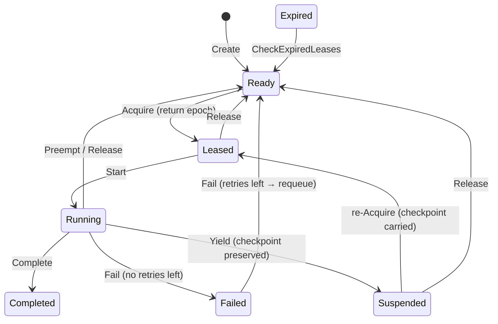

The `internal/taskfabric` package (package `taskfabric`) is the **Task
Scheduler** pillar of the ARES Kernel. It owns the durable-intent object model
(`Task`), the lease-fenced state machine (`Acquire` / `Start` / `Yield` /
`Preempt` / `Complete` / `Fail`), the execution-quantum primitive
(`RunQuantum`), and the capability-aware work-stealing substrate
(`AgentQueue`, `Steal`, `Schedule`, `Score`).

The central invariant is **Agent dies ≠ Task dies**: a `Task` is durable and
survives its owner through lease expiry and preserved checkpoints, while the
`Agent` that executes it is disposable. Every ownership-carrying operation must
present the fencing token (lease `Epoch`) returned by `Acquire`, so a stale
holder whose lease expired cannot release or complete a task that a new owner
has since acquired.

## Responsibility

- Own the durable-intent object (`Task`): stable id, required capability,
  priority, owner, lease, checkpoint, DAG dependencies, deadline, retry policy.
- Enforce the cooperative task state machine (`READY → LEASED → RUNNING →
  {COMPLETED | FAILED | SUSPENDED | READY}`) with illegal-transition rejection.
- Provide lease fencing: `Acquire` returns a monotonically increasing `Epoch`
  that must match on every subsequent `Start` / `Yield` / `Release` / `Preempt`
  / `Complete` / `Fail`, preventing the classic "A's lease expired → B
  acquires → A's late Release clobbers B" race.
- Implement the execution quantum: `RunQuantum` starts the leased task, runs
  one agent step (`reasoning → tool call → observation`), then transitions at
  the quantum boundary — `done → COMPLETED`, `err → FAILED`, otherwise `Yield`
  to SUSPENDED with the checkpoint preserved.
- Provide capability-aware scheduling: `Score = capability_overlap ×
  (1 − load) × confidence × (1 + priority)`; `Schedule` picks the best capable
  candidate and acquires the task on its behalf.
- Provide capability-aware work stealing: per-agent `AgentQueue`s and
  `Steal(from, capabilities, capabilityOf)` so an idle agent steals only tasks
  it is capable of executing — "who is the best executor", not "whoever is
  idle".
- Requeue expired leases via `CheckExpiredLeases` — the crash-recovery
  primitive that returns a dead agent's LEASED/RUNNING/SUSPENDED tasks to READY.
- Emit the full task lifecycle event log (`task.created` … `task.stolen`),
  optionally persisted to `ares_events.EventStore`; the log is the single
  source of truth from which Scheduler / Task / Lease state can be rebuilt.

## Architecture

```mermaid
flowchart TD
    APP["Application"] --> CR["Fabric.Create<br/>task → StateReady"]
    CR --> M["Fabric.tasks map"]
    ACQ["Fabric.Acquire<br/>id, agentID, ttl"] --> LK["ownerLocked<br/>StateReady/StateSuspended"]
    LK --> EP["epoch++ → Lease.Epoch"]
    EP --> TR["transition StateLeased<br/>Owner=agentID"]
    ACQ --> RET["return epoch (fencing token)"]
    SCH["Fabric.Schedule<br/>taskID, candidates, ttl"] --> SC["Score per candidate"]
    SC --> PK["Pick best capable"]
    PK --> ACQ
    RQ["Fabric.RunQuantum<br/>taskID, agentID, epoch, step"] --> ST["Fabric.Start<br/>LEASED → RUNNING"]
    ST --> STEP["step()<br/>reasoning → tool call → observation"]
    STEP -- done --> CMP["Fabric.Complete<br/>→ COMPLETED"]
    STEP -- err --> FL["Fabric.Fail<br/>→ FAILED or requeue READY"]
    STEP -- !done --> YL["Fabric.Yield<br/>→ SUSPENDED, checkpoint preserved"]
    PRM["Fabric.Preempt<br/>cooperative, quantum boundary"] --> RDY["transition StateReady<br/>Owner=\"\" Lease=nil"]
    EXP["Fabric.CheckExpiredLeases"] --> RQ2["expired LEASED/RUNNING/SUSPENDED<br/>→ READY (Agent 死亡 ≠ Task 死亡)"]
    STL["AgentQueue.Steal<br/>from, capabilities, capabilityOf"] --> SKP["skip incapable tasks"]
    SKP --> STLN["return stolen taskID"]
    REC["Fabric.record"] --> EV["TaskEvent log"]
    EV --> ES["ares_events.EventStore<br/>task.* (best-effort)"]
```

## Task state machine



Legal transitions are encoded in `canTransition` (`state.go`); any illegal
transition returns `ErrIllegalState`.

## External interfaces

```go
package taskfabric

// Fabric owns the task registry, lease epoch counter, event log, and optional
// confidence/event-store wiring.
type Fabric struct {
    // tasks map, epoch counter, confidence source, event store, clock
}
func NewFabric() *Fabric
func (f *Fabric) WithClock(now func() time.Time) *Fabric
func (f *Fabric) WithConfidenceSource(src ConfidenceSource) *Fabric
func (f *Fabric) WithEventStore(store ares_events.EventStore) *Fabric

// Task lifecycle primitives (design §6).
func (f *Fabric) Create(t *Task) error
func (f *Fabric) Acquire(id, agentID string, ttl time.Duration) (uint64, error)
func (f *Fabric) Start(id, agentID string, epoch uint64) error
func (f *Fabric) Yield(id, agentID string, epoch uint64, checkpoint any) error
func (f *Fabric) Complete(id, agentID string, epoch uint64) error
func (f *Fabric) Fail(id, agentID string, epoch uint64) error
func (f *Fabric) Release(id, agentID string, epoch uint64) error
func (f *Fabric) Preempt(taskID, agentID string, epoch uint64, reason string) error

// Crash recovery: requeue tasks whose lease expired without renewal.
func (f *Fabric) CheckExpiredLeases() int

// Capability-aware scheduling (design §8).
func (f *Fabric) Schedule(taskID string, candidates []Candidate, ttl time.Duration) (string, uint64, error)

// Execution quantum (design §5): start → step → transition at the boundary.
type QuantumStep func() (checkpoint any, done bool, err error)
func (f *Fabric) RunQuantum(taskID, agentID string, epoch uint64, step QuantumStep) error

// Introspection.
func (f *Fabric) Task(id string) (*Task, error)
func (f *Fabric) Events() []TaskEvent

// --- Types ---

type Task struct {
    ID           string
    Capability   string
    State        TaskState
    Priority     int
    Owner        string            // "" = unowned
    Lease        *Lease            // current TaskLease (nil when unowned)
    Checkpoint   any               // durable progress preserved across preemption
    Dependencies []string          // DAG prerequisites; is_ready = all completed
    Deadline     time.Time
    RetryPolicy  RetryPolicy
}

type TaskState string
const (
    StateReady     TaskState = "READY"
    StateLeased    TaskState = "LEASED"
    StateRunning   TaskState = "RUNNING"
    StateSuspended TaskState = "SUSPENDED"
    StateCompleted TaskState = "COMPLETED"
    StateFailed    TaskState = "FAILED"
)

type RetryPolicy struct {
    MaxRetries int
    Attempts   int
}
func (t *Task) CanRetry() bool

type Lease struct {
    Owner     string
    ExpiresAt time.Time
    Epoch     uint64          // fencing token, bumped on every Acquire
}
func NewLease(owner string, ttl time.Duration, epoch uint64) Lease
func (l Lease) IsExpired(now time.Time) bool

// --- Capability-aware scheduling ---

type Candidate struct {
    AgentID      string
    Capabilities []string
    Load         float64         // current utilization, [0,1]
    Confidence   float64         // experience prior, [0,1]
    Priority     float64         // >= 0; 0 = normal; OS-thread-priority analog
}
func Score(taskCapability string, c Candidate) float64
func Pick(taskCapability string, candidates []Candidate) *Candidate

type ConfidenceSource interface {
    // Confidence returns the experience prior for a task pattern, in [0,1].
    // 0 means "no experience yet" — the candidate keeps its declared confidence.
    Confidence(taskPattern string) float64
}

// --- Work stealing ---

type AgentQueue struct {
    AgentID string
    // mu guards tasks
}
func NewAgentQueue(agentID string) *AgentQueue
func (q *AgentQueue) Enqueue(taskID string)
func (q *AgentQueue) Len() int
func (q *AgentQueue) Steal(from *AgentQueue, capabilities []string, capabilityOf func(string) string) (string, bool)

// --- Event log ---

type EventType string
const (
    EventTaskCreated      EventType = "task.created"
    EventTaskReady        EventType = "task.ready"
    EventTaskAcquired     EventType = "task.acquired"
    EventTaskStarted      EventType = "task.started"
    EventTaskYielded      EventType = "task.yielded"
    EventTaskCheckpointed EventType = "task.checkpointed"
    EventTaskPreempted    EventType = "task.preempted"
    EventTaskReleased     EventType = "task.released"
    EventTaskCompleted    EventType = "task.completed"
    EventTaskFailed       EventType = "task.failed"
    EventTaskExpired      EventType = "task.expired"
    EventTaskStolen       EventType = "task.stolen"
)
type TaskEvent struct {
    Type       EventType
    TaskID     string
    AgentID    string
    State      TaskState
    Checkpoint any
    At         time.Time
}

// --- Sentinel errors ---

var (
    ErrTaskNotFound
    ErrTaskExists
    ErrTaskNotReady
    ErrNotOwner
    ErrEpochMismatch
    ErrIllegalState
    ErrNoCapableCandidate
)
```

## Key types and methods

| Type / Method | Purpose |
| --- | --- |
| `Fabric` | Task Scheduler pillar; owns the task map, lease-epoch counter, event log, and optional wiring. |
| `NewFabric` | Constructs an empty `Fabric`; chain `WithClock` / `WithConfidenceSource` / `WithEventStore` for tests and persistence. |
| `Fabric.Create` | Inserts a task as `READY` with no owner and no lease. |
| `Fabric.Acquire` | CAS ownership claim on an unowned `READY`/`SUSPENDED` task; returns the fencing token (lease `Epoch`). |
| `Fabric.Start` | Moves a `LEASED` task owned by `agentID` at the fenced `epoch` to `RUNNING`. |
| `Fabric.Yield` | Quantum-boundary primitive: hands execution back at a checkpoint; default transition is `SUSPENDED` with checkpoint preserved. |
| `Fabric.Complete` / `Fabric.Fail` | Finalize a `RUNNING` task as `COMPLETED`, or `FAILED`/requeued-to-`READY` per the retry policy. |
| `Fabric.Release` | Returns a `LEASED`/`RUNNING`/`SUSPENDED` task to `READY`, clearing owner and lease; epoch-fenced. |
| `Fabric.Preempt` | Cooperative preemption at a quantum boundary: task returns to `READY` with checkpoint preserved. |
| `Fabric.CheckExpiredLeases` | Crash-recovery primitive: requeues every task whose lease expired (Agent dies ≠ Task dies). |
| `Fabric.Schedule` | Capability-aware dispatch: scores candidates, picks the best capable one, and acquires the task on its behalf. |
| `Fabric.RunQuantum` | One execution quantum: `Start → step → {Complete | Fail | Yield}`. |
| `Score` / `Pick` | The capability-aware scoring function and its argmax selector. |
| `Candidate` | The scheduler's per-agent input: capabilities, load, confidence, priority. |
| `Lease` | TTL-based ownership lease with a fencing `Epoch`; same shape serves `TaskLease` / `ResourceLease` / `CapabilityLease`. |
| `TaskEvent` / `Events` | The immutable lifecycle event log; replaying it rebuilds full task state. |
| `AgentQueue` / `Steal` | Per-agent ready-queue and capability-aware stealing. |
| `ConfidenceSource` | Experience-prior adapter feeding the scheduler's `confidence` term. |

## Module collaboration

- `taskfabric` -> `internal/ares_events`: optional `EventStore` for best-effort
  persistence of `task.*` lifecycle events; the in-memory log stays
  authoritative within a process.
- `taskfabric` -> `internal/ares_skills` (via `ConfidenceSource`): the
  Experience `BestMatch` `SuccessRate` is the natural confidence prior feeding
  `Score`'s `confidence` term.
- `taskfabric` -> `internal/agentfabric`: the Scheduler picks among
  `agentfabric.Agent` instances; `Agent.Capabilities` / `Load` / `Confidence`
  / `Priority` populate `Candidate`.
- `taskfabric` -> `internal/agentipc`: a stolen or handed-off task's new owner
  is notified through the IPC bus.
- `taskfabric` -> `internal/system_runtime`: the Fabric is registered as a
  component and started/stopped by the Orchestrator.

## Extension points

1. **Plug an experience prior** by implementing `ConfidenceSource` and wiring
   it via `Fabric.WithConfidenceSource(src)`; `Schedule` then enriches
   candidates whose `Confidence` is unset.
2. **Persist the task lifecycle** by wiring `Fabric.WithEventStore(store)`;
   `record` best-effort appends `task.*` events so the log survives restarts.
3. **Inject a deterministic clock** via `Fabric.WithClock(now)` for hermetic
   tests of lease expiry and requeue.
4. **Add a scheduling policy** by composing `Score` / `Pick` / `Schedule`
   rather than mutating the Fabric internals — the primitives are stable, the
   policy is the variable.
5. **Customize retry behaviour** by populating `Task.RetryPolicy` before
   `Create`; `Fail` requeues to `READY` while `CanRetry()` holds, else
   transitions to `FAILED`.
6. **Verify recovery under crash** by `Acquire` → `Start` → (simulate owner
   death by advancing the clock past `ttl`) → `CheckExpiredLeases`, then
   re-`Acquire` from a second agent and resume from `Checkpoint`.

## Bilingual status

This page is the English reference. A Chinese translation with identical
structure and technical content is published as `taskfabric.zh.md`. All code
identifiers, type names, and signatures are kept in English in both files;
only the prose differs.

## Maturity

Production. The package is covered by `dag_test.go`, `event_store_test.go`,
`fabric_test.go`, `preempt_test.go`, `quantum_test.go`, `schedule_test.go`,
`steal_test.go`, and `benchmark_test.go`. It implements the cooperative
task state machine with lease fencing, integrates with the ARES Kernel via
`system_runtime`, and exposes no experimental markers.


