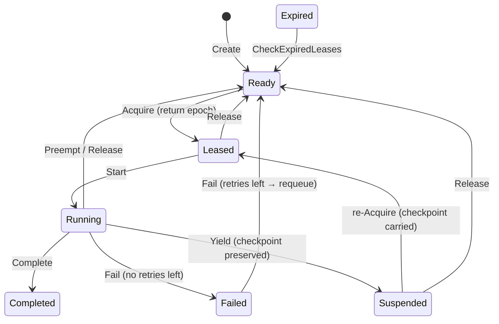

`internal/taskfabric` 包（包名 `taskfabric`）是 ARES Kernel 的 **Task
Scheduler** 支柱。它持有持久化意图对象模型（`Task`）、租约 fencing 状态机
（`Acquire` / `Start` / `Yield` / `Preempt` / `Complete` / `Fail`）、执行
quantum 原语（`RunQuantum`），以及能力感知的工作窃取基底（`AgentQueue`、
`Steal`、`Schedule`、`Score`）。

核心不变量是 **Agent 死亡 ≠ Task 死亡**：`Task` 是 durable 的，通过租约过期
与保留的 checkpoint 在 owner 死亡后存活；执行它的 `Agent` 则是 disposable 的。
每个携带所有权的操作都必须出示由 `Acquire` 返回的 fencing token（租约
`Epoch`），从而杜绝经典的"A 的租约过期 → B acquire → A 迟到 Release 误杀 B"
竞态。

## 职责

- 持有持久化意图对象（`Task`）：稳定 ID、所需 capability、优先级、owner、
  lease、checkpoint、DAG 依赖、deadline、retry policy。
- 强制执行协同式任务状态机（`READY → LEASED → RUNNING →
  {COMPLETED | FAILED | SUSPENDED | READY}`），拒绝非法转换。
- 提供租约 fencing：`Acquire` 返回单调递增的 `Epoch`，后续每个
  `Start` / `Yield` / `Release` / `Preempt` / `Complete` / `Fail` 都必须
  匹配该 epoch。
- 实现执行 quantum：`RunQuantum` 启动已租约任务，运行一个 agent step
  （`reasoning → tool call → observation`），随后在 quantum 边界转移——
  `done → COMPLETED`、`err → FAILED`、否则 `Yield` 到 SUSPENDED 并保留 checkpoint。
- 提供能力感知调度：`Score = capability_overlap × (1 − load) × confidence ×
  (1 + priority)`；`Schedule` 选出最佳合格 candidate 并代为 acquire 任务。
- 提供能力感知的工作窃取：每 agent 一个 `AgentQueue`，`Steal(from,
  capabilities, capabilityOf)` 使空闲 agent 只窃取自己有能力执行的任务——
  "谁是最佳执行者"，而非"谁空闲"。
- 通过 `CheckExpiredLeases` 回收过期租约——崩溃恢复原语，将死亡 agent 的
  LEASED/RUNNING/SUSPENDED 任务归还 READY。
- 发射完整的任务生命周期事件日志（`task.created` … `task.stolen`），可选地
  持久化到 `ares_events.EventStore`；该日志是单一事实源，可据此重建
  Scheduler / Task / Lease 状态。

## 架构图

```mermaid
flowchart TD
    APP["Application"] --> CR["Fabric.Create<br/>task → StateReady"]
    CR --> M["Fabric.tasks map"]
    ACQ["Fabric.Acquire<br/>id, agentID, ttl"] --> LK["ownerLocked<br/>StateReady/StateSuspended"]
    LK --> EP["epoch++ → Lease.Epoch"]
    EP --> TR["transition StateLeased<br/>Owner=agentID"]
    ACQ --> RET["return epoch (fencing token)"]
    SCH["Fabric.Schedule<br/>taskID, candidates, ttl"] --> SC["Score per candidate"]
    SC --> PK["Pick best capable"]
    PK --> ACQ
    RQ["Fabric.RunQuantum<br/>taskID, agentID, epoch, step"] --> ST["Fabric.Start<br/>LEASED → RUNNING"]
    ST --> STEP["step()<br/>reasoning → tool call → observation"]
    STEP -- done --> CMP["Fabric.Complete<br/>→ COMPLETED"]
    STEP -- err --> FL["Fabric.Fail<br/>→ FAILED or requeue READY"]
    STEP -- !done --> YL["Fabric.Yield<br/>→ SUSPENDED, checkpoint preserved"]
    PRM["Fabric.Preempt<br/>cooperative, quantum boundary"] --> RDY["transition StateReady<br/>Owner=\"\" Lease=nil"]
    EXP["Fabric.CheckExpiredLeases"] --> RQ2["expired LEASED/RUNNING/SUSPENDED<br/>→ READY (Agent 死亡 ≠ Task 死亡)"]
    STL["AgentQueue.Steal<br/>from, capabilities, capabilityOf"] --> SKP["skip incapable tasks"]
    SKP --> STLN["return stolen taskID"]
    REC["Fabric.record"] --> EV["TaskEvent log"]
    EV --> ES["ares_events.EventStore<br/>task.* (best-effort)"]
```

## 任务状态机



合法转换由 `canTransition`（`state.go`）编码；任何非法转换返回
`ErrIllegalState`。

## 外部接口

```go
package taskfabric

// Fabric owns the task registry, lease epoch counter, event log, and optional
// confidence/event-store wiring.
type Fabric struct {
    // tasks map, epoch counter, confidence source, event store, clock
}
func NewFabric() *Fabric
func (f *Fabric) WithClock(now func() time.Time) *Fabric
func (f *Fabric) WithConfidenceSource(src ConfidenceSource) *Fabric
func (f *Fabric) WithEventStore(store ares_events.EventStore) *Fabric

// Task lifecycle primitives (design §6).
func (f *Fabric) Create(t *Task) error
func (f *Fabric) Acquire(id, agentID string, ttl time.Duration) (uint64, error)
func (f *Fabric) Start(id, agentID string, epoch uint64) error
func (f *Fabric) Yield(id, agentID string, epoch uint64, checkpoint any) error
func (f *Fabric) Complete(id, agentID string, epoch uint64) error
func (f *Fabric) Fail(id, agentID string, epoch uint64) error
func (f *Fabric) Release(id, agentID string, epoch uint64) error
func (f *Fabric) Preempt(taskID, agentID string, epoch uint64, reason string) error

// Crash recovery: requeue tasks whose lease expired without renewal.
func (f *Fabric) CheckExpiredLeases() int

// Capability-aware scheduling (design §8).
func (f *Fabric) Schedule(taskID string, candidates []Candidate, ttl time.Duration) (string, uint64, error)

// Execution quantum (design §5): start → step → transition at the boundary.
type QuantumStep func() (checkpoint any, done bool, err error)
func (f *Fabric) RunQuantum(taskID, agentID string, epoch uint64, step QuantumStep) error

// Introspection.
func (f *Fabric) Task(id string) (*Task, error)
func (f *Fabric) Events() []TaskEvent

// --- Types ---

type Task struct {
    ID           string
    Capability   string
    State        TaskState
    Priority     int
    Owner        string            // "" = unowned
    Lease        *Lease            // current TaskLease (nil when unowned)
    Checkpoint   any               // durable progress preserved across preemption
    Dependencies []string          // DAG prerequisites; is_ready = all completed
    Deadline     time.Time
    RetryPolicy  RetryPolicy
}

type TaskState string
const (
    StateReady     TaskState = "READY"
    StateLeased    TaskState = "LEASED"
    StateRunning   TaskState = "RUNNING"
    StateSuspended TaskState = "SUSPENDED"
    StateCompleted TaskState = "COMPLETED"
    StateFailed    TaskState = "FAILED"
)

type RetryPolicy struct {
    MaxRetries int
    Attempts   int
}
func (t *Task) CanRetry() bool

type Lease struct {
    Owner     string
    ExpiresAt time.Time
    Epoch     uint64          // fencing token, bumped on every Acquire
}
func NewLease(owner string, ttl time.Duration, epoch uint64) Lease
func (l Lease) IsExpired(now time.Time) bool

// --- Capability-aware scheduling ---

type Candidate struct {
    AgentID      string
    Capabilities []string
    Load         float64         // current utilization, [0,1]
    Confidence   float64         // experience prior, [0,1]
    Priority     float64         // >= 0; 0 = normal; OS-thread-priority analog
}
func Score(taskCapability string, c Candidate) float64
func Pick(taskCapability string, candidates []Candidate) *Candidate

type ConfidenceSource interface {
    // Confidence returns the experience prior for a task pattern, in [0,1].
    // 0 means "no experience yet" — the candidate keeps its declared confidence.
    Confidence(taskPattern string) float64
}

// --- Work stealing ---

type AgentQueue struct {
    AgentID string
    // mu guards tasks
}
func NewAgentQueue(agentID string) *AgentQueue
func (q *AgentQueue) Enqueue(taskID string)
func (q *AgentQueue) Len() int
func (q *AgentQueue) Steal(from *AgentQueue, capabilities []string, capabilityOf func(string) string) (string, bool)

// --- Event log ---

type EventType string
const (
    EventTaskCreated      EventType = "task.created"
    EventTaskReady        EventType = "task.ready"
    EventTaskAcquired     EventType = "task.acquired"
    EventTaskStarted      EventType = "task.started"
    EventTaskYielded      EventType = "task.yielded"
    EventTaskCheckpointed EventType = "task.checkpointed"
    EventTaskPreempted    EventType = "task.preempted"
    EventTaskReleased     EventType = "task.released"
    EventTaskCompleted    EventType = "task.completed"
    EventTaskFailed       EventType = "task.failed"
    EventTaskExpired      EventType = "task.expired"
    EventTaskStolen       EventType = "task.stolen"
)
type TaskEvent struct {
    Type       EventType
    TaskID     string
    AgentID    string
    State      TaskState
    Checkpoint any
    At         time.Time
}

// --- Sentinel errors ---

var (
    ErrTaskNotFound
    ErrTaskExists
    ErrTaskNotReady
    ErrNotOwner
    ErrEpochMismatch
    ErrIllegalState
    ErrNoCapableCandidate
)
```

## 关键类型与方法

| 类型 / 方法 | 用途 |
| --- | --- |
| `Fabric` | Task Scheduler 支柱；持有 task map、lease-epoch 计数器、event log 与可选接线。 |
| `NewFabric` | 构造空 `Fabric`；用 `WithClock` / `WithConfidenceSource` / `WithEventStore` 链式注入测试与时钟。 |
| `Fabric.Create` | 插入任务为 `READY`，无 owner 无 lease。 |
| `Fabric.Acquire` | 对无主 `READY`/`SUSPENDED` 任务的 CAS 所有权声明；返回 fencing token（lease `Epoch`）。 |
| `Fabric.Start` | 将 `agentID` 在 fenced `epoch` 下拥有的 `LEASED` 任务转移到 `RUNNING`。 |
| `Fabric.Yield` | Quantum 边界原语：在 checkpoint 处交回执行权；默认转移到 `SUSPENDED` 并保留 checkpoint。 |
| `Fabric.Complete` / `Fabric.Fail` | 将 `RUNNING` 任务终结为 `COMPLETED`，或按 retry policy 标记 `FAILED`/重排队到 `READY`。 |
| `Fabric.Release` | 将 `LEASED`/`RUNNING`/`SUSPENDED` 任务归还 `READY`，清空 owner 与 lease；受 epoch fencing 保护。 |
| `Fabric.Preempt` | Quantum 边界的协同式抢占：任务回到 `READY` 并保留 checkpoint。 |
| `Fabric.CheckExpiredLeases` | 崩溃恢复原语：回收所有租约过期但未续约的任务（Agent 死亡 ≠ Task 死亡）。 |
| `Fabric.Schedule` | 能力感知派发：为 candidates 评分，选出最佳合格者并代为 acquire 任务。 |
| `Fabric.RunQuantum` | 单次执行 quantum：`Start → step → {Complete | Fail | Yield}`。 |
| `Score` / `Pick` | 能力感知评分函数与其 argmax 选择器。 |
| `Candidate` | 调度器的每 agent 输入：capabilities、load、confidence、priority。 |
| `Lease` | 基于 TTL 的所有权租约，含 fencing `Epoch`；同一形状复用于 `TaskLease` / `ResourceLease` / `CapabilityLease`。 |
| `TaskEvent` / `Events` | 不可变生命周期事件日志；按序回放即可重建完整任务状态。 |
| `AgentQueue` / `Steal` | 每 agent 的 ready-queue 与能力感知窃取。 |
| `ConfidenceSource` | 喂给调度器 `confidence` 项的经验先验适配器。 |

## 模块协作

- `taskfabric` -> `internal/ares_events`：可选 `EventStore`，用于 best-effort
  持久化 `task.*` 生命周期事件；进程内日志仍是权威源。
- `taskfabric` -> `internal/ares_skills`（经 `ConfidenceSource`）：Experience
  的 `BestMatch` `SuccessRate` 是喂给 `Score` `confidence` 项的天然先验。
- `taskfabric` -> `internal/agentfabric`：Scheduler 在 `agentfabric.Agent`
  实例间挑选；`Agent.Capabilities` / `Load` / `Confidence` / `Priority` 填入
  `Candidate`。
- `taskfabric` -> `internal/agentipc`：被窃取或交接的任务的新 owner 通过
  IPC 总线收到通知。
- `taskfabric` -> `internal/system_runtime`：Fabric 作为组件被注册，由
  Orchestrator 启停。

## 扩展方式

1. **插入经验先验**：实现 `ConfidenceSource` 并通过
   `Fabric.WithConfidenceSource(src)` 接线；`Schedule` 随后为未设置
   `Confidence` 的 candidate 补值。
2. **持久化任务生命周期**：通过 `Fabric.WithEventStore(store)` 接线；
   `record` 会 best-effort 追加 `task.*` 事件，使日志在重启后存活。
3. **注入确定性时钟**：通过 `Fabric.WithClock(now)` 在密闭测试中驱动
   lease 过期与重排队。
4. **新增调度策略**：组合 `Score` / `Pick` / `Schedule` 而非改动 Fabric
  内部——原语稳定，策略才是变量。
5. **定制重试行为**：在 `Create` 之前填充 `Task.RetryPolicy`；`Fail` 在
   `CanRetry()` 成立时重排队到 `READY`，否则转移到 `FAILED`。
6. **在崩溃下验证恢复**：`Acquire` → `Start` →（推进时钟越过 `ttl` 模拟
   owner 死亡）→ `CheckExpiredLeases`，再由第二个 agent 重新 `Acquire` 并从
   `Checkpoint` 恢复。

## 双语状态

本页为英文参考的结构镜像中文版。所有代码标识符、类型名与签名在两份文件中均
保持英文，仅叙述性文字不同。英文版发布为 `taskfabric.en.md`。

## 成熟度

Production。该包由 `dag_test.go`、`event_store_test.go`、`fabric_test.go`、
`preempt_test.go`、`quantum_test.go`、`schedule_test.go`、`steal_test.go`、
`benchmark_test.go` 覆盖。它实现了带租约 fencing 的协同式任务状态机，通过
`system_runtime` 集成进 ARES Kernel，且不含任何实验性标记。


