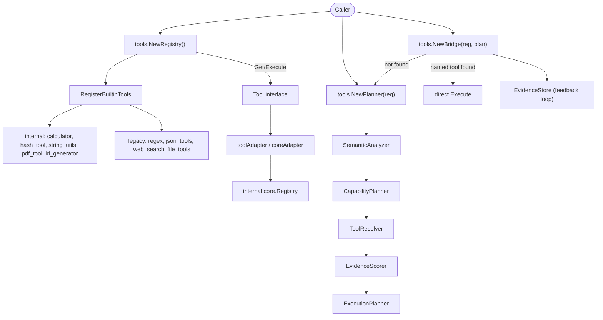

The `tools` module spans `api/tools` (the public `Tool` interface, `Registry`,
`ToolFunc`, and re-exports of the planner), `internal/tools/resources` (the
internal `core.Registry` and builtin tool implementations), and
`internal/tools/planner` (the intent-based capability planner and execution
bridge).

## Responsibility

- Define the 5-method `Tool` interface (`Name`, `Description`, `Parameters`,
  `Execute`, `Capabilities`) and the `ToolFunc` adapter for turning a plain
  function into a tool.
- `NewRegistry()` auto-registers all 9 built-in tools on creation so callers
  get a ready registry with zero setup.
- Ship 9 built-in tools: `calculator`, `hash_tool`, `string_utils`,
  `pdf_tool`, `id_generator` (from `internal/tools/resources/builtin/*`) plus
  `regex`, `json_tools`, `web_search`, `file_tools` (self-contained legacy
  tools).
- Bridge to the internal `core.Registry` via `toolAdapter`/`coreAdapter` so
  the same tools work in both API surfaces.
- Provide a capability `Planner` (intent analyze, decompose, resolve, score,
  plan) and a `Bridge` that executes by name with planner fallback.

## Architecture



## External interfaces

```go
// api/tools
type Result struct {
    Success bool `json:"success"`
    Data    any  `json:"data,omitempty"`
}

type Tool interface {
    Name() string
    Description() string
    Parameters() map[string]any
    Execute(ctx context.Context, params map[string]any) (Result, error)
    Capabilities() []string
}

type ToolFunc struct {
    ToolName   string
    ToolDesc   string
    ToolParams map[string]any
    Fn         func(ctx context.Context, params map[string]any) (any, error)
}

type ToolInfo struct {
    Name        string `json:"name"`
    Description string `json:"description"`
}

type Registry struct { /* unexported */ }
func NewRegistry() *Registry
func NewEmptyRegistry() *Registry
func RegisterBuiltinTools(r *Registry) error
func (r *Registry) Register(tool Tool) error
func (r *Registry) Unregister(name string) error
func (r *Registry) Get(name string) (Tool, bool)
func (r *Registry) Execute(ctx context.Context, name string, params map[string]any) (Result, error)
func (r *Registry) List() []string
func (r *Registry) ListTools() []ToolInfo
func (r *Registry) ListToolNames() []string
func (r *Registry) GetToolCapabilities(name string) ([]string, error)
func (r *Registry) PlannerProvider() *RegistryPlannerProvider

// Planner / Bridge (re-exports from internal/tools/planner)
type Planner = planner.Planner
type ExecutionPlan = planner.ExecutionPlan
type Bridge = planner.ToolExecutionBridge

func NewPlanner(r *Registry) (*Planner, error)
func NewBridge(r *Registry, p *Planner) (*Bridge, error)
```

## Key types and methods

| Type | Method | Purpose |
|------|--------|---------|
| `tools.Tool` | interface (5 methods) | Contract every tool implements. |
| `tools.ToolFunc` | field `Fn` | Adapter: wrap `func(ctx, params) (any, error)` as a `Tool`. |
| `tools.Result` | fields `Success`, `Data` | Execution outcome; errors are returned as `Result{Success:false}`. |
| `tools.Registry` | `NewRegistry()` | Pre-populated with all 9 builtins via `RegisterBuiltinTools`. |
| `tools.Registry` | `NewEmptyRegistry()` | Empty registry for custom-only environments. |
| `tools.Registry` | `Register(Tool)` / `Unregister(name)` | Add/remove tools; syncs the cached `core.Registry`. |
| `tools.Registry` | `Execute(ctx, name, params)` | Look up by name and dispatch. |
| `tools.Registry` | `GetToolCapabilities(name)` | Read declared capabilities for the planner. |
| `tools.Registry` | `PlannerProvider()` | Returns an adapter satisfying `planner.ToolProvider`. |
| `tools.RegisterBuiltinTools(r)` | function | Registers the 9 builtins; idempotent helper. |
| `tools.Planner` | `NewPlanner(r)` | Build a planner from a registry (analyzer, capability planner, resolver, scorer, execution planner). |
| `tools.Planner` | `Plan(ctx, request)` | Intent-based plan: analyze, decompose, resolve, score, build DAG. |
| `tools.Bridge` | `NewBridge(r, p)` | Wrap registry with planner fallback + evidence store. |
| `tools.Bridge` | `Execute(ctx, name, params, intent)` | Named-tool direct path; falls back to planner when name is empty/unknown. |
| `calculator` | builtin | Arithmetic expression evaluator (`expression` param). |
| `hash_tool` | builtin | Hashing utilities (from `internal/tools/resources/builtin/hash`). |
| `string_utils` | builtin | String manipulation (from `.../builtin/stringutils`). |
| `pdf_tool` | builtin | PDF text extraction (from `.../builtin/pdf`). |
| `id_generator` | builtin | Unique ID generation (from `.../builtin/system`). |
| `regex` | builtin | Regex match/extract/replace. |
| `json_tools` | builtin | JSON parse/transform/validate. |
| `web_search` | builtin | HTTP fetch with SSRF-safe dialer (`isPrivateIP` check). |
| `file_tools` | builtin | File read/write/list/exists/delete with path validation (`WithAllowedDir`). |

## Module collaboration

- `api/tools.Registry` is the public surface. `NewRegistry()` immediately
  calls `RegisterBuiltinTools`, which first registers the 5 internal-powered
  tools (via `fromCore` -> `coreAdapter`) and then the 4 self-contained
  legacy tools (`regexTool`, `jsonTool`, `webSearchTool`, `fileTool`).
- `toolAdapter` wraps a public `tools.Tool` so it satisfies the internal
  `core.Tool` interface (`Category`, `Capabilities` returning `core.Capability`,
  `Parameters` returning `*core.ParameterSchema`). `coreAdapter` wraps the
  reverse direction. The two adapters let the same tool instance live in both
  the public `Registry` and the cached `core.Registry` used by the planner.
- `Registry.PlannerProvider()` returns a `RegistryPlannerProvider` that
  satisfies `planner.ToolProvider` via structural typing (`ListTools`,
  `GetToolCapabilities`), so the planner can resolve capabilities without
  importing `api/tools`.
- `tools.NewPlanner(r)` wires `NewRuleBasedAnalyzer` ->
  `NewCapabilityPlanner` -> `NewToolResolver` -> `NewEvidenceScorer` ->
  `NewExecutionPlanner`, backed by a `MemoryEvidenceStore`.
- `tools.NewBridge(r, p)` wraps the internal `core.Registry` with the
  planner and an evidence store: a named call hits the registry directly,
  while an unnamed or unknown tool triggers planner-based intent resolution.
  Every execution writes evidence back into the store, refining future
  scoring.
- `web_search` uses `ssrfSafeDialContext` and `isPrivateIP` to block
  RFC1918/loopback/link-local addresses; `file_tools` validates paths via
  `validatePath` and supports `WithAllowedDir` to confine I/O to a sandbox.

## Extension points

1. **Register a custom tool.** Implement `tools.Tool` (5 methods) or build a
   `tools.ToolFunc{Name, Desc, Params, Fn}`, then call
   `registry.Register(myTool)`. `Parameters()` should return a JSON Schema
   map so the LLM can call it.
2. **Declare capabilities for the planner.** Return non-empty `[]string`
   from `Tool.Capabilities()`. The planner maps these to
   `planner.CapabilityDef` entries via `ToolCapabilityMap` for intent-based
   resolution.
3. **Start from an empty registry.** Call `tools.NewEmptyRegistry()`, then
   selectively `Register` only the tools you want. Re-add builtins later
   with `tools.RegisterBuiltinTools(r)` if needed.
4. **Use intent-based execution.** Build `tools.NewPlanner(reg)` and
   `tools.NewBridge(reg, planner)`, then call
   `bridge.Execute(ctx, "", nil, "compute 1+1")` to let the planner resolve
   the intent to `calculator` and execute it. Evidence is auto-recorded.
5. **Constrain `file_tools` to a sandbox.** Construct the registry, then
   re-register `file_tools` built from a `fileToolOption` like
   `WithAllowedDir("/var/ares/sandbox")` so `validatePath` rejects any path
   outside the allow-list.

## Bilingual status

This page is maintained in both English (`tools.en.md`) and Chinese
(`tools.zh.md`). Code blocks, type names, method names, and identifiers are
kept verbatim across both languages; prose is translated.

## Maturity

Production. The module is covered by `tools_test.go`,
`planner_test.go`, `bridge_test.go`, `evidence_test.go`, `dag_test.go`, and
`integration_test.go`, is integrated into the SDK via
`sdk.WithTool`/`runtime.RegisterTool`, and ships no experimental markers.


