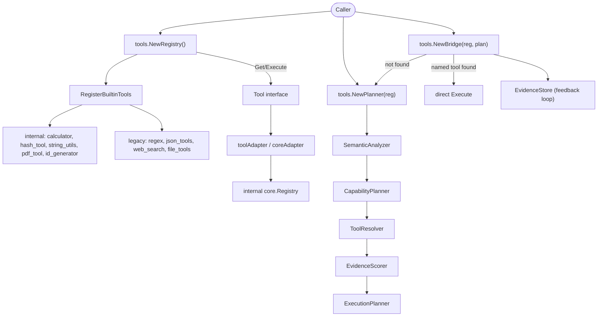

`tools` 模块横跨三处：`api/tools`（公开的 `Tool` 接口、`Registry`、
`ToolFunc` 以及 planner 的再导出）、`internal/tools/resources`（内部
`core.Registry` 与内置工具实现）、`internal/tools/planner`（基于意图的
能力规划器与执行桥）。

## 职责

- 定义 5 方法 `Tool` 接口（`Name`、`Description`、`Parameters`、
  `Execute`、`Capabilities`）以及把普通函数转为工具的 `ToolFunc` 适配器。
- `NewRegistry()` 在创建时自动注册全部 9 个内置工具，调用方零配置即得就绪
  注册表。
- 内置 9 个工具：`calculator`、`hash_tool`、`string_utils`、`pdf_tool`、
  `id_generator`（来自 `internal/tools/resources/builtin/*`），以及
  `regex`、`json_tools`、`web_search`、`file_tools`（自包含的遗留工具）。
- 通过 `toolAdapter`/`coreAdapter` 桥接内部 `core.Registry`，使同一工具在
  两套 API 表面均可使用。
- 提供能力 `Planner`（意图分析、分解、解析、打分、规划）与按名执行、缺失
  时回退到 planner 的 `Bridge`。

## 架构图



## 外部接口

```go
// api/tools
type Result struct {
    Success bool `json:"success"`
    Data    any  `json:"data,omitempty"`
}

type Tool interface {
    Name() string
    Description() string
    Parameters() map[string]any
    Execute(ctx context.Context, params map[string]any) (Result, error)
    Capabilities() []string
}

type ToolFunc struct {
    ToolName   string
    ToolDesc   string
    ToolParams map[string]any
    Fn         func(ctx context.Context, params map[string]any) (any, error)
}

type ToolInfo struct {
    Name        string `json:"name"`
    Description string `json:"description"`
}

type Registry struct { /* unexported */ }
func NewRegistry() *Registry
func NewEmptyRegistry() *Registry
func RegisterBuiltinTools(r *Registry) error
func (r *Registry) Register(tool Tool) error
func (r *Registry) Unregister(name string) error
func (r *Registry) Get(name string) (Tool, bool)
func (r *Registry) Execute(ctx context.Context, name string, params map[string]any) (Result, error)
func (r *Registry) List() []string
func (r *Registry) ListTools() []ToolInfo
func (r *Registry) ListToolNames() []string
func (r *Registry) GetToolCapabilities(name string) ([]string, error)
func (r *Registry) PlannerProvider() *RegistryPlannerProvider

// Planner / Bridge (re-exports from internal/tools/planner)
type Planner = planner.Planner
type ExecutionPlan = planner.ExecutionPlan
type Bridge = planner.ToolExecutionBridge

func NewPlanner(r *Registry) (*Planner, error)
func NewBridge(r *Registry, p *Planner) (*Bridge, error)
```

## 关键类型与方法

| 类型 | 方法 | 用途 |
|------|------|------|
| `tools.Tool` | interface（5 个方法） | 所有工具实现的契约。 |
| `tools.ToolFunc` | 字段 `Fn` | 适配器：把 `func(ctx, params) (any, error)` 包装为 `Tool`。 |
| `tools.Result` | 字段 `Success`、`Data` | 执行结果；错误以 `Result{Success:false}` 返回。 |
| `tools.Registry` | `NewRegistry()` | 通过 `RegisterBuiltinTools` 预装全部 9 个内置工具。 |
| `tools.Registry` | `NewEmptyRegistry()` | 仅自定义环境用的空注册表。 |
| `tools.Registry` | `Register(Tool)` / `Unregister(name)` | 增删工具，并同步缓存的 `core.Registry`。 |
| `tools.Registry` | `Execute(ctx, name, params)` | 按名查找并分派。 |
| `tools.Registry` | `GetToolCapabilities(name)` | 为 planner 读取声明的能力。 |
| `tools.Registry` | `PlannerProvider()` | 返回满足 `planner.ToolProvider` 的适配器。 |
| `tools.RegisterBuiltinTools(r)` | 函数 | 注册 9 个内置工具；幂等辅助函数。 |
| `tools.Planner` | `NewPlanner(r)` | 从注册表构建 planner（analyzer、capability planner、resolver、scorer、execution planner）。 |
| `tools.Planner` | `Plan(ctx, request)` | 基于意图的规划：分析、分解、解析、打分、构建 DAG。 |
| `tools.Bridge` | `NewBridge(r, p)` | 用 planner 回退与 evidence store 包装注册表。 |
| `tools.Bridge` | `Execute(ctx, name, params, intent)` | 命名工具直连；名字为空或未知时回退到 planner。 |
| `calculator` | 内置 | 算术表达式求值（参数 `expression`）。 |
| `hash_tool` | 内置 | 哈希工具（来自 `internal/tools/resources/builtin/hash`）。 |
| `string_utils` | 内置 | 字符串操作（来自 `.../builtin/stringutils`）。 |
| `pdf_tool` | 内置 | PDF 文本抽取（来自 `.../builtin/pdf`）。 |
| `id_generator` | 内置 | 唯一 ID 生成（来自 `.../builtin/system`）。 |
| `regex` | 内置 | 正则匹配/抽取/替换。 |
| `json_tools` | 内置 | JSON 解析/转换/校验。 |
| `web_search` | 内置 | 带 SSRF 安全 dialer 的 HTTP 抓取（`isPrivateIP` 检查）。 |
| `file_tools` | 内置 | 文件读/写/列/存在/删除，带路径校验（`WithAllowedDir`）。 |

## 模块协作

- `api/tools.Registry` 是公开表面。`NewRegistry()` 立即调用
  `RegisterBuiltinTools`：先注册 5 个 internal 驱动的工具（通过
  `fromCore` -> `coreAdapter`），再注册 4 个自包含遗留工具
  （`regexTool`、`jsonTool`、`webSearchTool`、`fileTool`）。
- `toolAdapter` 把公开 `tools.Tool` 包装为内部 `core.Tool` 接口
  （`Category`、返回 `core.Capability` 的 `Capabilities`、返回
  `*core.ParameterSchema` 的 `Parameters`）；`coreAdapter` 反向包装。两个
  适配器让同一工具实例同时存在于公开 `Registry` 与 planner 使用的缓存
  `core.Registry`。
- `Registry.PlannerProvider()` 返回的 `RegistryPlannerProvider` 通过结构
  化类型（`ListTools`、`GetToolCapabilities`）满足 `planner.ToolProvider`，
  使 planner 无需导入 `api/tools` 即可解析能力。
- `tools.NewPlanner(r)` 串联 `NewRuleBasedAnalyzer` ->
  `NewCapabilityPlanner` -> `NewToolResolver` -> `NewEvidenceScorer` ->
  `NewExecutionPlanner`，背后是 `MemoryEvidenceStore`。
- `tools.NewBridge(r, p)` 用 planner 与 evidence store 包装内部
  `core.Registry`：命名调用直接命中注册表，未命名或未知工具触发 planner
  意图解析。每次执行都会把证据写回 store，优化后续打分。
- `web_search` 使用 `ssrfSafeDialContext` 与 `isPrivateIP` 阻断
  RFC1918/loopback/link-local 地址；`file_tools` 通过 `validatePath`
  校验路径，并支持 `WithAllowedDir` 将 I/O 限制在沙箱内。

## 扩展方式

1. **注册自定义工具。** 实现 `tools.Tool`（5 个方法）或构建
   `tools.ToolFunc{Name, Desc, Params, Fn}`，再调用
   `registry.Register(myTool)`。`Parameters()` 应返回 JSON Schema map 以便
   LLM 调用。
2. **为 planner 声明能力。** 在 `Tool.Capabilities()` 返回非空
   `[]string`。planner 通过 `ToolCapabilityMap` 将其映射到
   `planner.CapabilityDef`，用于意图解析。
3. **从空注册表起步。** 调用 `tools.NewEmptyRegistry()`，再选择性
   `Register` 所需工具。如需后续补回内置工具，调用
   `tools.RegisterBuiltinTools(r)`。
4. **使用意图驱动执行。** 构建 `tools.NewPlanner(reg)` 与
   `tools.NewBridge(reg, planner)`，再调用
   `bridge.Execute(ctx, "", nil, "compute 1+1")`，planner 会把意图解析为
   `calculator` 并执行，证据自动记录。
5. **将 `file_tools` 限制在沙箱。** 构建注册表后，用 `fileToolOption`
  （如 `WithAllowedDir("/var/ares/sandbox")`）重新注册 `file_tools`，
  `validatePath` 会拒绝任何 allow-list 之外的路径。

## 双语状态

本页同时维护英文（`tools.en.md`）与中文（`tools.zh.md`）版本。两份文档中
的代码块、类型名、方法名与标识符保持原样，仅翻译散文。

## 成熟度

Production。本模块由 `tools_test.go`、`planner_test.go`、
`bridge_test.go`、`evidence_test.go`、`dag_test.go`、
`integration_test.go` 覆盖，已通过 `sdk.WithTool`/
`runtime.RegisterTool` 接入 SDK，无任何实验性标记。


