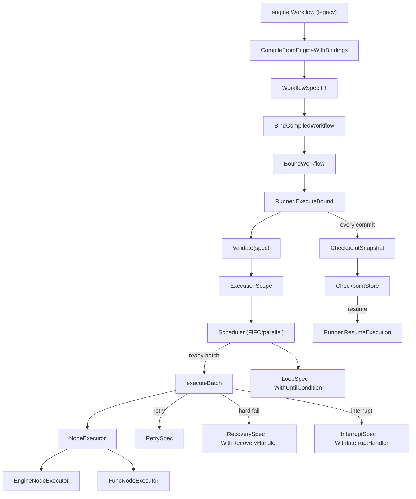

The `internal/workflow` package is the single production execution path for
DAG-based workflows. It defines a serializable intermediate representation
(`WorkflowSpec`), a single `Runner` that consumes it, a `Scheduler` that
topologically orders ready nodes, and an idempotent checkpoint protocol for
crash recovery.

## Responsibility

- Own the workflow IR (`WorkflowSpec` with `NodeSpec`/`EdgeSpec`/`LoopSpec`/
  `ScheduleSpec`) that decouples topology from execution semantics and is
  the only compilation target for legacy APIs.
- Run the IR through the single `Runner`: validate, build `ExecutionScope`,
  drive the `Scheduler`, execute ready batches, commit results, and emit
  ordered events.
- Support retries (`RetrySpec`), hard-failure recovery (`RecoverySpec` +
  `WithRecoveryHandler`), human-in-the-loop interrupts (`InterruptSpec` +
  `WithInterruptHandler`), and controlled loops (`LoopSpec` +
  `WithUntilCondition`).
- Persist atomic `CheckpointSnapshot`s via `ares_runtime.CheckpointStore`
  and resume execution idempotently through `Runner.ResumeExecution`.
- Compile legacy `engine.Workflow` definitions into the IR via
  `CompileFromEngine`/`CompileFromEngineWithBindings` and bind non-serializable
  closures via `BindCompiledWorkflow`.

## Architecture



## External interfaces

```go
// internal/workflow
type NodeID string

type WorkflowSpec struct {
    ID       string
    Nodes    []NodeSpec
    Edges    []EdgeSpec
    Entries  []NodeID
    Loop     *LoopSpec
    Schedule ScheduleSpec
}

type NodeSpec struct {
    ID          NodeID
    Name        string
    AgentType   string
    Input       string
    Timeout     time.Duration
    Retry       *RetrySpec
    Recovery    *RecoverySpec
    Interrupt   *InterruptSpec
    Join        JoinKind
    Condition   *ConditionExpr
    SubWorkflow *WorkflowSpec
    Metadata    map[string]string
}

type EdgeSpec struct {
    From     NodeID
    To       NodeID
    Kind     EdgeKind
    Branch   BranchKind
    Group    string
    Priority int
    Cond     *ConditionExpr
}

type NodeStatus string  // pending, ready, running, completed, failed, interrupted, cancelled, not_selected, unreachable, blocked
type EdgeKind string    // data_dependency, control_flow
type BranchKind string  // branch_one, branch_many
type JoinKind string    // join_all, join_any, merge

type RetrySpec struct {
    MaxAttempts       int
    InitialDelay      time.Duration
    MaxDelay          time.Duration
    BackoffMultiplier float64
}

type RecoverySpec struct {
    Strategy        string // "retry", "replace_node", "fail_fast"
    ReplacementAgent string
}

type InterruptSpec struct {
    Message    string
    TimeoutSec int
    AutoAction string // "skip", "approve", "fallback"
}

type LoopSpec struct {
    MaxIterations int
    LoopNodes     []NodeID
}

type ScheduleSpec struct {
    MaxParallel int
}

type Runner struct { /* unexported */ }
type RunnerOption func(*Runner)

func NewRunner(executor NodeExecutor, opts ...RunnerOption) *Runner
func WithScheduleStrategy(strategy ScheduleStrategy) RunnerOption
func WithReadySelector(selector func([]NodeID) NodeID) RunnerOption
func WithInterruptHandler(handler func(context.Context, *InterruptSpec, StateView) (bool, error)) RunnerOption
func WithRecoveryHandler(handler func(context.Context, NodeID, error, *NodeSpec) (bool, map[string]any, error)) RunnerOption
func WithConditionEvaluator(evaluator func(*ConditionExpr, StateView) bool) RunnerOption
func WithBindings(bindings map[NodeID]func(map[string]any) bool) RunnerOption
func WithUntilCondition(predicate func(map[string]any, int) bool) RunnerOption
func WithCompiledWorkflow(compiled *CompiledWorkflow) RunnerOption
func WithInitialInput(input string) RunnerOption
func WithInitialVariables(variables map[string]string) RunnerOption
func WithInitialState(state map[string]any) RunnerOption
func WithPluginBus(bus *ares_runtime.PluginBus) RunnerOption
func WithCheckpointStore(store ares_runtime.CheckpointStore) RunnerOption
func WithExecutionID(executionID string) RunnerOption
func WithFailOnNodeError(enabled bool) RunnerOption
func WithEventSink(sink RunnerEventSink) RunnerOption
func WithPatchQueue(queue *PatchQueue) RunnerOption
func WithExecutionCollector(collector *ares_runtime.ExecutionCollector) RunnerOption

func (r *Runner) Execute(ctx context.Context, spec *WorkflowSpec) (*Result, error)
func (r *Runner) ExecuteBound(ctx context.Context, bound *BoundWorkflow) (*Result, error)
func (r *Runner) ResumeExecution(ctx context.Context, spec *WorkflowSpec, executionID string) (*Result, error)

type NodeExecutor interface {
    ExecuteNode(ctx context.Context, spec *NodeSpec, scope *ExecutionScope) (map[string]any, error)
}

type ExecutableFunc func(ctx context.Context, view StateView) (map[string]any, error)
type FuncNodeExecutor struct { /* unexported */ }
func NewFuncNodeExecutor() *FuncNodeExecutor
func (e *FuncNodeExecutor) Register(id NodeID, fn ExecutableFunc)
func (e *FuncNodeExecutor) ExecuteNode(ctx context.Context, spec *NodeSpec, scope *ExecutionScope) (map[string]any, error)

type EngineNodeExecutor struct { /* unexported */ }
func NewEngineNodeExecutor(registry *engine.AgentRegistry, steps []*engine.Step) (*EngineNodeExecutor, error)
func NewEngineNodeExecutorWithStepExecutor(/* ... */) (*EngineNodeExecutor, error)
func (e *EngineNodeExecutor) ExecuteNode(ctx context.Context, spec *NodeSpec, scope *ExecutionScope) (map[string]any, error)

type Predicate func(state map[string]any) bool
type Router func(ctx context.Context, nodeID string, state map[string]any, output string) string
type LoopPredicate func(state map[string]any, iteration int) bool

type BoundWorkflow struct { /* unexported */ }
func BindCompiledWorkflow(compiled *CompiledWorkflow) (*BoundWorkflow, error)

type CompiledWorkflow struct { /* unexported */ }
func CompileFromEngine(w *engine.Workflow) (*WorkflowSpec, error)
func CompileFromEngineWithBindings(w *engine.Workflow) (*CompiledWorkflow, error)

type ExecutionScope struct { /* unexported */ }
func NewExecutionScope(execID string, spec *WorkflowSpec) *ExecutionScope
func (s *ExecutionScope) State() StateView
func (s *ExecutionScope) Writer() StateWriter
func (s *ExecutionScope) CommitState()
func (s *ExecutionScope) StateSnapshot() map[string]any
func (s *ExecutionScope) RestoreState(state map[string]any)
func (s *ExecutionScope) NodeStatus(id NodeID) NodeStatus
func (s *ExecutionScope) SetNodeStatus(id NodeID, status NodeStatus)
func (s *ExecutionScope) SetNodeOutput(id NodeID, output map[string]any)
func (s *ExecutionScope) SetNodeError(id NodeID, err error)
func (s *ExecutionScope) ToResult() *Result

type StateView interface {
    Get(key string) (any, bool)
    GetNodeOutput(nodeID NodeID) (map[string]any, bool)
}
type StateWriter interface {
    Set(key string, value any)
    SetNodeOutput(nodeID NodeID, output map[string]any)
}

type Result struct {
    ExecutionID string
    SpecID      string
    Status      NodeStatus
    NodeStates  []*NodeStatusValue
    Duration    time.Duration
    Error       string
}

type Scheduler struct { /* unexported */ }
func NewScheduler(spec *WorkflowSpec, strategy ScheduleStrategy) (*Scheduler, error)
func (s *Scheduler) HasReady() bool
func (s *Scheduler) Next() NodeID
func (s *Scheduler) NextWithSelector(selector func([]NodeID) NodeID) (NodeID, error)
func (s *Scheduler) OnNodeCompleted(id NodeID)
func (s *Scheduler) OnNodeFailed(id NodeID)

type CheckpointSnapshot struct {
    SchemaVersion         int
    ExecutionID           string
    SpecID                string
    BaseSpecHash          string
    SpecHash              string
    EffectiveSpec         *WorkflowSpec
    State                 map[string]any
    NodeStates            []NodeStatusValue
    Scheduler             SchedulerSnapshot
    LoopIteration         int
    LoopIterationComplete bool
    LoopHistory           []LoopIteration
    PendingInterrupts     []PendingInterrupt
    MutationIDs           []string
    PendingMutations      []Mutation
    EventSequence         uint64
    SavedAt               time.Time
    CollectorData         map[string]any
}

func NewWorkflow(id string) *WorkflowSpec
func (s *WorkflowSpec) AddNode(n NodeSpec) *WorkflowSpec
func (s *WorkflowSpec) AddEdge(e EdgeSpec) *WorkflowSpec
func (s *WorkflowSpec) WithEntry(ids ...NodeID) *WorkflowSpec
func (s *WorkflowSpec) WithLoop(loop *LoopSpec) *WorkflowSpec
func (s *WorkflowSpec) WithMaxParallel(n int) *WorkflowSpec
func RunWorkflow(ctx context.Context, spec *WorkflowSpec, functions map[NodeID]ExecutableFunc, opts ...RunnerOption) (*Result, error)
```

## Key types and methods

| Type | Method | Purpose |
|------|--------|---------|
| `WorkflowSpec` | `NewWorkflow(id)` / `AddNode` / `AddEdge` / `WithEntry` / `WithLoop` / `WithMaxParallel` | Builder API for the IR. |
| `NodeSpec` | fields `Retry`, `Recovery`, `Interrupt`, `Join`, `Condition`, `SubWorkflow` | Per-node execution policy. |
| `EdgeSpec` | fields `Kind`, `Branch`, `Group`, `Priority`, `Cond` | Edge classification (data vs. control flow, branch group). |
| `Runner` | `NewRunner(executor, opts...)` | Construct the single production runner with options. |
| `Runner` | `Execute(ctx, *WorkflowSpec)` | Validate, build scope, run, return `*Result`. |
| `Runner` | `ExecuteBound(ctx, *BoundWorkflow)` | Run with compiled predicates/routers attached. |
| `Runner` | `ResumeExecution(ctx, *WorkflowSpec, executionID)` | Load `CheckpointSnapshot`, verify spec hash, resume. |
| `NodeExecutor` | interface `ExecuteNode(ctx, *NodeSpec, *ExecutionScope)` | Pluggable node execution. |
| `FuncNodeExecutor` | `Register(id, fn)` | Bind `ExecutableFunc`s per node ID. |
| `EngineNodeExecutor` | `NewEngineNodeExecutor(registry, steps)` | Bridge legacy `engine.Step` execution to IR nodes. |
| `Scheduler` | `NewScheduler(spec, strategy)` / `Next()` / `OnNodeCompleted(id)` / `OnNodeFailed(id)` | Topological ready-set management. |
| `ExecutionScope` | `State()` / `Writer()` / `CommitState()` / `RestoreState(...)` | Per-execution state + node status bookkeeping. |
| `StateView` / `StateWriter` | `Get` / `GetNodeOutput` / `Set` / `SetNodeOutput` | Read/write interface passed to `ExecutableFunc`. |
| `BindCompiledWorkflow` | function | Attach non-serializable closures to a compiled spec. |
| `CompileFromEngineWithBindings` | function | Compile `engine.Workflow` to IR + closures in one step. |
| `CheckpointSnapshot` | struct | Atomic recovery record (schema v3); persisted via `CheckpointStore`. |
| `RetrySpec` / `RecoverySpec` / `InterruptSpec` / `LoopSpec` | structs | Retry, hard-fail recovery, HITL, loop policies. |
| `RunWorkflow` | function | Convenience: build `FuncNodeExecutor` from a function map and run. |

## Module collaboration

- `api/service/workflow.Service` and `client.WorkflowClient` both compile
  their `engine.Workflow` definitions via
  `workflow.CompileFromEngineWithBindings`, then call
  `BindCompiledWorkflow` and `NewEngineNodeExecutor` before constructing a
  `Runner` with `WithInitialInput`/`WithInitialVariables`.
- `Runner.Execute` first runs `Validate(spec)` (cycle detection, join
  compatibility, binding presence), then creates an `ExecutionScope`, seeds
  initial state/variables, publishes `RunnerEventWorkflowStarted`, and
  enters `executeWorkflow`.
- `executeIteration` asks the `Scheduler` for the next ready batch
  (`takeReadyBatch`), prepares any `InterruptSpec`s
  (`prepareBatchInterrupts`), and runs the batch via `executeBatch` ->
  `executeNode` -> `executeAttempt`. Failures trigger retry
  (`RetrySpec`), recovery (`recoverNode` + `WithRecoveryHandler`), or HITL
  (`handleInterrupt`).
- After every node commit, the runner routes via `routeTarget` (honoring
  `Router` closures and `BranchOne`/`BranchMany` edges), updates the
  scheduler (`OnNodeCompleted`/`OnNodeFailed`), and persists a
  `CheckpointSnapshot` through `WithCheckpointStore`. The snapshot includes
  spec hashes, scheduler state, loop iteration, pending interrupts,
  mutations, event sequence, and `ExecutionCollector` data.
- `Runner.ResumeExecution` reloads the snapshot, verifies `BaseSpecHash`
  and `SpecHash`, restores scope state and node statuses, replays pending
  interrupts, and resumes from the saved loop iteration, making resume
  idempotent.
- Loops wrap `executeWorkflow` in an iteration loop bounded by
  `LoopSpec.MaxIterations` and `WithUntilCondition`; `ResetNodesForIteration`
  re-arms loop-body node statuses between iterations.
- `PatchQueue` (`WithPatchQueue`) is the only supported runtime topology
  mutation path; pending mutations are committed and recorded in the
  checkpoint so they survive resume.

## Extension points

1. **Provide a custom node executor.** Implement `NodeExecutor` (or use
   `FuncNodeExecutor` + `Register(id, fn)`) and pass it to `NewRunner`. The
   executor receives the `NodeSpec` and an `ExecutionScope` for state
   access.
2. **Compile a legacy workflow.** Call
   `CompileFromEngineWithBindings(*engine.Workflow)` to get a
   `*CompiledWorkflow`, then `BindCompiledWorkflow` to attach
   non-serializable predicates/routers, then `Runner.ExecuteBound`.
3. **Enable crash recovery.** Attach `ares_runtime.CheckpointStore` via
   `WithCheckpointStore`. After a crash, call
   `Runner.ResumeExecution(ctx, spec, executionID)`; the runner verifies
   spec hashes and resumes from the last committed snapshot.
4. **Add HITL approval.** Set `NodeSpec.Interrupt` and pass
   `WithInterruptHandler(func(ctx, *InterruptSpec, StateView) (bool, error))`.
   The runner pauses the node until the handler returns; `AutoAction`
   (`skip`/`approve`/`fallback`) fires on timeout.
5. **Add custom recovery.** Set `NodeSpec.Recovery` (`retry`/
   `replace_node`/`fail_fast`) and pass `WithRecoveryHandler` to override
   the default policy, including substituting a different `AgentType` on
   `replace_node`.
6. **Run a controlled loop.** Set `WorkflowSpec.Loop` (`MaxIterations` +
   `LoopNodes`) and optionally `WithUntilCondition(predicate)` for
   early exit. `LoopHistory` is checkpointed so resume continues the right
   iteration.

## Bilingual status

This page is maintained in both English (`workflow.en.md`) and Chinese
(`workflow.zh.md`). Code blocks, type names, method names, and identifiers
are kept verbatim across both languages; prose is translated.

## Maturity

Production. The module is covered by `runner_test.go`, `scheduler.go`
tests, `diamond_test.go`, `edge_test.go`, `binding_contract_test.go`,
`lifecycle_contract_test.go`, `mutation_contract_test.go`,
`recovery_contract_test.go`, `scheduler_contract_test.go`, and
`bench_test.go`, is integrated into the SDK via
`api/service/workflow.Service` and `client.WorkflowClient`, and ships no
experimental markers.


