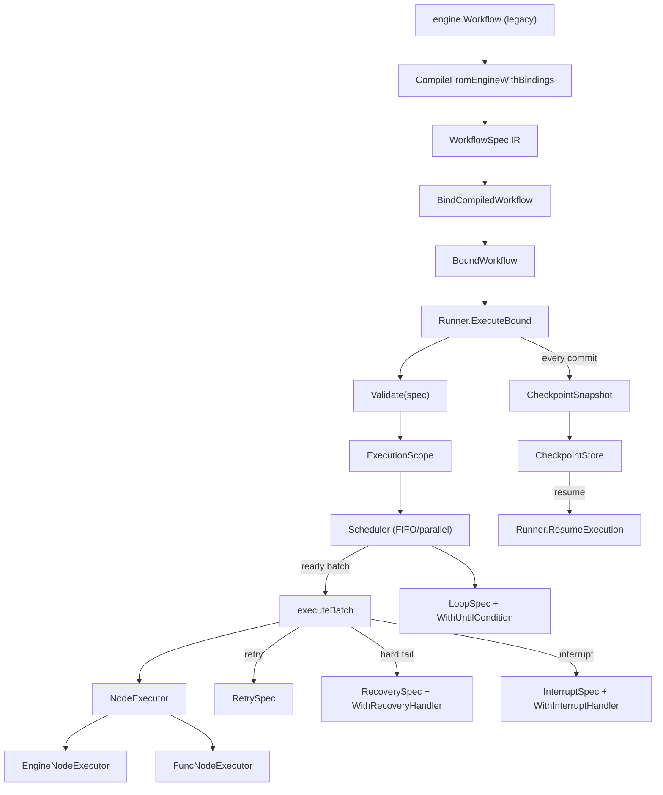

`internal/workflow` 包是 DAG 工作流的唯一生产执行路径。它定义了可序列化的
中间表示（`WorkflowSpec`）、消费它的单一 `Runner`、按拓扑排序就绪节点的
`Scheduler`，以及用于崩溃恢复的幂等检查点协议。

## 职责

- 持有工作流 IR（`WorkflowSpec` 含 `NodeSpec`/`EdgeSpec`/`LoopSpec`/
  `ScheduleSpec`），将拓扑与执行语义解耦，作为所有遗留 API 的唯一编译
  目标。
- 通过单一 `Runner` 运行 IR：校验、构建 `ExecutionScope`、驱动
  `Scheduler`、执行就绪批次、提交结果、发出有序事件。
- 支持重试（`RetrySpec`）、硬失败恢复（`RecoverySpec` +
  `WithRecoveryHandler`）、人在环中断（`InterruptSpec` +
  `WithInterruptHandler`）与受控循环（`LoopSpec` +
  `WithUntilCondition`）。
- 通过 `ares_runtime.CheckpointStore` 持久化原子 `CheckpointSnapshot`，并
  通过 `Runner.ResumeExecution` 幂等恢复执行。
- 通过 `CompileFromEngine`/`CompileFromEngineWithBindings` 把遗留
  `engine.Workflow` 定义编译为 IR，并通过 `BindCompiledWorkflow` 绑定不可
  序列化的闭包。

## 架构图



## 外部接口

```go
// internal/workflow
type NodeID string

type WorkflowSpec struct {
    ID       string
    Nodes    []NodeSpec
    Edges    []EdgeSpec
    Entries  []NodeID
    Loop     *LoopSpec
    Schedule ScheduleSpec
}

type NodeSpec struct {
    ID          NodeID
    Name        string
    AgentType   string
    Input       string
    Timeout     time.Duration
    Retry       *RetrySpec
    Recovery    *RecoverySpec
    Interrupt   *InterruptSpec
    Join        JoinKind
    Condition   *ConditionExpr
    SubWorkflow *WorkflowSpec
    Metadata    map[string]string
}

type EdgeSpec struct {
    From     NodeID
    To       NodeID
    Kind     EdgeKind
    Branch   BranchKind
    Group    string
    Priority int
    Cond     *ConditionExpr
}

type NodeStatus string  // pending, ready, running, completed, failed, interrupted, cancelled, not_selected, unreachable, blocked
type EdgeKind string    // data_dependency, control_flow
type BranchKind string  // branch_one, branch_many
type JoinKind string    // join_all, join_any, merge

type RetrySpec struct {
    MaxAttempts       int
    InitialDelay      time.Duration
    MaxDelay          time.Duration
    BackoffMultiplier float64
}

type RecoverySpec struct {
    Strategy        string // "retry", "replace_node", "fail_fast"
    ReplacementAgent string
}

type InterruptSpec struct {
    Message    string
    TimeoutSec int
    AutoAction string // "skip", "approve", "fallback"
}

type LoopSpec struct {
    MaxIterations int
    LoopNodes     []NodeID
}

type ScheduleSpec struct {
    MaxParallel int
}

type Runner struct { /* unexported */ }
type RunnerOption func(*Runner)

func NewRunner(executor NodeExecutor, opts ...RunnerOption) *Runner
func WithScheduleStrategy(strategy ScheduleStrategy) RunnerOption
func WithReadySelector(selector func([]NodeID) NodeID) RunnerOption
func WithInterruptHandler(handler func(context.Context, *InterruptSpec, StateView) (bool, error)) RunnerOption
func WithRecoveryHandler(handler func(context.Context, NodeID, error, *NodeSpec) (bool, map[string]any, error)) RunnerOption
func WithConditionEvaluator(evaluator func(*ConditionExpr, StateView) bool) RunnerOption
func WithBindings(bindings map[NodeID]func(map[string]any) bool) RunnerOption
func WithUntilCondition(predicate func(map[string]any, int) bool) RunnerOption
func WithCompiledWorkflow(compiled *CompiledWorkflow) RunnerOption
func WithInitialInput(input string) RunnerOption
func WithInitialVariables(variables map[string]string) RunnerOption
func WithInitialState(state map[string]any) RunnerOption
func WithPluginBus(bus *ares_runtime.PluginBus) RunnerOption
func WithCheckpointStore(store ares_runtime.CheckpointStore) RunnerOption
func WithExecutionID(executionID string) RunnerOption
func WithFailOnNodeError(enabled bool) RunnerOption
func WithEventSink(sink RunnerEventSink) RunnerOption
func WithPatchQueue(queue *PatchQueue) RunnerOption
func WithExecutionCollector(collector *ares_runtime.ExecutionCollector) RunnerOption

func (r *Runner) Execute(ctx context.Context, spec *WorkflowSpec) (*Result, error)
func (r *Runner) ExecuteBound(ctx context.Context, bound *BoundWorkflow) (*Result, error)
func (r *Runner) ResumeExecution(ctx context.Context, spec *WorkflowSpec, executionID string) (*Result, error)

type NodeExecutor interface {
    ExecuteNode(ctx context.Context, spec *NodeSpec, scope *ExecutionScope) (map[string]any, error)
}

type ExecutableFunc func(ctx context.Context, view StateView) (map[string]any, error)
type FuncNodeExecutor struct { /* unexported */ }
func NewFuncNodeExecutor() *FuncNodeExecutor
func (e *FuncNodeExecutor) Register(id NodeID, fn ExecutableFunc)
func (e *FuncNodeExecutor) ExecuteNode(ctx context.Context, spec *NodeSpec, scope *ExecutionScope) (map[string]any, error)

type EngineNodeExecutor struct { /* unexported */ }
func NewEngineNodeExecutor(registry *engine.AgentRegistry, steps []*engine.Step) (*EngineNodeExecutor, error)
func NewEngineNodeExecutorWithStepExecutor(/* ... */) (*EngineNodeExecutor, error)
func (e *EngineNodeExecutor) ExecuteNode(ctx context.Context, spec *NodeSpec, scope *ExecutionScope) (map[string]any, error)

type Predicate func(state map[string]any) bool
type Router func(ctx context.Context, nodeID string, state map[string]any, output string) string
type LoopPredicate func(state map[string]any, iteration int) bool

type BoundWorkflow struct { /* unexported */ }
func BindCompiledWorkflow(compiled *CompiledWorkflow) (*BoundWorkflow, error)

type CompiledWorkflow struct { /* unexported */ }
func CompileFromEngine(w *engine.Workflow) (*WorkflowSpec, error)
func CompileFromEngineWithBindings(w *engine.Workflow) (*CompiledWorkflow, error)

type ExecutionScope struct { /* unexported */ }
func NewExecutionScope(execID string, spec *WorkflowSpec) *ExecutionScope
func (s *ExecutionScope) State() StateView
func (s *ExecutionScope) Writer() StateWriter
func (s *ExecutionScope) CommitState()
func (s *ExecutionScope) StateSnapshot() map[string]any
func (s *ExecutionScope) RestoreState(state map[string]any)
func (s *ExecutionScope) NodeStatus(id NodeID) NodeStatus
func (s *ExecutionScope) SetNodeStatus(id NodeID, status NodeStatus)
func (s *ExecutionScope) SetNodeOutput(id NodeID, output map[string]any)
func (s *ExecutionScope) SetNodeError(id NodeID, err error)
func (s *ExecutionScope) ToResult() *Result

type StateView interface {
    Get(key string) (any, bool)
    GetNodeOutput(nodeID NodeID) (map[string]any, bool)
}
type StateWriter interface {
    Set(key string, value any)
    SetNodeOutput(nodeID NodeID, output map[string]any)
}

type Result struct {
    ExecutionID string
    SpecID      string
    Status      NodeStatus
    NodeStates  []*NodeStatusValue
    Duration    time.Duration
    Error       string
}

type Scheduler struct { /* unexported */ }
func NewScheduler(spec *WorkflowSpec, strategy ScheduleStrategy) (*Scheduler, error)
func (s *Scheduler) HasReady() bool
func (s *Scheduler) Next() NodeID
func (s *Scheduler) NextWithSelector(selector func([]NodeID) NodeID) (NodeID, error)
func (s *Scheduler) OnNodeCompleted(id NodeID)
func (s *Scheduler) OnNodeFailed(id NodeID)

type CheckpointSnapshot struct {
    SchemaVersion         int
    ExecutionID           string
    SpecID                string
    BaseSpecHash          string
    SpecHash              string
    EffectiveSpec         *WorkflowSpec
    State                 map[string]any
    NodeStates            []NodeStatusValue
    Scheduler             SchedulerSnapshot
    LoopIteration         int
    LoopIterationComplete bool
    LoopHistory           []LoopIteration
    PendingInterrupts     []PendingInterrupt
    MutationIDs           []string
    PendingMutations      []Mutation
    EventSequence         uint64
    SavedAt               time.Time
    CollectorData         map[string]any
}

func NewWorkflow(id string) *WorkflowSpec
func (s *WorkflowSpec) AddNode(n NodeSpec) *WorkflowSpec
func (s *WorkflowSpec) AddEdge(e EdgeSpec) *WorkflowSpec
func (s *WorkflowSpec) WithEntry(ids ...NodeID) *WorkflowSpec
func (s *WorkflowSpec) WithLoop(loop *LoopSpec) *WorkflowSpec
func (s *WorkflowSpec) WithMaxParallel(n int) *WorkflowSpec
func RunWorkflow(ctx context.Context, spec *WorkflowSpec, functions map[NodeID]ExecutableFunc, opts ...RunnerOption) (*Result, error)
```

## 关键类型与方法

| 类型 | 方法 | 用途 |
|------|------|------|
| `WorkflowSpec` | `NewWorkflow(id)` / `AddNode` / `AddEdge` / `WithEntry` / `WithLoop` / `WithMaxParallel` | IR 的构建 API。 |
| `NodeSpec` | 字段 `Retry`、`Recovery`、`Interrupt`、`Join`、`Condition`、`SubWorkflow` | 单节点执行策略。 |
| `EdgeSpec` | 字段 `Kind`、`Branch`、`Group`、`Priority`、`Cond` | 边分类（数据 vs. 控制、分支组）。 |
| `Runner` | `NewRunner(executor, opts...)` | 用选项构造唯一生产 Runner。 |
| `Runner` | `Execute(ctx, *WorkflowSpec)` | 校验、构建 scope、运行、返回 `*Result`。 |
| `Runner` | `ExecuteBound(ctx, *BoundWorkflow)` | 附带编译后的 predicate/router 运行。 |
| `Runner` | `ResumeExecution(ctx, *WorkflowSpec, executionID)` | 加载 `CheckpointSnapshot`、校验 spec hash、恢复。 |
| `NodeExecutor` | 接口 `ExecuteNode(ctx, *NodeSpec, *ExecutionScope)` | 可插拔的节点执行。 |
| `FuncNodeExecutor` | `Register(id, fn)` | 按节点 ID 绑定 `ExecutableFunc`。 |
| `EngineNodeExecutor` | `NewEngineNodeExecutor(registry, steps)` | 将遗留 `engine.Step` 执行桥接到 IR 节点。 |
| `Scheduler` | `NewScheduler(spec, strategy)` / `Next()` / `OnNodeCompleted(id)` / `OnNodeFailed(id)` | 拓扑就绪集管理。 |
| `ExecutionScope` | `State()` / `Writer()` / `CommitState()` / `RestoreState(...)` | 单次执行的状态与节点状态簿记。 |
| `StateView` / `StateWriter` | `Get` / `GetNodeOutput` / `Set` / `SetNodeOutput` | 传给 `ExecutableFunc` 的读写接口。 |
| `BindCompiledWorkflow` | 函数 | 将不可序列化闭包附加到编译后的 spec。 |
| `CompileFromEngineWithBindings` | 函数 | 一步将 `engine.Workflow` 编译为 IR + 闭包。 |
| `CheckpointSnapshot` | 结构体 | 原子恢复记录（schema v3），通过 `CheckpointStore` 持久化。 |
| `RetrySpec` / `RecoverySpec` / `InterruptSpec` / `LoopSpec` | 结构体 | 重试、硬失败恢复、HITL、循环策略。 |
| `RunWorkflow` | 函数 | 便捷入口：从函数 map 构建 `FuncNodeExecutor` 并运行。 |

## 模块协作

- `api/service/workflow.Service` 与 `client.WorkflowClient` 都通过
  `workflow.CompileFromEngineWithBindings` 编译 `engine.Workflow` 定义，
  再调用 `BindCompiledWorkflow` 与 `NewEngineNodeExecutor`，最后用
  `WithInitialInput`/`WithInitialVariables` 构造 `Runner`。
- `Runner.Execute` 先跑 `Validate(spec)`（环检测、join 兼容性、绑定存在
  性），再创建 `ExecutionScope`、注入初始状态/变量，发布
  `RunnerEventWorkflowStarted`，进入 `executeWorkflow`。
- `executeIteration` 向 `Scheduler` 请求下一就绪批次
  （`takeReadyBatch`），准备 `InterruptSpec`（`prepareBatchInterrupts`），
  通过 `executeBatch` -> `executeNode` -> `executeAttempt` 运行。失败触发
  重试（`RetrySpec`）、恢复（`recoverNode` + `WithRecoveryHandler`）或
  HITL（`handleInterrupt`）。
- 每次节点提交后，Runner 通过 `routeTarget`（遵循 `Router` 闭包与
  `BranchOne`/`BranchMany` 边）路由，更新调度器
  （`OnNodeCompleted`/`OnNodeFailed`），并通过 `WithCheckpointStore` 持久
  化 `CheckpointSnapshot`。快照含 spec hash、调度器状态、循环迭代、待处理
  中断、变更、事件序号与 `ExecutionCollector` 数据。
- `Runner.ResumeExecution` 重新加载快照，校验 `BaseSpecHash` 与
  `SpecHash`，恢复 scope 状态与节点状态，重放待处理中断，从已保存的循环
  迭代继续，使恢复幂等。
- 循环通过 `LoopSpec.MaxIterations` 与 `WithUntilCondition` 包裹
  `executeWorkflow`；`ResetNodesForIteration` 在迭代间重置循环体节点状态。
- `PatchQueue`（`WithPatchQueue`）是唯一支持的运行时拓扑变更路径；待处理
  变更会被提交并记录到检查点，使恢复后仍生效。

## 扩展方式

1. **提供自定义节点执行器。** 实现 `NodeExecutor`（或用
   `FuncNodeExecutor` + `Register(id, fn)`）并传给 `NewRunner`。执行器收
   到 `NodeSpec` 与用于状态访问的 `ExecutionScope`。
2. **编译遗留工作流。** 调用
   `CompileFromEngineWithBindings(*engine.Workflow)` 得到
   `*CompiledWorkflow`，再 `BindCompiledWorkflow` 附加不可序列化的
   predicate/router，最后 `Runner.ExecuteBound`。
3. **启用崩溃恢复。** 通过 `WithCheckpointStore` 接入
   `ares_runtime.CheckpointStore`。崩溃后调用
   `Runner.ResumeExecution(ctx, spec, executionID)`；Runner 校验 spec hash
   并从最近提交的快照恢复。
4. **新增 HITL 审批。** 设置 `NodeSpec.Interrupt` 并传入
   `WithInterruptHandler(func(ctx, *InterruptSpec, StateView) (bool, error))`。
   Runner 暂停节点直到 handler 返回；超时触发 `AutoAction`
   （`skip`/`approve`/`fallback`）。
5. **新增自定义恢复。** 设置 `NodeSpec.Recovery`
   （`retry`/`replace_node`/`fail_fast`）并传入 `WithRecoveryHandler` 覆盖
   默认策略，包括在 `replace_node` 时替换为不同 `AgentType`。
6. **运行受控循环。** 设置 `WorkflowSpec.Loop`（`MaxIterations` +
   `LoopNodes`），可选 `WithUntilCondition(predicate)` 提前退出。
   `LoopHistory` 会被检查点化，恢复时继续正确的迭代。

## 双语状态

本页同时维护英文（`workflow.en.md`）与中文（`workflow.zh.md`）版本。两份
文档中的代码块、类型名、方法名与标识符保持原样，仅翻译散文。

## 成熟度

Production。本模块由 `runner_test.go`、`scheduler.go` 测试、
`diamond_test.go`、`edge_test.go`、`binding_contract_test.go`、
`lifecycle_contract_test.go`、`mutation_contract_test.go`、
`recovery_contract_test.go`、`scheduler_contract_test.go`、
`bench_test.go` 覆盖，已通过 `api/service/workflow.Service` 与
`client.WorkflowClient` 接入 SDK，无任何实验性标记。


